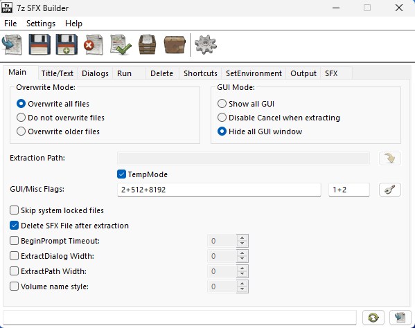

# Writeup

I [Nisseware: Exfiltration](../nisseware-exfiltration/) fik vi trukket C2-klienten `client.exe` ud af netværkstrafikken og reverset den nok til at se, at al kommunikation foregår over websockets, krypteret med `RC4`. Vi fandt RC4-nøglen `"n1ss3b4nd3ns_n1ss3w4r3"` og fik dekrypteret al kommunikation automatisk. Her så vi, at en lang række commands var blevet kørt, filer var blevet eksfiltreret, men en fil var også blevet hentet *ned* på forurettedes maskine og blev kørt:

```console
DOWNLOAD: C:\Users\Alf\Desktop\AntiVirusInstaller.exe (status 0 - File download successful)
CMD: &C:\Users\Alf\Desktop\AntiVirusInstaller.exe (status 0)
```

Filen er med al sandsynlighed selve ransomwaren, og umiddelbart prøver `N1ss3b4nd3n` at skjule den ved at navngive den som en antivirus installer.
Denne skal analyseres, så vi kan vurdere, hvordan den fungerer, om den har en persistancemekanisme, og om en fejl i ransomwaren gør det muligt at dekryptere forurettedes filer.
Der er en række forskellige måder at gå til opgaven på - vi vil først lige lave en smule dynamisk analyse (mest for sjov og illustrationen) og derefter gå mere statisk til værks.

### Dynamisk Analyse

Er man på en Windows lab VM, kan man forsøge at køre ransomwaren og se, hvad der sker - man vil få en konsol, der spørger om et krypteringspassword, men programmet er defanged og kører derefter kun under meget specifikke omstændigheder, så det vil i stedet lukke, og dropperen sletter sig selv. Får man sat en VM op, der matcher kriterierne, vil den kryptere filerne i en række mapper og ransomnoten popper frem med et genereret ID.

Til en indledende dynamisk analyse er programmet [Process Monitor (procmon)](https://learn.microsoft.com/en-us/sysinternals/downloads/procmon) rigtig godt. Det er lavet af Microsoft selv og er en del af deres `SysInternals` suite. Programmet monitorerer alle kørende processer og alle operationer, de foretager sig inden for en række kategorier, bl.a. aktivitet i filsystemet, registreringsdatabasen og netværk. Første gang man kører værktøjet, bliver man nok overrasket over, *hvor* mange ting, der konstant sker i baggrunden på ens maskine - på få sekunder kan der være genereret millioner af events, så det er vigtigt at filtrere outputtet med de indbyggede filtre.

Kører man `procmon` samtidig med, at dropperen igangsættes, vil der være nogle interessante ting at bide mærke i.
Vi kan sætte et filter på `Process Name is AntiVirusInstaller.exe` og `Operation is Create File`, for at se, hvilke filer dropperen skriver:


Her ses, at der genereres en række filer i den midlertidige mappe `C:\Users\User\AppData\Local\Temp\7ZipSFX.000`, bl.a. `AntiVirusInstaller.msi`, `7za.exe`, `conhost.exe`, `conhost.runtimeconfig.json` og vigtigst `flag.txt`! Hopper man til temp mappen vil man dog nu se, at filerne er slettet igen, og køres dropperen på ny, vil man maksimalt kunne spotte de nye filer et splitsekund, før de igen er slettet.

Her kan man fx forsøge at køre dropperen i en debugger og kun steppe indtil det punkt, hvor filerne er skrevet, men det vil nok være svært og træls at finde frem til.
En lidt... speciel... løsning på problemet er at lave et Python script, der i et evigt loop tjekker om `flag.txt` eksisterer på den sti og læser indholdet. Den vil sagtens kunne nå at printe flaget, før filen er slettet, meeen det kan ikke anbefales i praksis - lad os forsøge en lidt mere pålidelig metode og foretage en statisk analyse.

### Statisk Analyse

Det er altid fornuftigt at starte med en helt basal statisk analyse og lige køre `file` og `strings` (eller [floss](https://github.com/mandiant/flare-floss)) på maskinen (også før en evt. dynamisk tilgang):

```console
$ file AntiVirusInstaller.exe
AntiVirusInstaller.exe: PE32 executable (GUI) Intel 80386, for MS Windows, 4 sections
```

Altså umiddelbart bare en almindelige 32-bit Portable Executable, lad os se om `strings` giver os mere!
Vær opmærksom på, at en del strenge i Windows er encoded som UTF-16-LE, så det er altid vigtigt på `.exe`-filer både at køre `strings` og `strings -el`, der kigger efter strenge med den encoding. Her ses et udpluk af interessante strings fra begge udgaver:

```console
strings -n 8 AntiVirusInstaller.exe
...
7z SFX: 
7z SFX: warning
...
SFX module - Copyright (c) 2005-2012 Oleg Scherbakov
        1.6.0 develop [x86] build 2712 (December 30, 2012)
7-Zip archiver - Copyright (c) 1999-2011 Igor Pavlov
        9.22 beta (April 18, 2011)
...
;!@Install@!UTF-8!
GUIMode="2"
GUIFlags="2+512+8192"
MiscFlags="1+2"
SelfDelete="1"
RunProgram="hidcon:7za.exe x -y -p78675132787383836978 AntiVirusInstaller.msi"
RunProgram="dotnet conhost.exe --delete-original"
;This SFX archive was created with 7z SFX Builder v2.1. (http://sourceforge.net/projects/s-zipsfxbuilder/)
;!@InstallEnd@!7z
...
```

```console
strings -el -n 8 AntiVirusInstaller.exe
...
SfxString%d
...
RunProgram
AutoInstall
ExecuteFile
...
Oleg N. Scherbakov
7z Setup SFX (x86)
...
7ZSfxMod
...
7ZSfxMod_x86.exe
```

Utroligt mange strings nævner her `7-Zip` og rigtig mange gange nævnes `SFX` - kender man ikke til det format, er det klart [værd at slå op](https://7-zip.opensource.jp/chm/cmdline/switches/sfx.htm)!
`7z SFX` er et modul til at generere et "self extrating archive", dvs. en form for `7z`-arkiv, der er pakket som en eksekverbar fil, der kan udpakke sig selv.
Tanken er, at hvis man har et program, der er fordelt på flere filer, kan du pakke dem i et arkiv og i stedet for blot at udlevere et arkiv til modtageren, kan de få en rigtig eksekverbar fil som normalt, der fungerer som installer.

SFX-filen består af tre dele:

1. Et SFX modul (der er forskellige til fx GUI / CLI)
2. En config fil
3. En 7z-fil i bunden med de reelle filer

Disse concatenates bare til én samlet fil, typisk med en kommando i denne stil, hvis det gøres manuelt:

```console
$ copy /b 7zSD.sfx + config.txt + archive.7z archive.exe
```

SFX modulet extracter indholdet af 7z-filen til en midlertidig mappe (medmindre andet er specificeret i config filen).
Herefter definerer config filen, hvad installeren skal gøre og hvordan.
Denne skal starte med `;!@Install@!UTF-8!` og slutte med `;!@InstallEnd@!7z`, så faktisk har vi allerede fået extracted denne i vores `strings` output:

```
;!@Install@!UTF-8!
GUIMode="2"
GUIFlags="2+512+8192"
MiscFlags="1+2"
SelfDelete="1"
RunProgram="hidcon:7za.exe x -y -p78675132787383836978 AntiVirusInstaller.msi"
RunProgram="dotnet conhost.exe --delete-original"
;This SFX archive was created with 7z SFX Builder v2.1. (http://sourceforge.net/projects/s-zipsfxbuilder/)
;!@InstallEnd@!7z
```

I bunden ses en kommentar, der viser, at denne fil er blevet genereret med `7z SFX Builder v2.1`:



Her ses, at `GUIMode="2"` betyder, at alle GUI vinduer skal skjules, `SelfDelete="1"` at SFX-filen sletter sig selv efter afvikling, og så er der sat en række `GUIFlags` og `MiscFlags`, hvis betydning kan ses her:


Det er altså alle sammen flag, der gør, at programmet laver så lidt støj som muligt og ikke kræver nogen form for brugerinteraktion.
De to `RunProgram` linjer definerer, hvad installeren skal køre, når filerne fra den ydre `7z`-fil er extracted. Den første hard `hidcon` sat, hvilket står for `hide console`, så intet konsolvindue popper tydeligt op.

Før vi gennemgår, hvad installeren kører af kommandoer, giver det god mening at få extracted 7z-filen fra bunden og se, hvad den indeholder.
Et forsøg på at extracte med `binwalk` eller `foremost` viser, at det ikke er helt så ligetil, men man kan klart lave manuel extraction af alt indhold, der kommer efter config filen.
Et lidt mere elegant alternativ er dog bare at køre `7z` på filen! 7-zip kræver ikke, at selve 7z-dataen ligger i toppen af en fil, men leder selv efter headeren:

```console
$ 7z x AntiVirusInstaller.exe

Extracting archive: AntiVirusInstaller.exe

Files: 2
Size:       1306796
Compressed: 580444
```

Dette extracter to filer: `7za.exe` og `AntiVirusInstaller.msi`.
Efter den dynamiske analyse kan disse filnavne ikke komme som en overraskelse, men vi har nu også extracted dem med en pålidelig metode.

`7za.exe` er umiddelbart bare en self-contained version af `7z`, som kan bruges, uanset om brugeren har installeret 7zip selv eller ej.
Den anden fil ligner umiddelbart en installer, da den påstår at være en `msi`-fil - men hvad siger `file`?

```console
$ file AntiVirusInstaller.msi
AntiVirusInstaller.msi: 7-zip archive data, version 0.4
```

Aha! Det er faktisk bare et 7-zip arkiv i forklædning. Vi kan prøve at extracte dette, men den forventer et password.
Kigger vi tilbage i vores config fil ses, at første kommando, der køres, er:

```
7za.exe x -y -p78675132787383836978 AntiVirusInstaller.msi
```

Så den vedlagte self-contained 7z-extractor bruges til at extracte indholdet af `AntiVirusInstaller.msi` med password `78675132787383836978`.
Her gemmer sig et lille easter egg til den opmærksomme: Password er decimal ASCII encoding `78 67 51 32 78 73 83 83 69 78`, der decoder til `NC3 NISSEN` ;)

Er man på Windows, kan man extracte filen med den identiske kommando fra config filen, og ellers kan man bruge en installeret `7z` som normalt:

```console
$ 7z x -y -p78675132787383836978 AntiVirusInstaller.msi

Extracting archive: AntiVirusInstaller.msi

Files: 3
Size:       22695
Compressed: 14508
```

Dette giver os tre nye filer: `conhost.exe`, `conhost.runtimeconfig.json` og sidst, men ikke mindst `flag.txt`!
Vi har nu fundet frem til den faktiske ransomware, som dropperen har extractet og nu kører med den anden `RunProgram`-linje i config filen:

```
dotnet conhost.exe --delete-original
```

Som tegn på, vi nu har adgang til hjertet af programmet og som gevinst for at have foretaget en fornuftig analyse af dropperen, får vi nu flaget:

```console
$ cat flag.txt
NC3{s3lf_3xtr4ct1ng_p4yl04d}
```

Efterforskningen fortsætter i [Nisseware: Encryption](../nisseware-encryption/), hvor vi skal analysere selve ransomwaren og måske nå et af vores end goals: Dekryptering af forurettedes filer.

**Flag**

`NC3{s3lf_3xtr4ct1ng_p4yl04d}`
