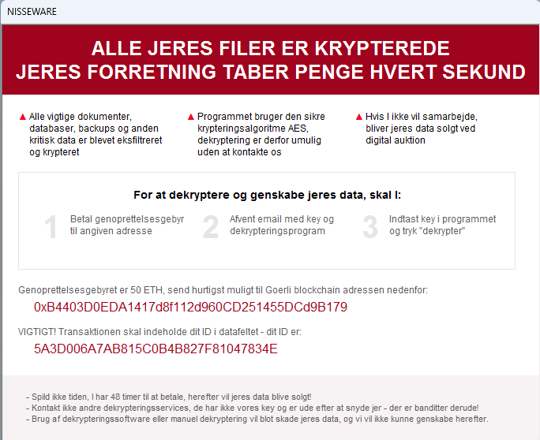
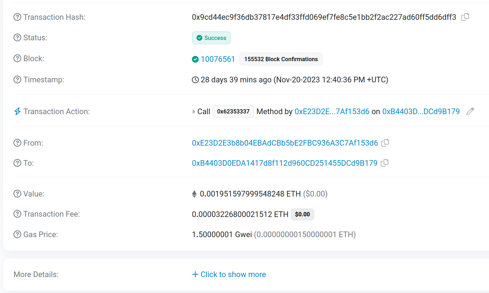
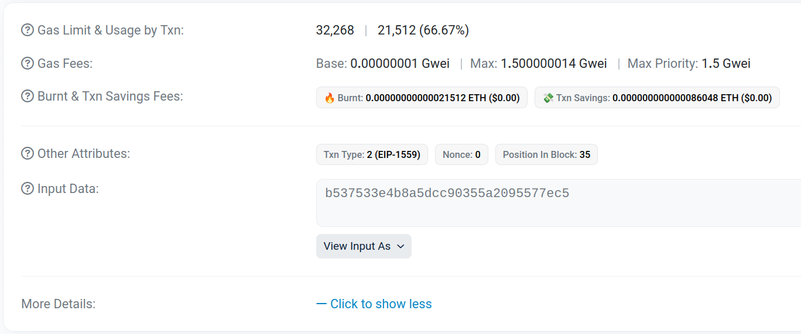
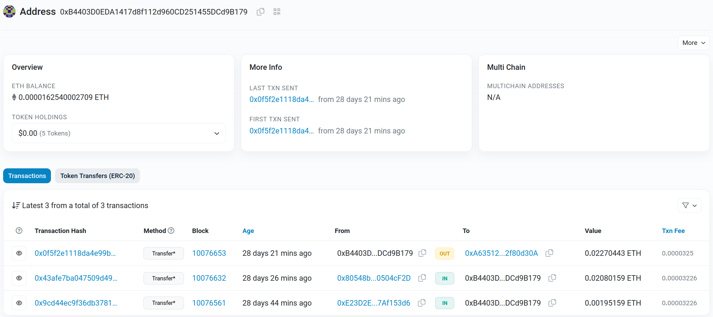
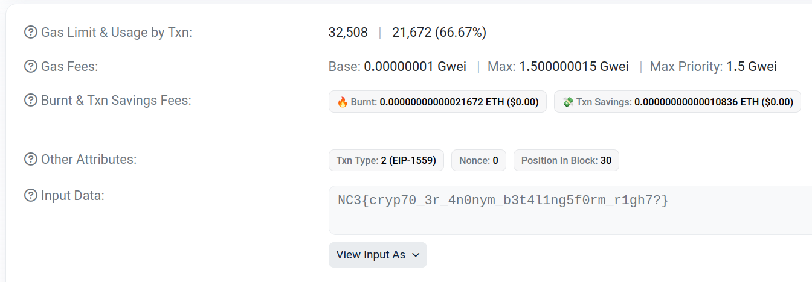

# Writeup

Denne opgave kan løses helt separat af alle de andre - den er måske naturlig at gå til, når ransomwaren er analyseret i [Nisseware: Dropper](../nisseware-dropper/) og [Nisseware: Encryption](../nisseware-encryption/), men kan fint løses fra starten, og vil i virkeligheden også analyseres af en anden gruppe teknikere end selve ransomwaren i det virkelige liv 😃

Vi har af forurettede fået udleveret et screenshot af ransomnoten fra angrebet:



Vigtigst er her den `ETH`-adresse, der er noteret hen mod bunden, samt informationen om, at pengene skal sendes på `Goerli blockchain`, et testing network for Ethereum.
Adressen er måske lidt træls at skrive af, men vi har i opgaveteksten også fået udleveret et transaktions-id fra et tidligere offer, der valgte at betale en lille løsesum:

```
0x9cd44ec9f36db37817e4df33ffd069ef7fe8c5e1bb2f2ac227ad60ff5dd6dff3
```

Dette er lidt nemmere hurtigt at slå op, og vi kan søge os frem til `Goerli Testnet Explorer`: https://goerli.etherscan.io/.
Her kan transaktionen (eller alternativt adressen fra ransomnoten) tilgås:

https://goerli.etherscan.io/tx/0x9cd44ec9f36db37817e4df33ffd069ef7fe8c5e1bb2f2ac227ad60ff5dd6dff3



Her er det altid interessant at klikke `Show More`, da en transaktion kan indeholde en smule input data - normalt hex encoded, men man kan vælge `View Input As -> UTF-8`:



I det her tilfælde er selve dataen en hexværdi, der ligner et hash meget.
Det stemmer fint overens med ransomnoten, der skriver `VIGTIGT! Transaktionen skal indeholde dit ID i datafeltet`, hvorefter IDet vises.

I transaktionen kan vi se både afsender og modtager. Afsenderen kan selvfølgelig være vigtig for at kunne identificere flere ofre, men her er vi mest interesseret i modtageren: https://goerli.etherscan.io/address/0xb4403d0eda1417d8f112d960cd251455dcd9b179 - samme adresse, der stod i ransomnoten og her, man starter fra, hvis man gad skrive den af manuelt:



Her ses to indkommende transaktioner, nok fra to forskellige ofre, samt en enkelt udadgående: https://goerli.etherscan.io/address/0xa63512cf03d9470e78cb7cd2de30b3042f80d30a.
Gruppen sender altså løsesummen videre til en anden adresse, måske for at vaske pengene eller bare overflytte til en samlet adresse.

På denne konto er der kun den ene transaktion fra `0xB4403D0EDA1417d8f112d960CD251455DCd9B179`, så den transaktion er interessant: https://goerli.etherscan.io/tx/0x0f5f2e1118da4e99b2d5bbfae98659b963261940400b74f0e265e6dae172b53e. Vi tjekker også her, om der er sendt tekst i datafeltet, og det leder os til flaget, der indikerer, at vi har fundet gruppens bagvedliggende adresse:



Fun fact, de to indkommende transaktioner til gruppens adresse fra ofre har følgende hashes (altså IDer) som data:

```
144d61b3bd1bdeb246f3f8876a2ff662
b537533e4b8a5dcc90355a2095577ec5
```

Den øverste kan ikke crackes med default wordlist, men er hash af `NC3CTF`. Det kan den nederste dog, som hurtigt findes til at være `nissen` 😉

Kryptoanalysen er nu færdig, og måske kan `N1ss3b4nd3n`s kryptovaluta beslaglægges, et vigtigt slutmål!

Har du fulgt den mest åbenlyse sti igennem opgaverne, fortsætter efterforskningen i [Nisseware: OSINT](../nisseware-osint/), hvor vi begynder at samle mere info på gruppen selv, så de kan disruptes og måske retsforfølges. Er du i stedet startet her, kan du gå i gang med den indledende efterforskning af selve angrebet i [Nisseware: Phishing](../nisseware-phishing/) og de følgende opgaver.

**Flag**

`NC3{cryp70_3r_4n0nym_b3t4l1ng5f0rm_r1gh7?}`
