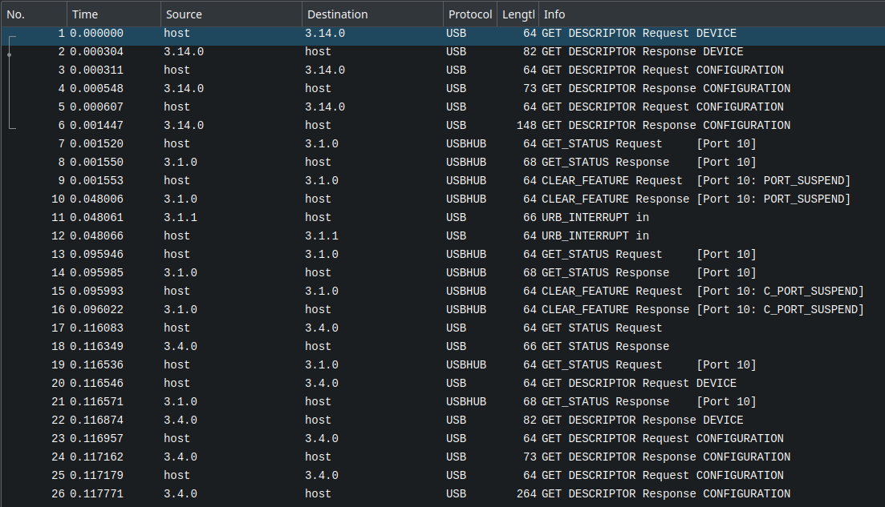

# Writeup

I opgaven udleveres et dump kaldet `keyboard.pcapng`, og der hintes kraftigt til, det er data packets fra et eksternt keyboard.
Åbnes dumpet i Wireshark ses en lang række frames sendt over USB-protokol:



Vi har altså nok at gøre med USB HID data (Human Interface Device), altså data fra devices, der lader mennesker interagere med computeren som fx keyboards, mus, joystick osv.

Disse typer devices bruger en fast protokol, hvor computeren først spørger devicen om at identificere sig selv og beskrive sit dataformat, hvorefter devicen sender et interrupt, hver gang der interageres med den. Hvert interrupt indeholder data om interaktionen, fx tastetryk for et keyboard eller bevægelser og klik for en mus.

I dette tilfælde har vi ikke de første HID report requests, hvor devicen beskriver sit dataformat,
så vi skal selv lidt gætte på, hvor den relevante data er i hvert datafelt - formatet er dog relativt fast.

Scroller vi ned igennem dumpet ses primært data fra source `3.14.3`, dvs. bus 3, device 14, endpoint 3.
For hver af disse interrupts ses et `HID Data` felt i stil med

```
200201003700000000000000000000
```

Dvs. umiddelbart er hvert datafelt 15 bytes, hvoraf det meste er null bytes.
Trækkes flere eksempler ud ses, at kun 4., 5. og 6. byte ændrer sig.
De første tre bytes er derfor nok en form for prefix og kan ignoreres.
Det typiske format for keyboards er:
```
modifier | reserved | key1 | key2 | key3 | key4 | key5 | key6
```
Den første `modifier` byte holder styr på, om en eller flere modifier knapper er aktive, fx venstre SHIFT, højre CTRL osv.
Herefter følger tit en reserveret null byte og så de faktiske keypresses, hvor mange keyboards supporter op til seks simultane tryk.

I vores data er det dog som sagt 4.-6. byte der ændrer sig, så vi har ikke umiddelbart en `reserved` null byte imellem, og der er maks trykket på to taster samtidig.

Dataen ligger i feltet med titlen `usbhid.data`, som vi også kan bruge som filter for kun at få de relevante frames med.
Vi kan hive al relevant data ud med `tshark`:

```bash
tshark -r keyboard.pcapng -Y "usbhid.data && usb.src == 3.14.3" -T fields -e usbhid.data > keyboard.txt
```

For at decode dataen, skal man vide hvilke bits i modifier byten, der svarer til hvilken modifier key, samt hvilken byteværdi hver af de normale taster har. Der findes flere fine decoder scripts tilgængelige på GitHub og en fin liste over key codes kan findes her: https://gist.github.com/MightyPork/6da26e382a7ad91b5496ee55fdc73db2.

Jeg har selv skrevet et script til formålet, der håndterer flere taster og situationer end de fleste andre, jeg har set. Det er tilgængeligt på følgende link, men blev med vilje taget ned et stykke tid op til CTFen: https://github.com/Nissen96/USB-HID-decoders.

Scriptet kan køres på den udtrukne data med parametrene `--offset 3` og `--no-reserved`, da vores data er prefixed med tre bytes og ikke indeholder en reserved byte som normalt:

```
$ python3 keyboard_decode.py --offset 3 --no-reserved keyboard.txt

Kaere Nissedagbog!

I dag har jeg vaeret paa besoeg hos Hr. Mortensen for at laere mere om udvikling af kundeorienterede loesninger.
Det er super spaendende, og jeg laerer en HEL masse, jeg ikke vidste foer!

I morgen skal jeg paa besoeg hos Nissefar, saa de kan teste om jeg allerede nu er klar til at komme paa udviklerholdet!
Det ville vaere ret cool at vaere medudvikler paa et saa indbringende produkt!

Jeg haaber det kommer til at gaa rigtig godt alt sammen!

NC3{p4s_paa_hv4d_du_5kr1v3r_n1ss3d3v_maaske_n0g3n_foelger_m3d!}

XOXO nissedev
```

Her får vi leaket noget af nissedevs dagbog, inklusiv flaget!

**Noter**

En del har nok undervejs haft problemer med, at de fleste eksisterende scripts antager en reserved byte, da det er mest normalt, men så får man et noget forkert resultat, så mange scripts skal tweakes for at virke.

De mere observante/grundige deltagere, der har været alle keypresses igennem, har måske opdaget, at nissedev faktisk skrev en del undervejs, han slettede igen. Jeg overvejede om flaget skulle være en af de ting, der blev skrevet og derefter slettet igen, men var flink i den første af opgaverne. Mit script har udover default simulation mode også et "replay" mode, hvor hver tastetryk gentages og teksten kan ses, som om man så med, mens nissedev skrev:


**Flag**

`NC3{p4s_paa_hv4d_du_5kr1v3r_n1ss3d3v_maaske_n0g3n_foelger_m3d!}`
